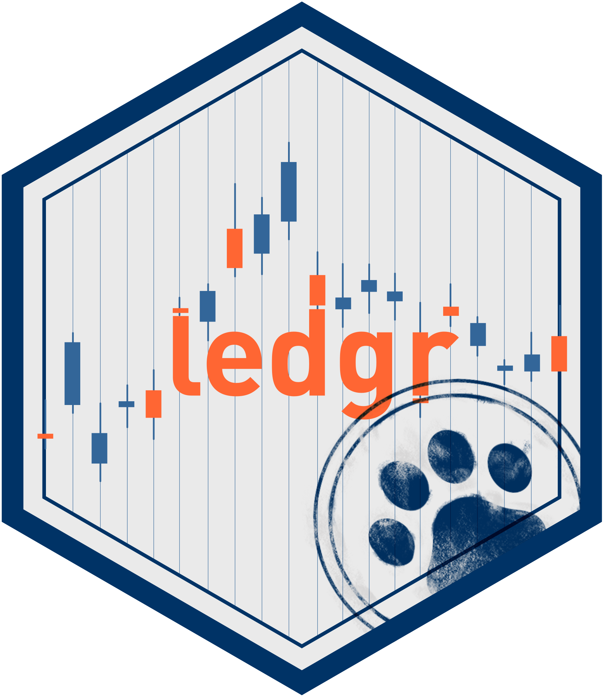

---
output:
  github_document:
    toc: false
    html_preview: false
    md_extensions: -smart
---

```{r setup, include=FALSE}
knitr::opts_chunk$set(
  collapse = TRUE,
  comment = "#>",
  fig.path = "man/figures/README-",
  out.width = "100%"
)
options(width = 90)
options(cli.unicode = FALSE)
if (file.exists("DESCRIPTION") && requireNamespace("pkgload", quietly = TRUE)) {
  pkgload::load_all(".", quiet = TRUE)
}
default_output_hook <- knitr::knit_hooks$get("output")
knitr::knit_hooks$set(
  output = function(x, options) {
    x <- gsub("Database:(\\s+)[^\\r\\n]+[.]duckdb", "Database:\\1<temporary DuckDB path>", x, perl = TRUE)
    x <- gsub("[ \t]+(?=\n)", "", x, perl = TRUE)
    default_output_hook(x, options)
  }
)
```

# ledgr



ledgr is an event-sourced systematic trading research framework for R.

Use it when you want a backtest result to be more than a temporary object in an
R session. ledgr starts from sealed market-data snapshots, runs strategies
through an experiment boundary, records event-sourced results, and lets you
reopen the evidence later.

```text
sealed snapshot -> experiment -> run -> event ledger -> results
```

The setup is not overhead. The setup is the audit trail.

## Install

```{r install, eval=FALSE}
if (!requireNamespace("pak", quietly = TRUE)) install.packages("pak")
pak::pak("blechturm/ledgr")
```

```{r attach, message=FALSE}
library(ledgr)
library(dplyr)

data("ledgr_demo_bars", package = "ledgr")
```

## Run A Small Backtest

Start with the package-owned demo bars. Real research should seal your own
market data, but the demo data keeps this first run local and deterministic.

```{r bars}
bars <- ledgr_demo_bars |>
  filter(
    instrument_id %in% c("DEMO_01", "DEMO_02"),
    between(ts_utc, ledgr_utc("2019-01-01"), ledgr_utc("2019-06-30"))
  )

bars |>
  slice_head(n = 4)
```

Seal the bars, declare the strategy boundary, and run one parameter set.

```{r quick-run}
snapshot <- ledgr_snapshot_from_df(
  bars,
  snapshot_id = "readme_demo"
)

features <- ledgr_feature_map(
  fast = ledgr_ind_sma(ledgr_param("fast_n")),
  slow = ledgr_ind_sma(ledgr_param("slow_n"))
)

exp <- ledgr_experiment(
  snapshot = snapshot,
  strategy = ledgr_demo_sma_crossover_strategy(),
  features = features,
  opening = ledgr_opening(cash = 10000),
  cost_model = ledgr_cost_zero()
)

bt <- ledgr_run(
  exp,
  feature_params = list(fast_n = 10L, slow_n = 40L),
  params = list(qty = 10, threshold = 0),
  run_id = "readme_sma_crossover"
)

summary(bt)
```

## Inspect The Evidence

The result views are derived from recorded events. The ledger is the source of
truth; trades, equity, and metrics are views over that evidence.

```{r inspect}
ledgr_results(bt, what = "trades")
head(ledgr_results(bt, what = "equity"), 3)
head(ledgr_results(bt, what = "returns"), 3)
```

Stored strategy provenance is inspectable without rerunning or evaluating the
strategy source. Use `trust = FALSE` for source and metadata inspection.

```{r extract-strategy}
stored_strategy <- ledgr_run_strategy(snapshot, "readme_sma_crossover", trust = FALSE)
list(
  reproducibility_level = stored_strategy$reproducibility_level,
  hash_verified = stored_strategy$hash_verified,
  strategy_params = stored_strategy$strategy_params
)
```

Hash verification proves stored-text identity, not code safety. Use
`trust = TRUE` only when you already trust the store and intentionally want to
recover a function object.

## Review, Promote, And Reopen

`ledgr_target` is a thin wrapper around the named numeric quantities the fold
consumes. Inspect one quantity with ordinary `[[` indexing, or recover the full
named numeric vector with `c()`.

```{r target-access}
target <- ledgr_target(
  c(DEMO_01 = 10, DEMO_02 = 0),
  universe = c("DEMO_01", "DEMO_02")
)
target[["DEMO_01"]]
target_values <- c(target)
target_values
```

An exploratory sweep remains evidence, not a decision. Name the ranking rule,
inspect its presentation table, then extract a candidate from the full ranked
table before promotion.

```{r review-and-promote}
grid <- ledgr_grid_cross(
  features = ledgr_feature_grid(
    fast_n = c(10L, 20L),
    slow_n = 40L
  ),
  strategy = ledgr_strategy_grid(
    qty = c(5, 10),
    threshold = 0
  )
)

sweep <- ledgr_sweep(exp, grid, seed = 2026L)
review <- ledgr_sweep_review(sweep, rank_by = -final_equity, n = 2L)
review$top

candidate <- ledgr_candidate(review$ranked, 1L)
promoted <- ledgr_promote(
  exp,
  candidate,
  run_id = "readme_promoted_candidate"
)
```

The run handle is a locator for durable evidence. Closing it releases owned
resources; it does not delete the run. Keep the store path and stable IDs, then
reopen the snapshot and completed run in a later session without executing the
strategy again.

```{r reopen-promoted}
store_path <- snapshot$db_path
snapshot_id <- snapshot$snapshot_id
promoted_run_id <- promoted$run_id

close(bt)
close(promoted)
ledgr_snapshot_close(snapshot)

snapshot <- ledgr_snapshot_open(store_path, snapshot_id, verify = TRUE)
bt <- ledgr_run_open(snapshot, promoted_run_id)
head(ledgr_results(bt, what = "equity"), 3)
```

## Where To Go Next

| Question | Article |
| --- | --- |
| I want the full research loop: snapshot, sweep, promotion, reopen. | [Research Workflow](https://blechturm.github.io/ledgr/articles/research-workflow.html) |
| I want the shortest runnable path through the package. | [Quickstart](https://blechturm.github.io/ledgr/articles/quickstart.html) |
| I want to write strategies correctly. | [Strategy Development](https://blechturm.github.io/ledgr/articles/strategy-development.html) |
| I want feature maps, indicators, and active aliases. | [Indicators](https://blechturm.github.io/ledgr/articles/indicators.html) |
| I want exploratory sweeps and candidate promotion. | [Sweeps](https://blechturm.github.io/ledgr/articles/sweeps.html) |
| I want return-panel evidence, PBO/CSCV, MinTRL, K-Ratio, DSR, and effective-trial diagnostics. | [Selection Integrity](https://blechturm.github.io/ledgr/articles/selection-integrity.html) |
| I want cost and target-risk policy boundaries. | [Risk And Cost](https://blechturm.github.io/ledgr/articles/risk-and-cost.html) |
| I want walk-forward evaluation. | [Walk-Forward](https://blechturm.github.io/ledgr/articles/walk-forward.html) |
| I want sealed snapshots, durable stores, backup, and reopen. | [Experiment Store](https://blechturm.github.io/ledgr/articles/experiment-store.html) |
| I want hashes, provenance tiers, and limits of recovery. | [Reproducibility](https://blechturm.github.io/ledgr/articles/reproducibility.html) |
| I want fills, trades, equity, metrics, and metric context. | [Metrics And Accounting](https://blechturm.github.io/ledgr/articles/metrics-and-accounting.html) |

Start with the pkgdown site for the full article set:
<https://blechturm.github.io/ledgr/>.

Installed package help remains available from R:

```{r docs, eval=FALSE}
help(package = "ledgr")
vignette(package = "ledgr")
```

## Ecosystem

ledgr connects to the R finance ecosystem through adapters. The core is narrow
by design: `data -> pulse -> decision -> fill -> ledger event -> portfolio
state`. Everything outside that sequence, such as data vendors, indicators,
charting, and analytics, can be provided by packages that already do those
things well.

| ledgr owns | Other packages can own |
|---|---|
| sealed snapshots and hashes | market-data acquisition |
| pulse construction and no-lookahead contexts | indicator calculations through adapters |
| target validation, target-risk transforms, fills, and ledger events | charting and visualization |
| run identity, provenance, and result reconstruction | downstream analytics and reporting |

This posture is deliberate. If you want an all-in-one charting or
array-backtesting package, ledgr may not be the shortest path. Choose ledgr
when you want the audit trail and adapter boundary to be explicit.

## Scope

The current ledgr research API is experiment-first. It includes memory-backed
exploratory sweep support, compact saved sweeps with optional retained return
and closed-trade evidence, classed target-risk transforms, optional parallel
candidate dispatch, canonical single-run returns, public return panels,
evidence-only selection-integrity diagnostics, classed/hashable business
objectives, and all-candidates eligibility tear-downs. It also includes a scoped
`compiled_accounting_model = "spot_fifo"` opt-in for memory-backed spot-asset
FIFO sweeps. Canonical R execution remains the default.

The compiled opt-in is not durable `ledgr_run()` integration, not a non-spot
accounting model, and not a general compiled fold core. The target-risk layer
is a target-vector transformation layer; it is not affordability enforcement,
portfolio optimization, margin, shorting or borrow policy, liquidity/capacity
modeling, OMS lifecycle behavior, or broker-grade risk control. The
selection-integrity diagnostics and business-objective eligibility results do
not choose or promote candidates and do not prove future profitability.
`business_objective_hash` is evidence provenance in this release, not run,
sweep, candidate, promotion, session, or walk-forward identity. ledgr does not
ship `ledgr_tune()`, automatic objective-based selection, objective-filtered
walk-forward identity, scored objective composition, purging/embargo/CPCV,
benchmark-relative diagnostics, broker adapters, paper trading, or live
trading. Those are separate roadmap items with different state and safety
requirements.

`ledgr_run()` returns a live handle. The run artifacts are already durable when
the run finishes. Most result inspection opens and closes its own read
connection; explicit `close(bt)` is resource cleanup for long sessions and
explicit opens.

```{r cleanup, include=FALSE}
if (exists("bt")) close(bt)
if (exists("snapshot")) ledgr_snapshot_close(snapshot)
```

## Pre-CRAN Compatibility

ledgr is not yet on CRAN. Until the first CRAN release, stored artifacts,
database schemas, config hashes, provenance formats, and experimental APIs may
change without backward compatibility or a deprecation cycle. Treat pre-CRAN
ledgr as a research/development package and expect to rerun experiments after
upgrading. Once ledgr is released on CRAN, the project will define an explicit
compatibility and deprecation policy.
