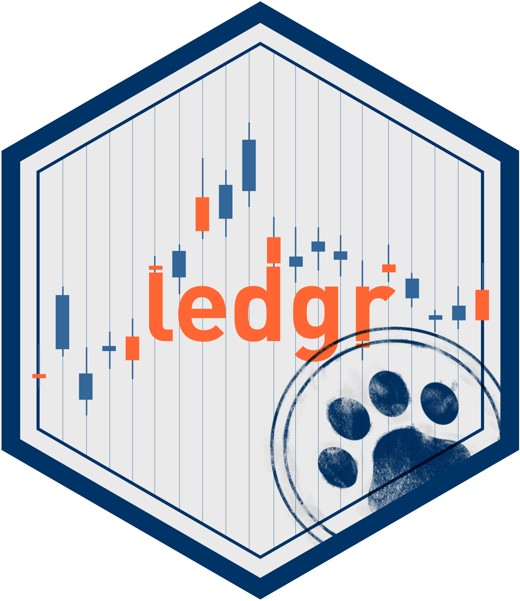

---
output:
  github_document:
    toc: false
    html_preview: false
    md_extensions: -smart
---

```{r}
#| label: setup
#| include: false

knitr::opts_chunk$set(
  collapse = TRUE,
  comment = "#>",
  fig.path = "man/figures/README-",
  out.width = "100%"
)
options(width = 90)
options(cli.unicode = FALSE)
if (file.exists("DESCRIPTION") && requireNamespace("pkgload", quietly = TRUE)) {
  pkgload::load_all(".", quiet = TRUE)
}
default_output_hook <- knitr::knit_hooks$get("output")
knitr::knit_hooks$set(
  output = function(x, options) {
    x <- gsub("Database:(\\s+)[^\\r\\n]+[.]duckdb", "Database:\\1<temporary DuckDB path>", x, perl = TRUE)
    x <- gsub("[ \t]+(?=\n)", "", x, perl = TRUE)
    default_output_hook(x, options)
  }
)
```

# ledgr



**Backtests you can trust, and reopen later.**

ledgr is an R package for systematic trading research. It is built so that the
usual ways a backtest fools you fail loudly instead of quietly:

- A strategy sees one decision time at a time. It cannot read tomorrow's price,
  because tomorrow's price is not in what it receives.
- You can declare which instruments existed and were eligible on each date, so
  delisted instruments stay in the test instead of silently dropping out.
- A parameter sweep keeps every candidate and comes with diagnostics for
  selection bias, so its best result can be questioned before you trust it.
- Every run is stored with the hash of its data, its parameters, and its
  strategy source, so you can reopen it months later and see exactly what ran.

```text
sealed snapshot -> experiment -> run -> event ledger -> results
```

The setup is not overhead. The setup is the audit trail.

## What ledgr Does, And In What Order

ledgr is deliberately narrow. It does one kind of backtest completely before
it adds the next:

- long-only positions in spot instruments, starting with equities;
- end-of-day decisions on daily bars, filled at the next open;
- point-in-time universes, with cash distributions and delistings modelled
  explicitly.

Shorting and leverage, intraday bars, other asset classes, and order types
such as limits and stops come later, each only once its accounting is
specified and tested. Share-changing corporate actions such as splits and
mergers are next;
[Cash Distributions](https://blechturm.github.io/ledgr/articles/corporate-action-cash.html)
describes what is modelled today. This release does not claim corporate-action
completeness, broker-exact settlement, net cash, tax correctness, or exact
recipient exposure. Sub-second trading is not a goal.

If you need any of those today, another backtester will serve you better. If
you need daily research you can trust and reopen later, that is what ledgr is
built for.

## Install

ledgr needs R 4.6.0 or later. Install it from GitHub. The install needs
network access, so it is not run when this page is built:

```{r}
#| label: install
#| eval: false

if (!requireNamespace("pak", quietly = TRUE)) install.packages("pak")
pak::pak("blechturm/ledgr")
```

```{r}
#| label: attach
#| message: false

library(ledgr)
library(dplyr)
```

## A First Backtest

A strategy is a function of the current decision context, `ctx`, and your
parameters, `params`. It returns the holdings you want after the next fill: a
number of shares for every instrument.

```{r}
#| label: strategy

above_trend <- function(ctx, params) {
  trend <- ctx$vec$feature("sma_20")
  if (!ledgr_passed_warmup(trend)) return(ctx$flat())
  above <- ctx$vec$close > trend * (1 + params$buffer)
  targets <- ctx$flat()
  targets[above] <- params$qty
  targets
}
```

This one holds `qty` shares of every instrument whose close is above its
20-day moving average by at least `buffer`, and nothing otherwise.
`ctx$flat()` starts from zero shares for every instrument, and `ctx$vec` holds
today's values for all of them at once. For the first 19 bars the average does
not exist yet, so the strategy holds nothing until it does.

Run it on the package's demo data. The data is sealed into a snapshot first,
so every run records exactly which data it used. The snapshot lives in a
temporary store here; a real project passes a persistent path, so the evidence
outlives the R session:

```{r}
#| label: first-run

bars <- ledgr_demo_bars |>
  filter(
    instrument_id %in% c("DEMO_01", "DEMO_02", "DEMO_03"),
    between(ts_utc, ledgr_utc("2019-01-01"), ledgr_utc("2019-12-31"))
  )

snapshot <- ledgr_snapshot_from_df(
  bars,
  snapshot_id = "readme_demo",
  db_path = ledgr_temp_store()
)

exp <- ledgr_experiment(
  snapshot = snapshot,
  strategy = above_trend,
  features = list(ledgr_ind_sma(20)),
  opening = ledgr_opening(cash = 10000),
  cost_model = ledgr_cost_zero()
)

bt <- ledgr_run(
  exp,
  params = list(qty = 10, buffer = 0),
  run_id = "readme_first_run"
)
bt
```

The compact print is the result most readers need first: the opening cash,
the final equity, the return and drawdown over the period, and the number of
closed round trips. The last two lines concern dividends. This demo data
carries no distribution records and does not say how its prices were adjusted,
so the return may omit dividends or count them twice; that is fine for learning
the mechanics, and
[Cash Distributions](https://blechturm.github.io/ledgr/articles/corporate-action-cash.html)
shows how to supply that evidence. Detailed equity, fills, trades, metrics,
and evidence remain available through the result API. The cost model is
required: `ledgr_cost_zero()` states openly that this demo trades for free.

## Reopen The Evidence Later

The run is already durable. Save its locators, release the live handles, and
reopen the same evidence later. `verify = TRUE` recomputes the data hash first:

```{r}
#| label: reopen

store_path <- snapshot$db_path
snapshot_id <- snapshot$snapshot_id
run_id <- bt$run_id

close(bt)
ledgr_snapshot_close(snapshot)

snapshot <- ledgr_snapshot_open(store_path, snapshot_id, verify = TRUE)
bt <- ledgr_run_open(snapshot, run_id)
tail(ledgr_results(bt, what = "equity"), 2)
```

The reopened run returns the same equity curve: each row's equity is its cash
plus the value of its positions, and `drawdown` is the fall from the highest
equity so far.

## Why ledgr?

| Research failure | What ledgr records or restricts | See it demonstrated |
|---|---|---|
| Looking ahead | Strategies receive one decision-time context | [Leakage](https://blechturm.github.io/ledgr/articles/leakage.html) |
| Survivors replacing the historical universe | Membership and availability are point in time | [Survivorship Bias](https://blechturm.github.io/ledgr/articles/survivorship-bias.html) |
| Mistaking a lucky sweep winner for validation | Every candidate and its diagnostics remain evidence | [Selection Integrity](https://blechturm.github.io/ledgr/articles/selection-integrity.html) |
| Losing the data, code, or parameters behind a result | Runs retain hashes, provenance, and reopenable evidence | [Reproducibility](https://blechturm.github.io/ledgr/articles/reproducibility.html) |

## Learn More

Start with [Quickstart](https://blechturm.github.io/ledgr/articles/quickstart.html),
then use [Strategy Basics](https://blechturm.github.io/ledgr/articles/strategy-development.html)
to write your own rule. [Research Workflow](https://blechturm.github.io/ledgr/articles/research-workflow.html)
takes that rule through code iterations, sweeps and promotion. The
[article index](https://blechturm.github.io/ledgr/) covers data preparation,
indicators, accounting, costs, walk-forward evaluation, and durable stores.
Installed help is available through `vignette(package = "ledgr")` and
`help(package = "ledgr")`.

ledgr works with the rest of the R ecosystem: indicators from TTR or your own
functions, market data from any source you can put in a data frame, and
results as ordinary tibbles.

## Status

ledgr is research software, not investment advice. Backtests are evidence
tools; they do not predict future returns or provide compliance guarantees.
See [DISCLAIMER.md](DISCLAIMER.md).

ledgr is not yet on CRAN. Until the first CRAN release, stored artifacts,
database schemas, and APIs may change without a deprecation cycle, so expect
to rerun experiments after upgrading.

```{r}
#| label: cleanup
#| include: false

if (exists("bt")) close(bt)
if (exists("snapshot")) ledgr_snapshot_close(snapshot)
```
