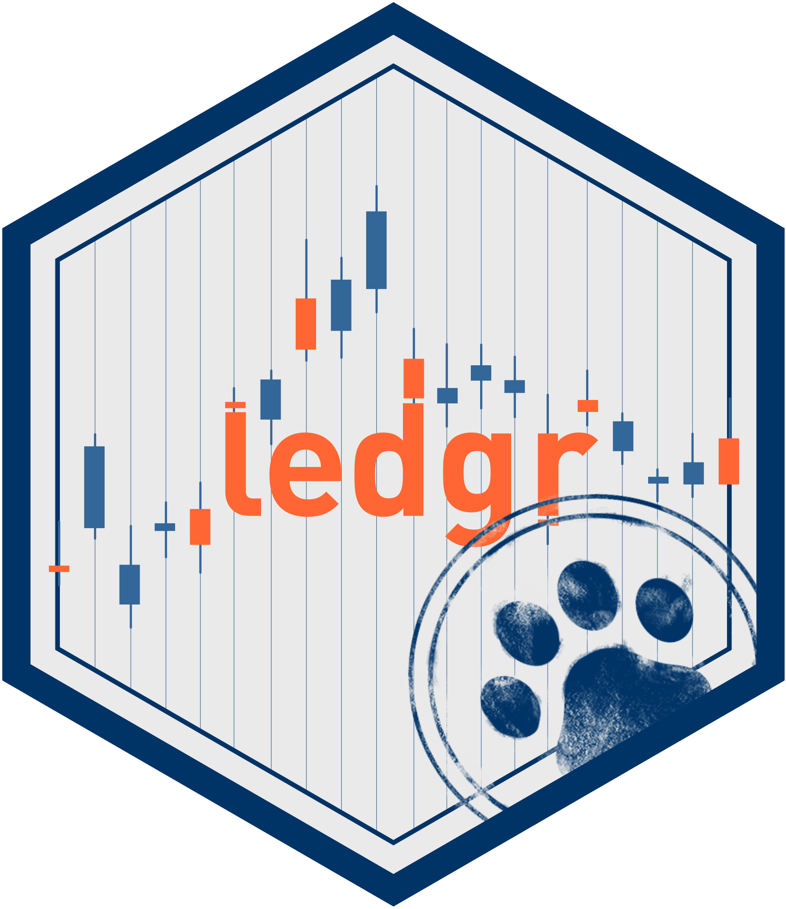

# ledgr



ledgr is an event-sourced systematic trading research framework for R.

Use it when you want a backtest result to be more than a temporary
object in an R session. ledgr starts from sealed market-data snapshots,
runs strategies through an experiment boundary, records event-sourced
results, and lets you reopen the evidence later.

``` text
sealed snapshot -> experiment -> run -> event ledger -> results
```

The setup is not overhead. The setup is the audit trail.

## Install

``` r
if (!requireNamespace("pak", quietly = TRUE)) install.packages("pak")
pak::pak("blechturm/ledgr")
```

``` r
library(ledgr)
library(dplyr)

data("ledgr_demo_bars", package = "ledgr")
```

## Run A Small Backtest

Start with the package-owned demo bars. Real research should seal your
own market data, but the demo data keeps this first run local and
deterministic.

``` r
bars <- ledgr_demo_bars |>
  filter(
    instrument_id %in% c("DEMO_01", "DEMO_02"),
    between(ts_utc, ledgr_utc("2019-01-01"), ledgr_utc("2019-06-30"))
  )

bars |>
  slice_head(n = 4)
#> # A tibble: 4 x 7
#>   ts_utc              instrument_id  open  high   low close volume
#>   <dttm>              <chr>         <dbl> <dbl> <dbl> <dbl>  <dbl>
#> 1 2019-01-01 00:00:00 DEMO_01        89.7  91.8  89.7  91.5 468600
#> 2 2019-01-02 00:00:00 DEMO_01        91.5  91.6  91.0  91.3 438315
#> 3 2019-01-03 00:00:00 DEMO_01        91.3  92.1  89.6  90.5 576390
#> 4 2019-01-04 00:00:00 DEMO_01        90.7  91.1  89.5  89.8 458921
```

Seal the bars, declare the strategy boundary, and run one parameter set.

``` r
snapshot <- ledgr_snapshot_from_df(
  bars,
  snapshot_id = "readme_demo"
)

features <- ledgr_feature_map(
  fast = ledgr_ind_sma(ledgr_param("fast_n")),
  slow = ledgr_ind_sma(ledgr_param("slow_n"))
)

exp <- ledgr_experiment(
  snapshot = snapshot,
  strategy = ledgr_demo_sma_crossover_strategy(),
  features = features,
  opening = ledgr_opening(cash = 10000)
)

bt <- ledgr_run(
  exp,
  feature_params = list(fast_n = 10L, slow_n = 40L),
  params = list(qty = 10, threshold = 0),
  run_id = "readme_sma_crossover"
)

summary(bt)
#> ledgr Backtest Summary
#> ======================
#>
#> Performance Metrics:
#>   Total Return:        1.07%
#>   Annualized Return:   2.11%
#>   Max Drawdown:        -0.76%
#>
#> Risk Metrics:
#>   Risk-Free Rate:      0.00% annual
#>   Annualization:       252 periods/year (US equity daily)
#>   Volatility (annual): 1.56%
#>   Sharpe Ratio:        1.349
#>
#> Trade Statistics:
#>   Total Trades:        2
#>   Win Rate:            100.00%
#>   Avg Trade:           $53.41
#>
#> Exposure:
#>   Time in Market:      59.69%
```

## Inspect The Evidence

The result views are derived from recorded events. The ledger is the
source of truth; trades, equity, and metrics are views over that
evidence.

``` r
ledgr_results(bt, what = "trades")
#> # A tibble: 2 x 9
#>   event_seq ts_utc     instrument_id side    qty price   fee realized_pnl action
#>       <int> <date>     <chr>         <chr> <dbl> <dbl> <dbl>        <dbl> <chr>
#> 1         3 2019-04-23 DEMO_01       SELL     10 102.      0         27.4 CLOSE
#> 2         4 2019-06-13 DEMO_02       SELL     10  76.5     0         79.4 CLOSE
head(ledgr_results(bt, what = "equity"), 3)
#> # A tibble: 3 x 6
#>   ts_utc     equity  cash positions_value running_max drawdown
#>   <date>      <dbl> <dbl>           <dbl>       <dbl>    <dbl>
#> 1 2019-01-01  10000 10000               0       10000        0
#> 2 2019-01-02  10000 10000               0       10000        0
#> 3 2019-01-03  10000 10000               0       10000        0
```

Stored strategy provenance is inspectable without rerunning or
evaluating the strategy source. Use `trust = FALSE` for source and
metadata inspection.

``` r
stored_strategy <- ledgr_extract_strategy(snapshot, "readme_sma_crossover", trust = FALSE)
list(
  reproducibility_level = stored_strategy$reproducibility_level,
  hash_verified = stored_strategy$hash_verified,
  strategy_params = stored_strategy$strategy_params
)
#> $reproducibility_level
#> [1] "tier_1"
#>
#> $hash_verified
#> [1] TRUE
#>
#> $strategy_params
#> $strategy_params$qty
#> [1] 10
#>
#> $strategy_params$threshold
#> [1] 0
```

Hash verification proves stored-text identity, not code safety. Use
`trust = TRUE` only when you already trust the store and intentionally
want to recover a function object.

## Where To Go Next

| Question | Article |
|----|----|
| I want the full research loop: snapshot, sweep, promotion, reopen. | [Research Workflow](https://blechturm.github.io/ledgr/articles/research-workflow.html) |
| I want to write strategies correctly. | [Strategy Development](https://blechturm.github.io/ledgr/articles/strategy-development.html) |
| I want feature maps, indicators, and active aliases. | [Indicators](https://blechturm.github.io/ledgr/articles/indicators.html) |
| I want exploratory sweeps and candidate promotion. | [Sweeps](https://blechturm.github.io/ledgr/articles/sweeps.html) |
| I want sealed snapshots, durable stores, backup, and reopen. | [Experiment Store](https://blechturm.github.io/ledgr/articles/experiment-store.html) |
| I want hashes, provenance tiers, and limits of recovery. | [Reproducibility](https://blechturm.github.io/ledgr/articles/reproducibility.html) |
| I want fills, trades, equity, metrics, and metric context. | [Metrics And Accounting](https://blechturm.github.io/ledgr/articles/metrics-and-accounting.html) |

Start with the pkgdown site for the full article set:
<https://blechturm.github.io/ledgr/>.

Installed package help remains available from R:

``` r
help(package = "ledgr")
vignette(package = "ledgr")
```

## Ecosystem

ledgr connects to the R finance ecosystem through adapters. The core is
narrow by design:
`data -> pulse -> decision -> fill -> ledger event -> portfolio state`.
Everything outside that sequence, such as data vendors, indicators,
charting, and analytics, can be provided by packages that already do
those things well.

| ledgr owns | Other packages can own |
|----|----|
| sealed snapshots and hashes | market-data acquisition |
| pulse construction and no-lookahead contexts | indicator calculations through adapters |
| target validation, fills, and ledger events | charting and visualization |
| run identity, provenance, and result reconstruction | downstream analytics and reporting |

This posture is deliberate. If you want an all-in-one charting or
array-backtesting package, ledgr may not be the shortest path. Choose
ledgr when you want the audit trail and adapter boundary to be explicit.

## Scope

The current ledgr research API is experiment-first and includes
sequential exploratory sweep support. It does not ship automatic
ranking, `ledgr_tune()`, parallel sweep, walk-forward/PBO/CSCV helpers,
full sweep artifact persistence, broker adapters, paper trading, live
trading, or short-selling semantics. Those are separate roadmap items
with different state and safety requirements.

`ledgr_run()` returns a live handle. The run artifacts are already
durable when the run finishes. Most result inspection opens and closes
its own read connection; explicit `close(bt)` is resource cleanup for
long sessions, explicit opens, and lazy result cursors.

## Pre-CRAN Compatibility

ledgr is not yet on CRAN. Until the first CRAN release, stored
artifacts, database schemas, config hashes, provenance formats, and
experimental APIs may change without backward compatibility or a
deprecation cycle. Treat pre-CRAN ledgr as a research/development
package and expect to rerun experiments after upgrading. Once ledgr is
released on CRAN, the project will define an explicit compatibility and
deprecation policy.
