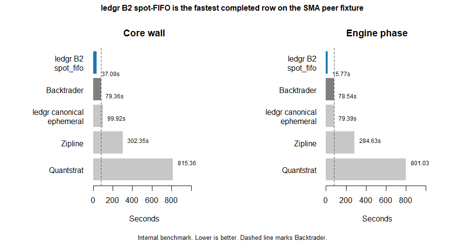
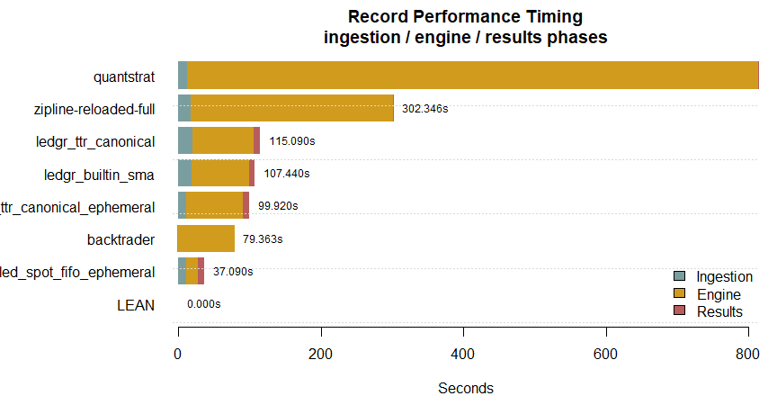
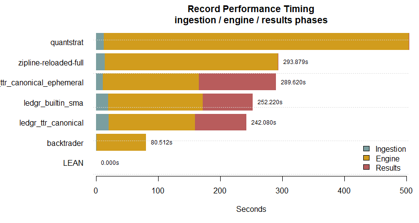
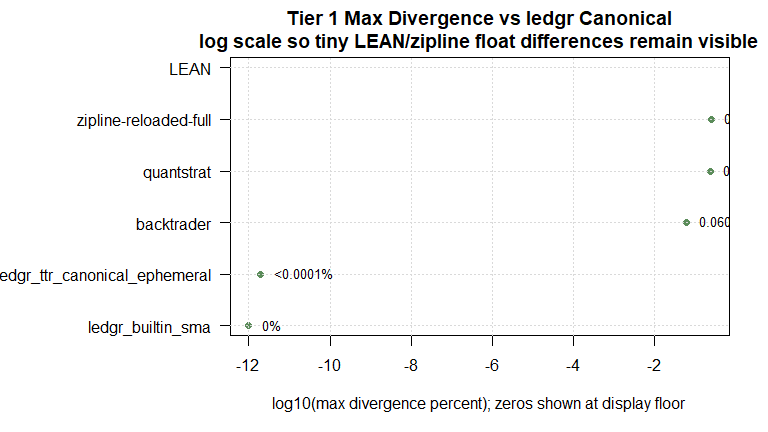

# ledgr Peer Parity And Performance Benchmark Report


On a standard 500-instrument, 5-year daily-bar SMA crossover workload,
ledgr’s memory-backed opt-in compiled spot-FIFO accelerator is the
fastest completed row in this included event-driven comparison, ahead of
Backtrader by a meaningful margin on end-to-end wall time and by a
larger margin on engine work alone. Parsed canonical equity, cash, and
position outputs match canonical R ledgr exactly, so the speedup comes
from the scoped spot-FIFO hot frame rather than from cutting corners.

This report walks the measurement: headline result first, parity check
second, full peer comparison third, methodology last. Read in order, or
jump to whichever section answers what you came to verify.

> **Scope of this report**
>
> Internal repo-local benchmark. Same host, same seed, single fixture.
> The B2 row is an explicit opt-in
> (`compiled_accounting_model = "spot_fifo"`) on ledgr’s
> ephemeral/memory-backed path. Default ledgr execution remains
> canonical R. Numbers are for maintainer use and release-closeout
> language, not a public ranking or a universal speed claim.

## Headline: B2 spot-FIFO vs Backtrader

Same fixture, same seed, same shared bars CSV. The B2 row uses ledgr’s
explicit `compiled_accounting_model = "spot_fifo"` spot-FIFO hot frame
on the ephemeral benchmark boundary; Backtrader uses its standard
event-driven loop. Both run the same SMA crossover strategy.

| Surface | B2 seconds | Backtrader seconds | B2 / Backtrader | B2 reduction vs Backtrader |
|:---|:---|:---|:---|:---|
| Core wall | 37.090 | 79.363 | 0.47x | 53.3% |
| Engine phase | 15.770 | 78.543 | 0.20x | 79.9% |

Two ratios, both honest. The engine-phase ratio is the slice the
compiled hot frame actually replaces. The core-wall ratio is what a user
sees end-to-end. The remaining wall B2 spends after the engine phase is
R-side results materialization: building the canonical equity, fills,
and trades artifacts the harness measures. Backtrader’s equivalent
results phase is much smaller because it writes raw CSVs without
canonical materialization.



## Why the speed claim is trustworthy

A speed number only matters if the engine produces the same answer.
ledgr’s compiled `spot_fifo` row matches canonical ledgr ephemeral with
zero parsed canonical-output difference on this fixture across equity,
cash, and the position proxy.

| Check                       | Value    |
|:----------------------------|:---------|
| Canonical ephemeral rows    | 1260     |
| B2 rows                     | 1260     |
| Merged rows                 | 1260     |
| Equity correlation          | 1.000000 |
| Max abs equity diff         | 0        |
| Max abs cash diff           | 0        |
| Max abs position proxy diff | 0        |

The compiled path is doing the same accounting as the R path, just
faster. That makes the speed delta a real engine measurement rather than
a corner cut. Peer-by-peer parity against ledgr canonical follows below.

## Full peer comparison

The B2 sidecar row is measured on the same fixture as the seven-row peer
record bundle and appended here for comparison. Backtrader is the
closest comparable: event-driven, Python, no durable persistence.
Zipline and quantstrat are included as event-driven reference points;
both are materially slower. LEAN is included as a status row when the
local CLI is available, otherwise marked unavailable with the failure
reason.

ledgr appears in canonical and B2 rows because both answer useful
questions. Canonical durable and ephemeral track the R fold and the
auditability surface ledgr ships by default. B2 tracks the opt-in
compiled hot frame. Keeping both prevents reading a compiled opt-in
result as a default ledgr claim.

| Engine | Status | Full row | Ingestion | Engine | Results | Total | Bars/sec |
|:---|:---|:---|:---|:---|:---|:---|:---|
| ledgr_ttr_canonical | DONE | 115.120 | 19.780 | 86.580 | 8.730 | 115.090 | 5,473.98 |
| ledgr_ttr_canonical_ephemeral | DONE | 99.920 | 11.070 | 79.390 | 9.460 | 99.920 | 6,305.04 |
| ledgr_builtin_sma | DONE | 107.440 | 19.000 | 80.960 | 7.480 | 107.440 | 5,863.74 |
| quantstrat | DONE | 815.760 | 12.960 | 801.030 | 1.370 | 815.360 | 772.665 |
| backtrader | DONE | 86.360 | 0.666 | 78.543 | 0.154 | 79.363 | 7,938.23 |
| zipline-reloaded-full | DONE | 318.900 | 17.256 | 284.626 | 0.464 | 302.346 | 2,083.71 |
| LEAN | UNAVAILABLE | 9.520 | NA | NA | NA | NA | NA |
| ledgr_ttr_compiled_spot_fifo_ephemeral | DONE | 37.130 | 11.430 | 15.770 | 9.890 | 37.090 | 16,985.7 |

Read `Total` as the engine-row boundary. Read `Full row` as the wrapper
cost around that boundary; large full-row overhead on Python rows
reflects per-invocation process and environment setup outside the phase
total. Phase definitions are in the Methodology section.



## Equity curves

Each engine’s equity is normalized to its first observed value, so curve
shape is comparable without implying an absolute return ranking. A
flat-overlapping bundle of curves is the expected pattern when parity
holds; visible separation is a divergence-source signal worth
investigating in the parity tables below.



## Peer parity

ledgr’s canonical TTR row is the parity reference. Each peer is compared
against it across three tiers: per-bar equity behavior, derived top-line
metrics, and trade-level surface. A peer that disagrees with canonical
TTR gets a `review` status and a documented divergence attribution
rather than being treated as wrong by default.

The mental move when a parity check fails is to consider three
candidates in order: ledgr is wrong, the peer is wrong, the harness is
wrong. The residual difference is then attributed to a named source:
indicator initialization window, fill-timing edge, cost or margin
default, position-sizing rounding, timestamp alignment, or
float-ordering rounding.

### Tier 1: per-bar equity behavior

| Peer | Tier 1 | Parity surface | Equity corr | Max div | Return corr |
|:---|:---|:---|:---|:---|:---|
| ledgr_ttr_canonical_ephemeral | pass | equity + fills + realized trades | 1.000000 | \<0.0001% | 1.000000 |
| ledgr_builtin_sma | pass | equity + fills + realized trades | 1.000000 | 0% | 1.000000 |
| quantstrat | review (partial surface) | partial: equity + trade count only | 0.999778 | 0.2374% | 0.987795 |
| backtrader | pass | equity + fills + realized trades | 0.999999 | 0.06082% | 0.999746 |
| zipline-reloaded-full | pass | equity + fills + realized trades | 0.999757 | 0.2486% | 0.146064 |
| LEAN | review | unavailable | NA | NA | NA |

Rows in `review` carry an explicit attribution:

| Peer | Review attribution       |
|:-----|:-------------------------|
| LEAN | unavailable peer surface |



### Tier 2: derived top-line metrics

| Peer | Total return delta | Sharpe diff | Max DD delta |
|:---|:---|:---|:---|
| ledgr_ttr_canonical_ephemeral | \<0.00001 pp | 0.000000000000363265 | \<0.00001 pp |
| ledgr_builtin_sma | 0 pp | 0 | 0 pp |
| quantstrat | -0.16107 pp | -0.106235 | 0.0025844 pp |
| backtrader | -0.055685 pp | -0.00973772 | -0.00017200 pp |
| zipline-reloaded-full | -0.18998 pp | -0.125183 | -0.0019703 pp |
| LEAN | NA | NA | NA |

### Tier 3: trade-level surface

| Peer | Trade count diff | Trade surface | Parity note |
|:---|---:|:---|:---|
| ledgr_ttr_canonical_ephemeral | 0 | available_realized_pnl | equity + fills + realized trades |
| ledgr_builtin_sma | 0 | available_realized_pnl | equity + fills + realized trades |
| quantstrat | 33777 | trade_count_available_only | partial: equity + trade count only |
| backtrader | -238 | available_realized_pnl | equity + fills + realized trades |
| zipline-reloaded-full | -682 | available_realized_pnl | equity + fills + realized trades |
| LEAN | NA | unavailable | unavailable |

### Per-bar divergence attribution

Every DONE peer row writes a per-bar `_divergence.csv` plus a
`_divergence_summary.csv`. The attribution columns below decompose total
absolute equity divergence against `ledgr_ttr_canonical` into named
sources.

| Peer | Total abs divergence | Diverging bars | First divergence | Indicator warmup | Fill timing | Calendar | Position size | Float rounding | Other |
|:---|:---|---:|:---|:---|:---|:---|:---|:---|:---|
| ledgr_ttr_canonical_ephemeral | 0.00004476123 | 1221 | 2018-01-15T00:00:00Z | 0% | 0% | 0% | 0% | 100.0% | 0% |
| ledgr_builtin_sma | 0 | 0 | NA | 0% | 0% | 0% | 0% | 100.0% | 0% |
| quantstrat | 16597234\. | 1250 | 2018-01-15T00:00:00Z | 0% | 98.96% | 0% | 1.040% | 0% | 0% |
| backtrader | 6931489\. | 1250 | 2018-01-15T00:00:00Z | 0% | 0.01299% | 0% | 99.99% | 0% | 0% |
| zipline-reloaded-full | 9200442\. | 1000 | 2018-01-16T00:00:00Z | 0% | 26.01% | 0% | 73.99% | 0% | 0% |

## Methodology

### Harness

The harness lives at `dev/bench/peer_benchmark/peer_benchmark.R`. It
runs two checks per peer: numerical parity against ledgr canonical TTR,
and same-host phase timing. The parity check asks whether the engines
agree on this strategy and data. The timing check asks how long this
local same-host harness took under the declared boundary.

Smoke command:

``` powershell
& "C:\Program Files\R\R-4.5.2\bin\x64\Rscript.exe" dev/bench/peer_benchmark/peer_benchmark.R --preset smoke
```

Record command:

``` powershell
& "C:\Program Files\R\R-4.5.2\bin\x64\Rscript.exe" dev/bench/peer_benchmark/peer_benchmark.R --preset record
```

Record command with the opt-in B2 row:

``` powershell
& "C:\Program Files\R\R-4.5.2\bin\x64\Rscript.exe" dev/bench/peer_benchmark/peer_benchmark.R --preset record --compiled-accounting-model spot_fifo
```

The harness writes ignored local artifacts under `dev/bench/results/`:
one shared bars CSV with input hash, per-engine canonical equity curves
where available, fills and trade summary tables where available, engine
surface-status rows for unavailable outputs, Tier 1/2/3 parity CSVs,
performance timing CSV, environment metadata JSON, and append-only
parity history JSON under `dev/bench/results/parity_history/`.

### Required rows

| Row | Status policy |
|----|----|
| ledgr canonical TTR | Required; errors if `TTR` is missing. |
| ledgr canonical TTR ephemeral | Required; runs the same fold core through an in-memory output handler and must match durable ledgr equity/fills before the run is accepted. |
| ledgr B2 spot-FIFO ephemeral | Optional; enabled with `--compiled-accounting-model spot_fifo`; uses the same bars/features/strategy surface as ledgr canonical TTR ephemeral, uses the same closed enum and memory-handler dispatch as the public `compiled_accounting_model = "spot_fifo"` sweep opt-in, and must match canonical ledgr outputs before being interpreted as a peer-comparison row. |
| ledgr built-in SMA diagnostic | Required; runs through ledgr built-ins. |
| quantstrat | Runs when local R packages are installed; otherwise explicit unavailable row. |
| Backtrader | Managed through `dev/bench/peer_benchmark/python/backtrader/` and run through `python -m uv`. |
| zipline-reloaded full engine | Managed through `dev/bench/peer_benchmark/python/zipline/`; temporary csvdir bundle ingestion plus `zipline.run_algorithm()`. |
| LEAN CLI | Managed through `dev/bench/peer_benchmark/python/lean/`; invokes the local LEAN CLI or reports unavailable with the CLI failure reason. |

Optional peers must emit a status row. Missing fills/trade surfaces are
labeled with unavailable metadata rather than silently dropped.

### Phase definitions

Each DONE row in the performance table is split into three measured
phases:

- **Ingestion**: from timed-window start until the engine has native
  data structures ready to iterate.
- **Engine**: from ready-to-iterate until strategy execution completes
  and engine state is final.
- **Results**: from final engine state until canonical equity, fills,
  and trades are materialized for this harness.

The three phase columns must reconcile to `Total` within 0.5 seconds or
the harness aborts. LEAN is the one explicit exception: when the local
CLI runs, the whole CLI subprocess is bucketed as engine time because
ingestion, run, and extraction are not separable from outside the CLI.

| Engine | Ingestion | Engine | Results |
|----|----|----|----|
| `ledgr_ttr_canonical` | `read.csv`, timestamp normalization, DuckDB snapshot creation, experiment construction | `ledgr_run()` | `ledgr_results()` for equity/fills plus canonical materialization |
| `ledgr_ttr_canonical_ephemeral` | `read.csv`, timestamp normalization, in-memory bars/features/projection construction | `ledgr_execute_fold()` with `ledgr_memory_output_handler()` | event-stream equity/fills reconstruction plus canonical materialization |
| `ledgr_ttr_compiled_spot_fifo_ephemeral` | Same ephemeral ledgr boundary as `ledgr_ttr_canonical_ephemeral` | fold execution with `compiled_accounting_model = "spot_fifo"` on the memory handler | event-stream equity/fills canonical materialization |
| `ledgr_builtin_sma` | Same durable ledgr boundary with built-in SMA features | `ledgr_run()` | `ledgr_results()` for equity/fills plus canonical materialization |
| `quantstrat` | `read.csv`, xts/globalenv construction, portfolio/account/orders/strategy setup | `applyStrategy()` plus account updates | account/transaction extraction plus canonical materialization |
| `backtrader` | `read.csv`, `PandasData` construction, `cerebro.adddata` loop | `cerebro.run()` | CSV writes from in-memory observer/fill rows |
| `zipline-reloaded-full` | `read.csv`, temporary csvdir creation, bundle registration and ingest | `run_algorithm()` | performance-frame transaction/equity extraction plus CSV writes |
| `LEAN` | Not separable from outside the CLI | whole CLI subprocess if available | Not separable from outside the CLI |

Boundary ambiguity decisions: quantstrat initialization is ingestion
because it builds native portfolio/order state before strategy
iteration; zipline bundle registration/ingest is ingestion because it
creates the native bundle consumed by `run_algorithm()`; LEAN CLI phases
are unavailable from outside the CLI.

| Engine | Boundary |
|:---|:---|
| ledgr_ttr_canonical | durable ledgr: ingestion=bars CSV read plus DuckDB snapshot plus experiment construction; engine=ledgr_run; results=ledgr_results equity/fills plus canonical materialization |
| ledgr_ttr_canonical_ephemeral | ephemeral ledgr: ingestion=bars CSV read plus in-memory bars/features/projection; engine=ledgr_execute_fold with memory output handler; results=event-stream equity/fills reconstruction plus canonical materialization |
| ledgr_builtin_sma | durable ledgr built-in SMA: ingestion=bars CSV read plus DuckDB snapshot plus experiment construction; engine=ledgr_run; results=ledgr_results equity/fills plus canonical materialization |
| quantstrat | ingestion=bars CSV read, xts/globalenv setup, initPortf/initAcct/initOrders/strategy setup; engine=applyStrategy plus account updates; results=equity/transaction extraction plus canonical writes |
| backtrader | ingestion=bars CSV read, PandasData feed construction, cerebro.adddata loop; engine=cerebro.run; results=canonical equity/fill/trade writes |
| zipline-reloaded-full | ingestion=bars CSV read, temporary csvdir construction, bundle registration and ingest; engine=zipline run_algorithm; results=canonical equity/fill/trade writes |
| LEAN | LEAN CLI phase split is unavailable locally; if configured, the whole CLI subprocess is the measured boundary, otherwise the row is UNAVAILABLE |
| ledgr_ttr_compiled_spot_fifo_ephemeral | ephemeral ledgr with compiled_accounting_model=spot_fifo: same bars/projection/strategy surface as ledgr_ttr_canonical_ephemeral; engine uses compiled spot-FIFO fill/accounting batch; results=event-stream equity/fills canonical materialization |

### Parity tiers

Tier 1 per-bar parity: equity-curve correlation, max single-bar equity
divergence as a fraction of ledgr equity, daily-return correlation, cash
trajectory match where both engines expose cash, and position proxy
match where both engines expose comparable positions.

Tier 2 derived top-line parity: total return, annualized return,
annualized volatility, Sharpe ratio where defined, and max drawdown.

Tier 3 trade-level parity: trade count, win rate and average trade where
the peer exposes comparable realized trade data, and explicit
unavailable metadata where the peer does not.

The ledgr crossover strategy used by this report is vectorized over
`ctx$features_wide`. It keeps previous crossover state in
`ctx$state_prev`, but the current feature comparison and target updates
are vector operations rather than a per-instrument R loop.

### Parity glossary

| Label | Meaning |
|----|----|
| `Tier 1` | Per-bar equity/return parity status. `pass` means the row passed the current tolerance; `review` means the row has a documented divergence attribution. |
| `Parity surface` | Which comparable artifacts exist for that peer. Quantstrat is partial because this harness currently gets account equity and transaction count, not comparable fills or realized trade P&L. |
| `Equity corr` | Correlation between peer equity and ledgr canonical equity. Closer to 1 is better. |
| `Max div` | Largest single-bar equity difference versus ledgr canonical, shown as a percent of ledgr equity. Lower is better. |
| `Return corr` | Correlation between one-bar equity changes. Closer to 1 is better. |
| `Total return delta` | Peer total return minus ledgr canonical total return, in percentage points. |
| `Sharpe diff` | Peer Sharpe minus ledgr canonical Sharpe. |
| `Max DD delta` | Peer max drawdown minus ledgr canonical max drawdown, in percentage points. |
| `Trade count diff` | Peer closed-trade count minus ledgr canonical closed-trade count. |

### Engine status

| Engine | Status | Reason |
|:---|:---|:---|
| ledgr_ttr_canonical | DONE |  |
| ledgr_ttr_canonical_ephemeral | DONE |  |
| ledgr_builtin_sma | DONE |  |
| quantstrat | DONE |  |
| backtrader | DONE |  |
| zipline-reloaded-full | DONE |  |
| LEAN | UNAVAILABLE | LEAN CLI unavailable: lean backtest rejected the temporary project root; local lean init organization setup is required. |

### Surface availability

| engine | equity | fills | trades |
|:---|:---|:---|:---|
| ledgr_ttr_canonical | available | available | available_realized_pnl |
| ledgr_ttr_canonical_ephemeral | available | available | available_realized_pnl |
| ledgr_builtin_sma | available | available | available_realized_pnl |
| quantstrat | available | available | trade_count_available_only |
| backtrader | available | available | available_realized_pnl |
| zipline-reloaded-full | available | available | available_realized_pnl |
| LEAN | unavailable | unavailable | unavailable |

### Latest record bundle

| field | value |
|:---|:---|
| created_at | 2026-06-02T16:23:18Z |
| release | v0.1.8.10 |
| preset | record |
| input_hash | 0b183457b3fe720d63b02a90fe552e1202fdb31b4e967a75e91304f9d3e416fc |
| git_sha | f115bfab386746ad8b8728d22786b52e388abba3 |

## Caveats

### Same-host scope

Hardware, R version, OS, and toolchain versions are pinned to the
maintainer’s environment. The numbers are comparable within this record
bundle. They are not a portable speed ranking across hosts or a public
benchmark claim.

### Interpreting the B2 row

The B2 row is interpreted only when measured on the same peer fixture as
the external engines: same shared bars CSV, same fast/slow SMA settings,
same seed. It is also an opt-in compiled accelerator measurement, not a
default ledgr claim. ledgr’s default execution path remains canonical R.
Do not combine B2 numbers arithmetically with workload-grid B2 rows,
which use a different fixture.

### Engines deliberately excluded

VectorBT is excluded from the event-driven peer table because it is a
vectorized engine and a different paradigm. Published external LEAN and
Ziplime reference rows remain context-only. The same-host LEAN row is
driven only through the real LEAN CLI; if that CLI is not usable
locally, the row is marked unavailable.

### Historical-shape context

Do not compare bars/sec here directly to the v0.1.8.7
`peer_sma_crossover` row as a pure version regression. That row used the
same 500 x 1260 scale but a continuous `fast > slow` target strategy and
far fewer fills. This row uses high-turnover crossover-state semantics
plus per-engine parity artifacts and surface-status outputs. The
three-phase table is the useful comparison artifact, not a single
bars/sec headline.
