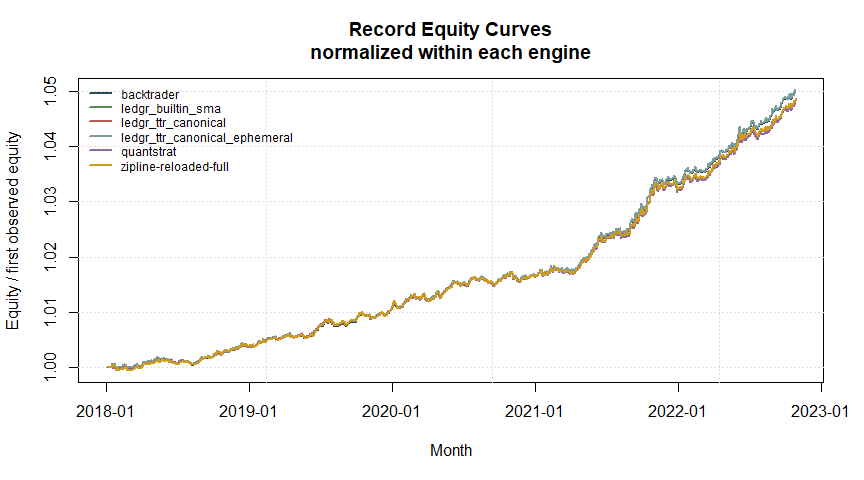

# ledgr Peer Parity And Performance Benchmark Report


## Scope

This report is a repo-local maintainer artifact for v0.1.8.8 / LDG-2476.
It is not package documentation, not pkgdown content, and not a public
release-note performance claim.

The report has two separate jobs:

- compute internal parity checks against the ledgr canonical TTR-backed
  row;
- record local performance timings with the measured boundary stated for
  each engine row.

The parity benchmark asks whether the engines agree on this strategy and
data. The performance benchmark asks how long this local same-host
harness took under the declared boundary. Those are related but not the
same question.

Published external LEAN and Ziplime reference rows remain context-only.
The same-host LEAN row is driven only through the real LEAN CLI; if that
CLI is not usable locally, the row is marked unavailable. VectorBT
remains excluded from the event-driven peer table because it is a
vectorized engine and a different paradigm.

## Harness

The current harness is `dev/bench/peer_benchmark/peer_benchmark.R`.

Smoke command:

``` powershell
& "C:\Program Files\R\R-4.5.2\bin\x64\Rscript.exe" dev/bench/peer_benchmark/peer_benchmark.R --preset smoke
```

The harness writes ignored local artifacts under `dev/bench/results/`:

- one shared bars CSV with input hash;
- per-engine canonical equity curves where available;
- fills and trade summary tables where available;
- engine surface-status rows for unavailable outputs;
- Tier 1, Tier 2, and Tier 3 parity CSV;
- performance timing CSV;
- environment metadata JSON;
- append-only parity history JSON under
  `dev/bench/results/parity_history/`.

## Required Rows

| Row | Status Policy |
|----|----|
| ledgr canonical TTR | Required; errors if `TTR` is missing. |
| ledgr canonical TTR ephemeral | Required; runs the same fold core through an in-memory output handler and must match durable ledgr equity/fills before the run is accepted. |
| ledgr built-in SMA diagnostic | Required; runs through ledgr built-ins. |
| quantstrat | Runs when local R packages are installed; otherwise explicit unavailable row. |
| Backtrader | Managed through `dev/bench/peer_benchmark/python/backtrader/` and run through `python -m uv`. |
| zipline-reloaded full engine | Managed through `dev/bench/peer_benchmark/python/zipline/`; temporary csvdir bundle ingestion plus `zipline.run_algorithm()`. |
| LEAN CLI | Managed through `dev/bench/peer_benchmark/python/lean/`; invokes the local LEAN CLI or reports unavailable with the CLI failure reason. |

Optional peers must emit a status row. Missing fills/trade surfaces are
labeled with unavailable metadata rather than silently dropped.

## Parity Tiers

Tier 1 per-bar parity:

- equity-curve correlation;
- max single-bar equity divergence as a fraction of ledgr equity;
- daily-return correlation;
- cash trajectory match where both engines expose cash;
- position proxy match where both engines expose comparable positions.

Tier 2 derived top-line parity:

- total return;
- annualized return;
- annualized volatility;
- Sharpe ratio where defined;
- max drawdown.

Tier 3 trade-level parity:

- trade count;
- win rate and average trade where the peer exposes comparable realized
  trade data;
- explicit unavailable metadata where the peer does not expose a
  comparable trade surface.

The ledgr crossover strategy used by this report is vectorized over
`ctx$features_wide`. It keeps previous crossover state in
`ctx$state_prev`, but the current feature comparison and target updates
are vector operations rather than a per-instrument R loop.

## Divergence Attribution

When a parity check fails, the candidate explanations are:

1.  ledgr is wrong;
2.  the peer is wrong;
3.  the harness is wrong.

The default mental move is to consider all three, not to assume ledgr
first. Residual divergences are attributed to one of:

- indicator initialization window;
- fill-timing edges;
- cost/margin defaults;
- position-sizing rounding;
- timestamp alignment;
- float-ordering rounding.

## Current Record Results

The record preset is the primary LDG-2476 artifact. Tables and plots
below read the newest matching artifact bundle from
`dev/bench/results/`. They are still internal same-host evidence, not
public ranking material.

Record command:

``` powershell
& "C:\Program Files\R\R-4.5.2\bin\x64\Rscript.exe" dev/bench/peer_benchmark/peer_benchmark.R --preset record
```

Latest record bundle:

| field | value |
|:---|:---|
| created_at | 2026-05-31T11:44:51Z |
| release | v0.1.8.8 |
| preset | record |
| input_hash | 39b78eecbc4aea6a9969853bd29c015d6efced008f5f3e1b4bf1f94695306e56 |
| git_sha | 2b89f4e431581ce9c0239007493595f6d551ce4d |

### Engine Status

This table only shows whether each row completed. Timing interpretation
is in the separate performance section below.

| Engine | Status | Reason |
|:---|:---|:---|
| ledgr_ttr_canonical | DONE |  |
| ledgr_ttr_canonical_ephemeral | DONE |  |
| ledgr_builtin_sma | DONE |  |
| quantstrat | DONE |  |
| backtrader | DONE |  |
| zipline-reloaded-full | DONE |  |
| LEAN | UNAVAILABLE | LEAN CLI unavailable: lean backtest rejected the temporary project root; local lean init organization setup is required. |

### Performance Benchmark

The performance benchmark uses the same record input as the parity
benchmark: record, 500 instruments, 1260 daily bars, and 630,000 total
bars.

The report now splits each DONE row into three measured phases:

- `Ingestion`: from timed-window start until the engine has native data
  structures ready to iterate.
- `Engine`: from ready-to-iterate until strategy execution completes and
  engine state is final.
- `Results`: from final engine state until canonical equity/fills/trades
  are materialized for this harness.

The three phase columns must reconcile to `Total` within 0.5 seconds or
the harness aborts. LEAN is the one explicit exception: the local CLI
row is unavailable here; if it becomes available, the CLI subprocess
boundary is bucketed as engine time because ingestion/run/extraction are
not separable from outside the CLI.

This is a real local performance benchmark under stated boundaries. It
is still not a public speed ranking because the rows intentionally
expose different engine surfaces. Ledgr now appears in two rows: durable
and ephemeral. The ephemeral row removes DuckDB snapshot/event-log
persistence while keeping the same fold core, so the durability cost is
visible as the delta between those two ledgr rows.

Use `Total` for the engine-row boundary and `Full row` for the current
wrapper cost around that row. Large full-row overhead, especially in
Python rows, reflects per-invocation process/environment setup outside
the phase total.

Do not compare the bars/sec here directly to the v0.1.8.7
`peer_sma_crossover` row as a pure version regression. The old row used
the same 500 x 1260 scale but a continuous `fast > slow` target strategy
and far fewer fills. This row uses high-turnover crossover-state
semantics plus per-engine parity artifacts and surface-status outputs.

| Engine | Status | Full row | Ingestion | Engine | Results | Total | Bars/sec |
|:---|:---|:---|:---|:---|:---|:---|:---|
| ledgr_ttr_canonical | DONE | 242.120 | 20.710 | 138.370 | 83.000 | 242.080 | 2,602.45 |
| ledgr_ttr_canonical_ephemeral | DONE | 289.660 | 10.970 | 154.750 | 123.900 | 289.620 | 2,175.26 |
| ledgr_builtin_sma | DONE | 252.220 | 19.690 | 151.970 | 80.560 | 252.220 | 2,497.82 |
| quantstrat | DONE | 504.770 | 12.440 | 490.750 | 1.360 | 504.550 | 1,248.64 |
| backtrader | DONE | 82.120 | 0.655 | 79.704 | 0.153 | 80.512 | 7,824.9 |
| zipline-reloaded-full | DONE | 295.000 | 14.149 | 279.278 | 0.451 | 293.879 | 2,143.74 |
| LEAN | UNAVAILABLE | 2.200 | NA | NA | NA | NA | NA |

### Phase Definitions

| Engine | Ingestion | Engine | Results |
|----|----|----|----|
| `ledgr_ttr_canonical` | `read.csv`, timestamp normalization, DuckDB snapshot creation, experiment construction | `ledgr_run()` | `ledgr_results()` for equity/fills plus canonical materialization |
| `ledgr_ttr_canonical_ephemeral` | `read.csv`, timestamp normalization, in-memory bars/features/projection construction | `ledgr_execute_fold()` with `ledgr_memory_output_handler()` | event-stream equity/fills reconstruction plus canonical materialization |
| `ledgr_builtin_sma` | Same durable ledgr boundary with built-in SMA features | `ledgr_run()` | `ledgr_results()` for equity/fills plus canonical materialization |
| `quantstrat` | `read.csv`, xts/globalenv construction, portfolio/account/orders/strategy setup | `applyStrategy()` plus account updates | account/transaction extraction plus canonical materialization |
| `backtrader` | `read.csv`, `PandasData` construction, `cerebro.adddata` loop | `cerebro.run()` | CSV writes from in-memory observer/fill rows |
| `zipline-reloaded-full` | `read.csv`, temporary csvdir creation, bundle registration and ingest | `run_algorithm()` | performance-frame transaction/equity extraction plus CSV writes |
| `LEAN` | Not separable from outside the CLI | whole CLI subprocess if available | Not separable from outside the CLI |

Boundary ambiguity decisions: quantstrat initialization is ingestion
because it builds native portfolio/order state before strategy
iteration; zipline bundle registration/ingest is ingestion because it
creates the native bundle consumed by `run_algorithm()`; LEAN CLI phases
are unavailable from outside the CLI and are disclosed as such.

Timing boundary notes:

| Engine | Boundary |
|:---|:---|
| ledgr_ttr_canonical | durable ledgr: ingestion=bars CSV read plus DuckDB snapshot plus experiment construction; engine=ledgr_run; results=ledgr_results equity/fills plus canonical materialization |
| ledgr_ttr_canonical_ephemeral | ephemeral ledgr: ingestion=bars CSV read plus in-memory bars/features/projection; engine=ledgr_execute_fold with memory output handler; results=event-stream equity/fills reconstruction plus canonical materialization |
| ledgr_builtin_sma | durable ledgr built-in SMA: ingestion=bars CSV read plus DuckDB snapshot plus experiment construction; engine=ledgr_run; results=ledgr_results equity/fills plus canonical materialization |
| quantstrat | ingestion=bars CSV read, xts/globalenv setup, initPortf/initAcct/initOrders/strategy setup; engine=applyStrategy plus account updates; results=equity/transaction extraction plus canonical writes |
| backtrader | ingestion=bars CSV read, PandasData feed construction, cerebro.adddata loop; engine=cerebro.run; results=canonical equity/fill/trade writes |
| zipline-reloaded-full | ingestion=bars CSV read, temporary csvdir construction, bundle registration and ingest; engine=zipline run_algorithm; results=canonical equity/fill/trade writes |
| LEAN | LEAN CLI phase split is unavailable locally; if configured, the whole CLI subprocess is the measured boundary, otherwise the row is UNAVAILABLE |


The performance comparison is phase-explicit for DONE rows. The LEAN row
is unavailable in this local run because the CLI failed before the
engine could start.

### Historical Shape Context

The v0.1.8.7 closeout row was 500 x 1260 with continuous target
semantics and about 13k fills. This record is 500 x 1260 with
crossover-event semantics and about 68k ledgr fills. The three-phase
table is therefore the useful artifact: it shows ingestion, engine, and
result materialization separately instead of collapsing a high-turnover
workload into one headline number.

### Parity Glossary

The raw CSV keeps machine-readable field names for downstream scripts.
The tables below use shorter labels:

| Label | Meaning |
|----|----|
| `Tier 1` | Per-bar equity/return parity status. `pass` means the row passed the current tolerance; `review` means the row has a documented divergence attribution. |
| `Parity surface` | Which comparable artifacts exist for that peer. Quantstrat is partial because this harness currently gets account equity and transaction count, not comparable fills or realized trade P&L. |
| `Equity corr` | Correlation between peer equity and ledgr canonical equity. Closer to 1 is better. |
| `Max div` | Largest single-bar equity difference versus ledgr canonical, shown as a percent of ledgr equity. Lower is better. |
| `Return corr` | Correlation between one-bar equity changes. Closer to 1 is better. |
| `Total return delta` | Peer total return minus ledgr canonical total return, in percentage points. |
| `Sharpe diff` | Peer Sharpe minus ledgr canonical Sharpe. |
| `Max DD delta` | Peer max drawdown minus ledgr canonical max drawdown, in percentage points. |
| `Trade count diff` | Peer closed-trade count minus ledgr canonical closed-trade count. |

### Tier 1 Per-Bar Parity

| Peer | Tier 1 | Parity surface | Equity corr | Max div | Return corr |
|:---|:---|:---|:---|:---|:---|
| ledgr_ttr_canonical_ephemeral | pass | equity + fills + realized trades | 1.000000 | \<0.0001% | 1.000000 |
| ledgr_builtin_sma | pass | equity + fills + realized trades | 1.000000 | 0% | 1.000000 |
| quantstrat | review (partial surface) | partial: equity + trade count only | 0.999820 | 0.2364% | 0.984103 |
| backtrader | pass | equity + fills + realized trades | 0.999997 | 0.07605% | 0.996982 |
| zipline-reloaded-full | pass | equity + fills + realized trades | 0.999708 | 0.3072% | 0.185355 |
| LEAN | review | unavailable | NA | NA | NA |

Rows marked `review` keep the standard divergence-source attribution:

| Peer | Review attribution       |
|:-----|:-------------------------|
| LEAN | unavailable peer surface |

### Per-Bar Divergence Attribution

Every DONE peer row writes a per-bar `_divergence.csv` plus a
`_divergence_summary.csv`. Attribution is computed from equity
divergence and same-timestamp fill/transaction comparisons against
`ledgr_ttr_canonical`.

| Peer | Total abs divergence | Diverging bars | First divergence | Indicator warmup | Fill timing | Calendar | Position size | Float rounding | Other |
|:---|:---|---:|:---|:---|:---|:---|:---|:---|:---|
| ledgr_ttr_canonical_ephemeral | 0.00004439242 | 1232 | 2018-01-15T00:00:00Z | 0% | 0% | 0% | 0% | 100.0% | 0% |
| ledgr_builtin_sma | 0 | 0 | NA | 0% | 0% | 0% | 0% | 100.0% | 0% |
| quantstrat | 7123941\. | 1250 | 2018-01-15T00:00:00Z | 0% | 98.53% | 0% | 1.474% | 0% | 0% |
| backtrader | 1767730\. | 1250 | 2018-01-15T00:00:00Z | 0% | 0.1725% | 0% | 99.83% | 0% | 0% |
| zipline-reloaded-full | 4910988\. | 1000 | 2018-01-16T00:00:00Z | 0% | 25.76% | 0% | 74.24% | 0% | 0% |


### Tier 2 Top-Line Metrics

| Peer | Total return delta | Sharpe diff | Max DD delta |
|:---|:---|:---|:---|
| ledgr_ttr_canonical_ephemeral | \<0.00001 pp | 0.0000000000000683897 | \<0.00001 pp |
| ledgr_builtin_sma | 0 pp | 0 | 0 pp |
| quantstrat | -0.21639 pp | -0.0921541 | -0.0066419 pp |
| backtrader | -0.013911 pp | 0.0201086 | -0.000022846 pp |
| zipline-reloaded-full | -0.16168 pp | -0.0816218 | -0.0025964 pp |
| LEAN | NA | NA | NA |

### Tier 3 Trade Surface

| Peer | Trade count diff | Trade surface | Parity note |
|:---|---:|:---|:---|
| ledgr_ttr_canonical_ephemeral | 0 | available_realized_pnl | equity + fills + realized trades |
| ledgr_builtin_sma | 0 | available_realized_pnl | equity + fills + realized trades |
| quantstrat | 33621 | trade_count_available_only | partial: equity + trade count only |
| backtrader | -332 | available_realized_pnl | equity + fills + realized trades |
| zipline-reloaded-full | -625 | available_realized_pnl | equity + fills + realized trades |
| LEAN | NA | unavailable | unavailable |

### Equity Curves

The plot normalizes equity for each engine to its first observed value,
so shape differences are visible without implying an absolute
performance ranking between engines.



### Surface Availability

| engine | equity | fills | trades |
|:---|:---|:---|:---|
| ledgr_ttr_canonical | available | available | available_realized_pnl |
| ledgr_ttr_canonical_ephemeral | available | available | available_realized_pnl |
| ledgr_builtin_sma | available | available | available_realized_pnl |
| quantstrat | available | available | trade_count_available_only |
| backtrader | available | available | available_realized_pnl |
| zipline-reloaded-full | available | available | available_realized_pnl |
| LEAN | unavailable | unavailable | unavailable |
