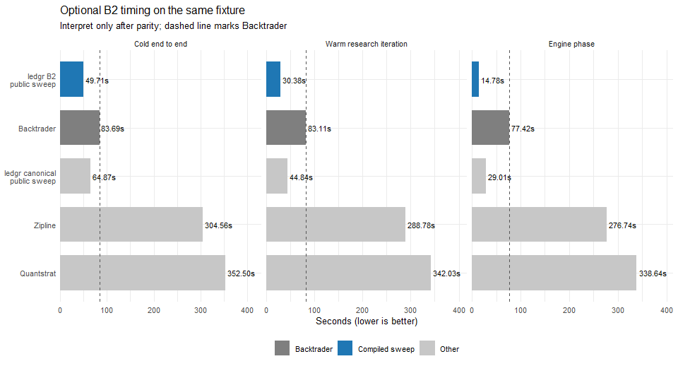
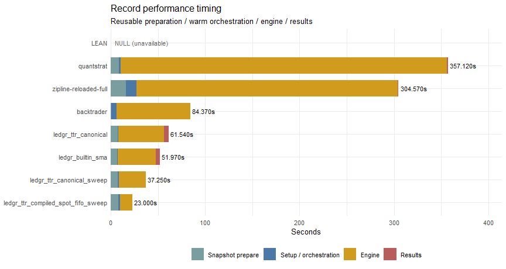
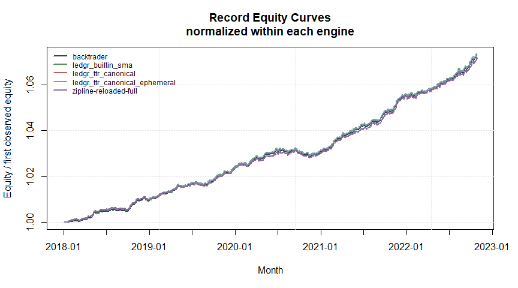
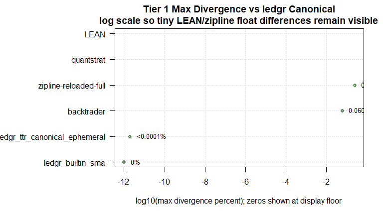

# ledgr Peer Parity And Performance Benchmark Report


This tracked report records the v0.2.1.0 internal same-host peer
workload. Parity is interpreted before timing. The report preserves
phase boundaries, unavailable engines, and classified divergences
without turning one host and one fixture into a public engine ranking.

The exact sampled record command was:

``` powershell
& dev/bench/peer_benchmark/run_record.ps1 `
  -RepoRoot "C:\tmp\ledgr-ws12" `
  -Release "v0.2.1.0" `
  -LedgrOrder "ttr-first"
```

The exact ignored local prefix is
`dev/bench/results/peer_benchmark_record_20260926T080725Z`. It was
measured from commit `c7d936ddccbdf7affbdcd1c9be22f7d8fdaa7eb0`; the
exact benchmark harness has SHA-256
`9ac0c8f2b5f276000f10028104de9824f106719705307329853f6a2de283edaf`. It
ran under R 4.6.1 ucrt on Windows build 26200. Quantstrat 0.25 completed
from the isolated library with the ticket-pinned blotter 0.17.0,
FinancialInstrument 1.3.0, xts 0.14.2, and TTR 0.24.4. Backtrader and
zipline-reloaded completed through pinned `uv` environments. Local LEAN
was unavailable because its CLI root uses an obsolete organization
layout. No hosted LEAN service was used.

The report checks every ledgr row before interpreting its timing. The
canonical public sweep completed in 39.68 seconds cold and 32.31 seconds
warm; the public compiled sweep completed in 27.19 seconds cold and
17.60 seconds warm. The two public sweep rows are exact across all 1,260
equity rows, 68,201 fills, and the realized-trade row after normalizing
only the engine label. Against durable ledgr, fills and trades are
exact; compensated production-inline equity passes the existing relative
`all.equal()` tolerance of `1e-8`, with maximum absolute residual
`1.9744e-07`, maximum relative residual `1.971e-14`, and affected column
`equity` across 1,222 rows. Earlier diagnostic peer CSVs used
reconstructed equity; this final record uses compensated
production-inline equity as the memory reference. Richer surfaces come
from an explicitly untimed private oracle and are used only for parity.
The report retains peer residuals and partial surfaces rather than
turning a numerical tolerance into a claim of full parity. Zipline now
pairs all 1,260 source sessions positionally and records daily-return
correlation `0.987974`; the v0.2.0.1 report’s `0.146064` was produced by
the disclosed one-day timestamp misalignment and remains historical
evidence rather than being rewritten.

Workstream 17 also corrects the indicator boundary. All published TTR
rows now use exported `ledgr_ind_ttr("SMA")`; the retired private
wrapper is absent. Durable public TTR and built-in SMA ran in separate
fresh R processes with identical R, library-path and package-version
records. Their feature axes and NA masks are exact; 1,260,000 numeric
cells pass the existing `1e-8` tolerance with maximum absolute residual
`7.567e-10`. Equity, fills and realized trades are exact. Timing does
not identify a source effect: the promoted TTR-first record reports warm
clocks of 53.02 and 68.33 seconds. The six-order attribution spike
independently places every source in every process position twice; each
contrast changes direction. That spike classifies the old 9.57-second
chart gap as order-confounded rather than a package-speed difference. A
later built-in-first diagnostic is excluded because its command was not
recorded and its first-position clock did not reproduce the spike.

> **Scope of this report**
>
> Internal repo-local benchmark. Same host, same seed, single fixture. A
> B2 row, when explicitly requested, remains an opt-in
> (`compiled_accounting_model = "spot_fifo"`) on ledgr’s public
> one-candidate sweep path. Default ledgr execution remains canonical R.
> Numbers are for maintainer use and release closeout, not a public
> ranking or a universal performance claim.

## Optional B2 timing context

When requested, the B2 row uses ledgr’s explicit
`compiled_accounting_model = "spot_fifo"` hot frame on the same fixture,
seed, shared bars, and SMA crossover strategy as the other rows. If it
is absent, this section reports that state rather than synthesizing a
comparison.

| Surface | B2 seconds | Backtrader seconds | B2 / Backtrader | B2 reduction vs Backtrader |
|:---|:---|:---|:---|:---|
| Cold end to end | 27.190 | 89.080 | 0.31x | 69.5% |
| Warm research iteration | 17.600 | 88.498 | 0.20x | 80.1% |
| Engine phase | 14.710 | 82.605 | 0.18x | 82.2% |

The three clocks answer different questions. Cold includes the reusable
sealed snapshot. Warm measures the public research iteration over that
unchanged snapshot. Engine isolates the fold slice replaced by the
compiled hot frame. The timed sweep results phase uses retained inline
facts and public accessors; the private full-surface parity oracle runs
outside every reported clock.



## Indicator source boundary

The old report always ran a private TTR wrapper before built-in SMA in
one R process. That row order could not attribute its 9.57-second
difference. This record replaces the wrapper with exported
`ledgr_ind_ttr("SMA")` everywhere and runs the two durable rows in
independent child processes. LTB-0075 also reverses their launch order
on a small executable fixture; that detector is not another peer record.

| Surface | Standard | Result | Max absolute residual | Max relative residual |
|----|----|---:|---:|---:|
| feature axis | exact | PASS | 0 | 0 |
| feature NA mask | exact | PASS | 0 | 0 |
| feature values | relative `all.equal()` tolerance `1e-8` | PASS | 7.567e-10 | 1.182e-13 |

| Order     | Source         | Cold s | Warm s | Engine s |
|-----------|----------------|-------:|-------:|---------:|
| TTR first | public TTR SMA |  60.82 |  53.02 |    47.44 |
| TTR first | built-in SMA   |  76.16 |  68.33 |    61.67 |

The six-permutation attribution spike carries the source conclusion. Its
first-position means were 50.635 seconds for built-in SMA, 51.050 for
the private wrapper and 51.295 for public TTR, and every pair changed
direction by process position. The old 9.57-second gap therefore did not
reproduce as an indicator-source cost.

A later built-in-first diagnostic exists beside the promoted record, but
its command was not recorded and its first-launched built-in row took
65.50 seconds against the spike’s matching first-position observations
of 50.530 and 50.740 seconds. It is not loaded by this report and
supports no attribution claim. The public-adapter correction is a
measurement-boundary fix, not a package speedup.

## Why parity comes before timing

A speed number only matters if the engine produces the same answer. When
the compiled row is present, the following check requires exact identity
for fills, trades, and every non-floating equity field. Floating equity
uses only the already registered relative `all.equal()` tolerance of
`1e-8` and reports its residuals.

| Surface | Standard | Result | Max absolute residual | Max relative residual | Affected columns | Affected rows |
|:---|:---|:---|---:|---:|:---|---:|
| equity | relative all.equal tolerance 1e-8 | PASS | 0 | 0 |  | 0 |
| fills | exact | PASS | 0 | 0 | none | 0 |
| trades | exact | PASS | 0 | 0 | none | 0 |

The report renders compiled timing only after the registered comparisons
pass. Peer-by-peer tolerance results against durable ledgr follow below;
timing does not waive a failed semantic comparison.

## Full peer comparison

A compiled row, when requested, uses the same fixture as the other
engines. Backtrader, Zipline, quantstrat, and LEAN retain their declared
lifecycle boundaries and availability states; no row is treated as
universally representative of its engine or language.

Canonical durable and public-sweep rows track the audited run workflow
and the interactive research workflow ledgr ships. An optional B2 sweep
row tracks the opt-in compiled hot frame. Keeping those labels distinct
prevents reading a compiled opt-in result as a default ledgr claim.

| Engine row | Status | Cost | Risk | Compiled | Full row | Snapshot prepare | Setup / orchestration | Engine phase | Results | Cold | Warm | Bars/sec |
|:---|:---|:---|:---|:---|:---|:---|:---|:---|:---|:---|:---|:---|
| ledgr_ttr_canonical | DONE | cost_zero | risk_none | NA | 60.860 | 7.800 | 0.360 | 47.440 | 5.220 | 60.820 | 53.020 | 10,358.4 |
| ledgr_ttr_canonical_sweep | DONE | cost_zero | risk_none | NA | 39.770 | 7.370 | 2.460 | 29.850 | 0.000 | 39.680 | 32.310 | 15,877 |
| ledgr_ttr_compiled_spot_fifo_sweep | DONE | cost_zero | risk_none | spot_fifo | 27.250 | 9.590 | 2.830 | 14.710 | 0.060 | 27.190 | 17.600 | 23,170.3 |
| ledgr_builtin_sma | DONE | cost_zero | risk_none | NA | 76.190 | 7.830 | 0.470 | 61.670 | 6.190 | 76.160 | 68.330 | 8,272.06 |
| quantstrat | DONE | NA | NA | NA | 427.110 | 9.460 | 1.970 | 414.330 | 1.190 | 426.950 | 417.490 | 1,475.58 |
| backtrader | DONE | NA | NA | NA | 89.110 | 0.582 | 5.627 | 82.605 | 0.266 | 89.080 | 88.498 | 7,072.29 |
| zipline-reloaded-full | DONE | NA | NA | NA | 338.230 | 17.063 | 14.558 | 305.732 | 0.877 | 338.230 | 321.167 | 1,862.64 |
| LEAN | UNAVAILABLE | NA | NA | NA | NULL | NULL | NULL | NULL | NULL | NULL | NULL | NA |

Read `Cold` as the sum of snapshot preparation, setup/orchestration,
engine, and results. Read `Warm` as the same row without reusable
snapshot preparation. `Full row` is the wrapper clock around the engine
row; phase definitions are in the Methodology section.

For an unavailable engine, every displayed performance clock is `NULL`.
A failed wrapper attempt may have elapsed time in its raw metadata, but
that is diagnostic latency rather than a completed benchmark result.

The public-sweep setup field is broader than experiment-object
construction. It is the complete public `ledgr_sweep()` wall not covered
by its candidate fold and inline-results clocks, plus experiment and
grid construction. It therefore includes warm snapshot reads, bars
matrices and views, validation, feature and task preparation, and sweep
retention/orchestration. The durable row exposes no matching subclock:
analogous work inside `ledgr_run()` remains in that row’s engine phase.
Compare cold and warm totals across those rows; use the colored segments
only as each row’s declared decomposition.

For peer comparison, this complete boundary is the cold end-to-end view
when the engines perform meaningfully comparable preparation and produce
the required outputs. ledgr’s repeated research workflow has a separate
warm clock over an existing unchanged, verified snapshot. Snapshot
preparation is paid once per unchanged data-and-facts identity and again
after that identity changes.



## Equity curves

Each engine’s equity is normalized to its first observed value, so curve
shape is comparable without implying an absolute return ranking. A
flat-overlapping bundle of curves is the expected pattern when parity
holds; visible separation is a divergence-source signal worth
investigating in the parity tables below.



## Peer parity

ledgr’s canonical TTR row is the parity reference. Each peer is compared
against it across three tiers: per-bar equity behavior, derived top-line
metrics, and trade-level surface. A peer that disagrees with canonical
TTR gets a `review` status and a documented divergence attribution
rather than being treated as wrong by default.

The mental move when a parity check fails is to consider three
candidates in order: ledgr is wrong, the peer is wrong, the harness is
wrong. The residual difference is then attributed to a named source:
indicator initialization window, fill-timing edge, cost or margin
default, position-sizing rounding, timestamp alignment, or
float-ordering rounding.

### Tier 1: per-bar equity behavior

| Peer | Tier 1 | Parity surface | Retained rows | Equity corr | Max div | Return corr |
|:---|:---|:---|:---|:---|:---|:---|
| ledgr_ttr_canonical_sweep | pass | equity + fills + realized trades | 100.0% | 1.000000 | 0% | 1.000000 |
| ledgr_ttr_compiled_spot_fifo_sweep | pass | equity + fills + realized trades | 100.0% | 1.000000 | 0% | 1.000000 |
| ledgr_builtin_sma | pass | equity + fills + realized trades | 100.0% | 1.000000 | 0% | 1.000000 |
| quantstrat | review (partial surface) | partial: equity + fills + trade count; no realized trade P&L | 100.0% | 0.999778 | 0.2374% | 0.987795 |
| backtrader | pass | equity + fills + realized trades | 99.2% | 0.999999 | 0.06082% | 0.999746 |
| zipline-reloaded-full | review (weak return correlation) | equity + fills + realized trades | 100.0% | 0.999832 | 0.2002% | 0.987974 |
| LEAN | review | unavailable | not recorded | NA | NA | NA |

Rows in `review` carry an explicit attribution:

| Peer | Review attribution |
|:---|:---|
| quantstrat | partial surface: no comparable realized-trade P&L |
| zipline-reloaded-full | equity-level tolerance passes, but daily-return correlation is 0.987974 |
| LEAN | unavailable peer surface |



### Tier 2: derived top-line metrics

| Peer | Total return delta | Sharpe diff | Max DD delta |
|:---|:---|:---|:---|
| ledgr_ttr_canonical_sweep | 0 pp | 0 | 0 pp |
| ledgr_ttr_compiled_spot_fifo_sweep | 0 pp | 0 | 0 pp |
| ledgr_builtin_sma | 0 pp | 0 | 0 pp |
| quantstrat | -0.16107 pp | -0.106235 | 0.0025844 pp |
| backtrader | -0.055685 pp | -0.00973772 | -0.00017200 pp |
| zipline-reloaded-full | -0.18998 pp | -0.125183 | -0.0019703 pp |
| LEAN | NA | NA | NA |

### Tier 3: trade-level surface

| Peer | Trade count diff | Trade surface | Parity note |
|:---|---:|:---|:---|
| ledgr_ttr_canonical_sweep | 0 | available_realized_pnl | equity + fills + realized trades |
| ledgr_ttr_compiled_spot_fifo_sweep | 0 | available_realized_pnl | equity + fills + realized trades |
| ledgr_builtin_sma | 0 | available_realized_pnl | equity + fills + realized trades |
| quantstrat | 33777 | trade_count_available_only | partial: equity + fills + trade count; no realized trade P&L |
| backtrader | -238 | available_realized_pnl | equity + fills + realized trades |
| zipline-reloaded-full | -682 | available_realized_pnl | equity + fills + realized trades |
| LEAN | NA | unavailable | unavailable |

### Per-bar divergence attribution

Every DONE peer row writes a per-bar `_divergence.csv` plus a
`_divergence_summary.csv`. The attribution columns below decompose total
absolute equity divergence against `ledgr_ttr_canonical` into named
sources.

| Peer | Total abs divergence | Diverging bars | First divergence | Indicator warmup | Fill timing | Calendar | Position size | Float rounding | Other |
|:---|:---|---:|:---|:---|:---|:---|:---|:---|:---|
| ledgr_ttr_canonical_sweep | 0 | 0 | NA | n/a (zero divergence) | n/a (zero divergence) | n/a (zero divergence) | n/a (zero divergence) | n/a (zero divergence) | n/a (zero divergence) |
| ledgr_ttr_compiled_spot_fifo_sweep | 0 | 0 | NA | n/a (zero divergence) | n/a (zero divergence) | n/a (zero divergence) | n/a (zero divergence) | n/a (zero divergence) | n/a (zero divergence) |
| ledgr_builtin_sma | 0 | 0 | NA | n/a (zero divergence) | n/a (zero divergence) | n/a (zero divergence) | n/a (zero divergence) | n/a (zero divergence) | n/a (zero divergence) |
| quantstrat | 16597234\. | 1250 | 2018-01-15T00:00:00Z | 0% | 98.96% | 0% | 1.040% | 0% | 0% |
| backtrader | 6931489\. | 1250 | 2018-01-15T00:00:00Z | 0% | 0.01299% | 0% | 99.99% | 0% | 0% |
| zipline-reloaded-full | 10752058\. | 1250 | 2018-01-15T00:00:00Z | 0% | 20.% | 0% | 80.00% | 0% | 0% |

## Methodology

### Harness

The harness lives at `dev/bench/peer_benchmark/peer_benchmark.R`. It
runs two checks per peer: numerical parity against ledgr canonical TTR,
and same-host phase timing. The parity check asks whether the engines
agree on this strategy and data. The timing check asks how long this
local same-host harness took under the declared boundary.

Smoke command:

``` powershell
& "C:\Program Files\R\R-4.6.1\bin\x64\Rscript.exe" dev/bench/peer_benchmark/peer_benchmark.R --preset smoke
```

Record command:

``` powershell
& "C:\Program Files\R\R-4.6.1\bin\x64\Rscript.exe" dev/bench/peer_benchmark/peer_benchmark.R --preset record
```

Record command with the opt-in B2 row:

``` powershell
& "C:\Program Files\R\R-4.6.1\bin\x64\Rscript.exe" dev/bench/peer_benchmark/peer_benchmark.R --preset record --compiled-accounting-model spot_fifo
```

Current-surface cost/risk-chain command:

``` powershell
& "C:\Program Files\R\R-4.6.1\bin\x64\Rscript.exe" dev/bench/peer_benchmark/peer_benchmark.R --preset record --engine-set ledgr-cost --release v0.1.9.6
```

The harness writes ignored local artifacts under `dev/bench/results/`:
one shared bars CSV with input hash, per-engine canonical equity curves
where available, fills and trade summary tables where available, engine
surface-status rows for unavailable outputs, Tier 1/2/3 parity CSVs,
performance timing CSV, environment metadata JSON, and append-only
parity history JSON under `dev/bench/results/parity_history/`.

### Required rows

| Row | Status policy |
|----|----|
| ledgr canonical TTR | Required; errors if `TTR` is missing. |
| ledgr canonical TTR public sweep | Required; calls public `ledgr_sweep()` with one candidate and retained returns/trades. Full equity/fill parity is checked afterward by an untimed internal oracle. |
| ledgr current-surface cost/risk sweep | Optional; enabled with `--engine-set ledgr-cost`; measures public cost/risk-chain sweeps on the same fixture and seed. The legacy resolver row remains an internal diagnostic. |
| ledgr B2 spot-FIFO public sweep | Optional; enabled with `--compiled-accounting-model spot_fifo`; calls the same public one-candidate sweep with the closed compiled selector and must match the canonical sweep before timing is interpreted. |
| ledgr built-in SMA diagnostic | Required; runs through ledgr built-ins. |
| quantstrat | Runs when local R packages are installed; otherwise explicit unavailable row. |
| Backtrader | Managed through `dev/bench/peer_benchmark/python/backtrader/` and run through `python -m uv`. |
| zipline-reloaded full engine | Managed through `dev/bench/peer_benchmark/python/zipline/`; temporary csvdir bundle ingestion plus `zipline.run_algorithm()`. |
| LEAN CLI | Managed through `dev/bench/peer_benchmark/python/lean/`; invokes the local LEAN CLI or reports unavailable with the CLI failure reason. |

Optional peers must emit a status row. Missing fills/trade surfaces are
labeled with unavailable metadata rather than silently dropped.

### Phase definitions

Each DONE row in the performance table is split into four measured
phases:

- **Snapshot preparation**: reusable native data or bundle preparation.
- **Setup / orchestration** (`experiment_setup_sec`): construction and
  other non-engine work repeated for each experiment or public workflow
  call.
- **Engine**: from ready-to-iterate until strategy execution completes
  and engine state is final.
- **Results**: from final engine state through the result surface
  declared by the row. Public sweep rows retain and read returns/trades;
  their richer parity-oracle surfaces are generated outside the reported
  clock.

The four phase columns must reconcile to the cold clock within 0.5
seconds or the harness aborts. The warm clock is setup/orchestration
plus engine plus results.

The internal phase boundary is not identical across rows. Durable ledgr
times the complete public `ledgr_run()` call as engine work. Public
sweep rows expose candidate fold and inline-results clocks; their
remaining public-call wall is recorded as setup/orchestration. The
latter includes warm snapshot reads, matrix/view preparation and
retention assembly, not merely creation of the experiment object. Cold
and warm totals are the cross-row comparison surfaces. The components
explain each row and must not be compared as identical internal
operations. LEAN is the one explicit exception: when the local CLI runs,
the whole CLI subprocess is bucketed as engine time because preparation,
execution, and extraction are not separable from outside the CLI.

| Engine | Snapshot preparation | Setup / orchestration | Engine | Results |
|----|----|----|----|----|
| `ledgr_ttr_canonical` | CSV read, timestamp normalization, and sealed DuckDB snapshot | experiment and run identity | `ledgr_run()` | `ledgr_results()` plus canonical materialization |
| `ledgr_ttr_canonical_sweep` | CSV read, timestamp normalization, and sealed DuckDB snapshot | experiment, one-candidate grid, and public sweep orchestration outside its candidate clocks | public `ledgr_sweep()` candidate fold | inline summary plus public retained returns/trades; full parity oracle excluded |
| `ledgr_ttr_canonical_sweep_with_cost_risk` | Same public sweep boundary | experiment, one-candidate grid, cost model, risk chain, and sweep orchestration | public sweep with cost and risk chains | inline summary plus public retained returns/trades; full parity oracle excluded |
| `ledgr_ttr_compiled_spot_fifo_sweep` | Same public sweep boundary | experiment, one-candidate grid, compiled-model selection, and sweep orchestration | public sweep with `compiled_accounting_model = "spot_fifo"` | inline summary plus public retained returns/trades; full parity oracle excluded |
| `ledgr_builtin_sma` | Same durable ledgr boundary | experiment with built-in SMA features | `ledgr_run()` | `ledgr_results()` plus canonical materialization |
| `quantstrat` | CSV read, xts construction, and global data assignment | portfolio, account, orders, and strategy | `applyStrategy()` plus account updates | equity and transaction extraction plus canonical writes |
| `backtrader` | CSV read and grouped pandas bars | feeds, broker, and strategy construction | `cerebro.run()` | canonical equity, fill, and trade writes |
| `zipline-reloaded-full` | CSV read, csvdir creation, bundle registration, and ingest | algorithm callbacks and calendar | `run_algorithm()` | performance-frame extraction plus canonical writes |
| `LEAN` | Not separable from outside the CLI | Not separable from outside the CLI | whole CLI subprocess if available | Not separable from outside the CLI |

Boundary ambiguity decisions: quantstrat data/xts preparation is
reusable while portfolio, account, order, and strategy construction is
experiment-specific; zipline bundle registration/ingest is reusable
native-data preparation; LEAN CLI phases are unavailable from outside
the CLI.

| Engine | Boundary |
|:---|:---|
| ledgr_ttr_canonical | durable ledgr: snapshot preparation=bars CSV read plus DuckDB snapshot; experiment setup=ledgr_experiment plus run identity; engine=ledgr_run; results=ledgr_results equity/fills plus canonical materialization |
| ledgr_ttr_canonical_sweep | public one-candidate ledgr_sweep: snapshot preparation=bars CSV read plus DuckDB snapshot; experiment setup=ledgr_experiment, grid, and sweep orchestration outside candidate engine/results clocks; engine=public sweep candidate fold; results=public retained returns/trades; full parity surfaces come from an untimed internal oracle |
| ledgr_ttr_compiled_spot_fifo_sweep | public one-candidate ledgr_sweep with compiled_accounting_model=spot_fifo: same snapshot/strategy surface as ledgr_ttr_canonical_sweep; engine uses compiled spot-FIFO fill/accounting batch; results=public retained returns/trades; full parity surfaces come from an untimed internal oracle |
| ledgr_builtin_sma | durable ledgr built-in SMA: snapshot preparation=bars CSV read plus DuckDB snapshot; experiment setup=ledgr_experiment plus run identity; engine=ledgr_run; results=ledgr_results equity/fills plus canonical materialization |
| quantstrat | snapshot preparation=bars CSV read plus xts/globalenv setup; experiment setup=portfolio/account/orders/strategy setup; engine=applyStrategy plus account updates; results=equity/transaction extraction plus canonical writes |
| backtrader | snapshot preparation=bars CSV read plus grouped pandas bars; experiment setup=PandasData feeds, cerebro.adddata, broker and strategy; engine=cerebro.run; results=canonical equity/fill/trade writes |
| zipline-reloaded-full | snapshot preparation=bars CSV read, temporary csvdir construction, bundle registration and ingest; experiment setup=algorithm callbacks and calendar; engine=zipline run_algorithm; results=canonical equity/fill/trade writes |
| LEAN | snapshot preparation=shared-bars inspection; experiment setup=temporary project and config; engine=whole LEAN CLI subprocess including inseparable internal data loading; results=result extraction and canonical writes |

### Parity tiers

Tier 1 per-bar parity: equity-curve correlation, max single-bar equity
divergence as a fraction of ledgr equity, daily-return correlation, cash
trajectory match where both engines expose cash, and position proxy
match where both engines expose comparable positions.

Tier 2 derived top-line parity: total return, annualized return,
annualized volatility, Sharpe ratio where defined, and max drawdown.

Tier 3 trade-level parity: trade count, win rate and average trade where
the peer exposes comparable realized trade data, and explicit
unavailable metadata where the peer does not.

The ledgr crossover strategy used by this report is vectorized over
`ctx$features_wide`. It keeps previous crossover state in
`ctx$state_prev`, but the current feature comparison and target updates
are vector operations rather than a per-instrument R loop.

### Parity glossary

| Label | Meaning |
|----|----|
| `Tier 1` | Per-bar equity/return parity status. `pass` means the row passed the current tolerance; `review` means the row has a documented divergence attribution. |
| `Parity surface` | Which comparable artifacts exist for that peer. Quantstrat is partial because this harness gets account equity, transactions, and a trade count, but not comparable realized trade P&L. |
| `Equity corr` | Correlation between peer equity and ledgr canonical equity. Closer to 1 is better. |
| `Max div` | Largest single-bar equity difference versus ledgr canonical, shown as a percent of ledgr equity. Lower is better. |
| `Return corr` | Correlation between one-bar equity changes. Closer to 1 is better. |
| `Total return delta` | Peer total return minus ledgr canonical total return, in percentage points. |
| `Sharpe diff` | Peer Sharpe minus ledgr canonical Sharpe. |
| `Max DD delta` | Peer max drawdown minus ledgr canonical max drawdown, in percentage points. |
| `Trade count diff` | Peer closed-trade count minus ledgr canonical closed-trade count. |

### Engine status

| Engine | Status | Reason |
|:---|:---|:---|
| ledgr_ttr_canonical | DONE |  |
| ledgr_ttr_canonical_sweep | DONE |  |
| ledgr_ttr_compiled_spot_fifo_sweep | DONE |  |
| ledgr_builtin_sma | DONE |  |
| quantstrat | DONE |  |
| backtrader | DONE |  |
| zipline-reloaded-full | DONE |  |
| LEAN | UNAVAILABLE | LEAN CLI unavailable: lean backtest rejected the temporary project root; local lean init organization setup is required. |

### Surface availability

| engine | equity | fills | trades |
|:---|:---|:---|:---|
| ledgr_ttr_canonical | available | available | available_realized_pnl |
| ledgr_ttr_canonical_sweep | available | available | available_realized_pnl |
| ledgr_ttr_compiled_spot_fifo_sweep | available | available | available_realized_pnl |
| ledgr_builtin_sma | available | available | available_realized_pnl |
| quantstrat | available | available | trade_count_available_only |
| backtrader | available | available | available_realized_pnl |
| zipline-reloaded-full | available | available | available_realized_pnl |
| LEAN | unavailable | unavailable | unavailable |

### Latest record bundle

| field | value |
|:---|:---|
| created_at | 2026-09-26T08:07:25Z |
| release | v0.2.1.0 |
| preset | record |
| input_hash | 0b183457b3fe720d63b02a90fe552e1202fdb31b4e967a75e91304f9d3e416fc |
| git_sha | c7d936ddccbdf7affbdcd1c9be22f7d8fdaa7eb0 |
| process_tree_peak_mib | 1715.7 |
| peak_sampling_interval_sec | 1 |

### Isolated quantstrat environment

| Package | Version | GitHub SHA | Library |
|:---|:---|:---|:---|
| quantstrat | 0.25 | 1114e4a1a8a3b68d2fb7a62b52d743cbc5e4b39f | C:/tmp/ledgr-quantstrat-batch10-lib/quantstrat |
| blotter | 0.17.0 | dddb448f7a5d6eb63dfbe421ba80779e820a3601 | C:/tmp/ledgr-quantstrat-batch10-lib/blotter |
| FinancialInstrument | 1.3.0 | 98bcf09fc80e25611897404dcd59321ef67850ac | C:/tmp/ledgr-quantstrat-batch10-lib/FinancialInstrument |
| xts | 0.14.2 |  | C:/tmp/ledgr-quantstrat-batch10-lib/xts |
| TTR | 0.24.4 |  | C:/tmp/ledgr-quantstrat-batch10-lib/TTR |

## Caveats

### Same-host scope

Hardware, R version, OS, and toolchain versions are pinned to the
maintainer’s environment. The numbers are comparable within this record
bundle. They are not a portable speed ranking across hosts or a public
benchmark claim.

### Interpreting the B2 row

The B2 row is interpreted only when measured through the public
one-candidate sweep on the same peer fixture as the external engines:
same shared bars CSV, same fast/slow SMA settings, same seed. It is also
an opt-in compiled accelerator measurement, not a default ledgr claim.
ledgr’s default execution path remains canonical R. Do not combine B2
numbers arithmetically with workload-grid B2 rows, which use a different
fixture.

### Engines deliberately excluded

VectorBT is excluded from the event-driven peer table because it is a
vectorized engine and a different paradigm. Published external LEAN and
Zipline reference rows remain context-only. The same-host LEAN row is
driven only through the real LEAN CLI; if that CLI is not usable
locally, the row is marked unavailable.

### Historical-shape context

Do not compare bars/sec here directly to the v0.1.8.7
`peer_sma_crossover` row as a pure version regression. That row used the
same 500 x 1260 scale but a continuous `fast > slow` target strategy and
far fewer fills. This row uses high-turnover crossover-state semantics
plus per-engine parity artifacts and surface-status outputs. The
four-phase table is the useful comparison artifact, not a single
bars/sec headline.
