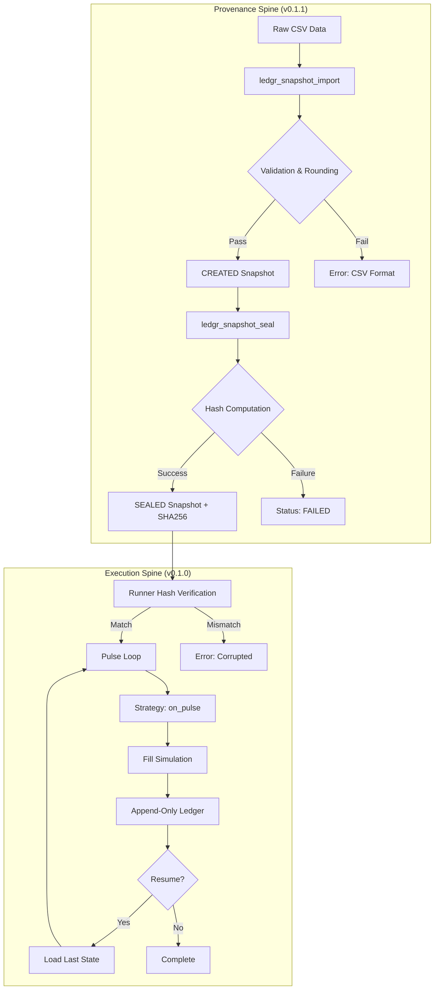
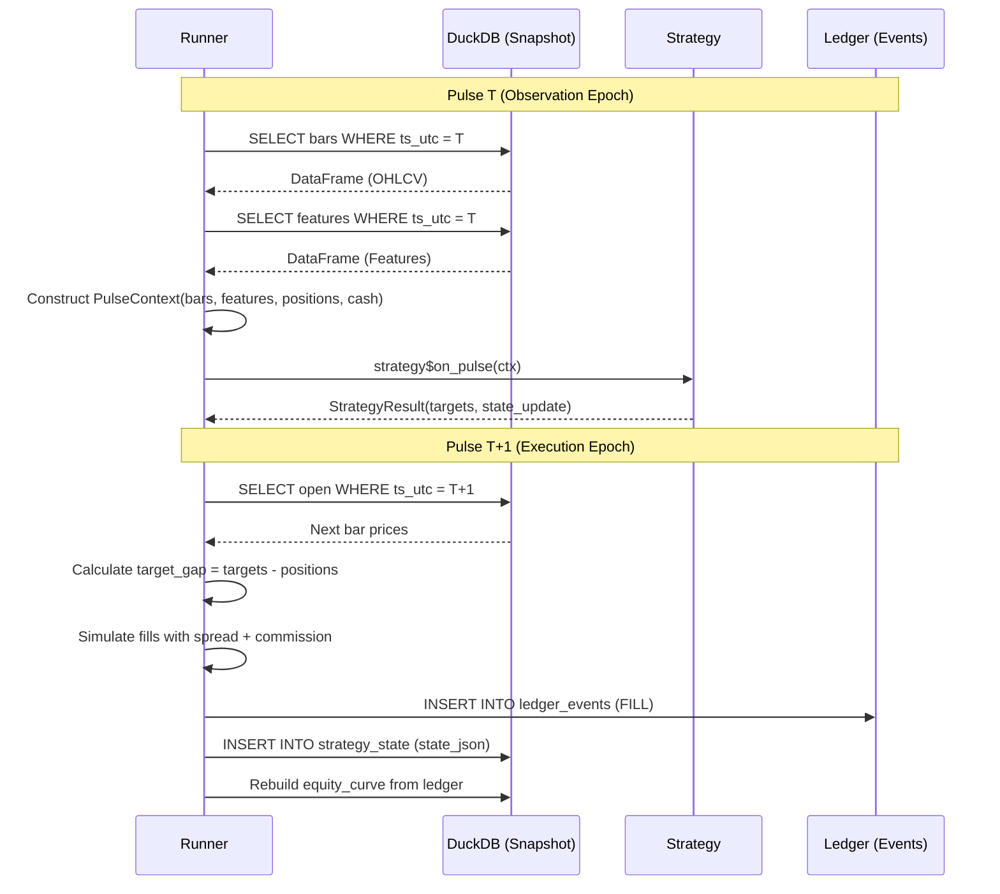
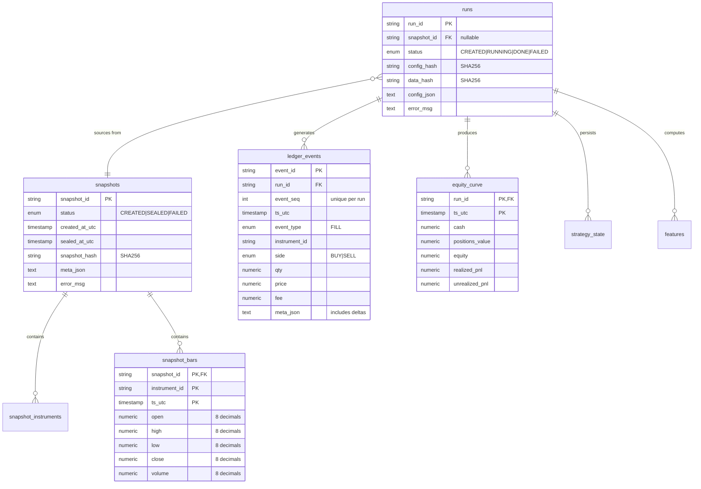
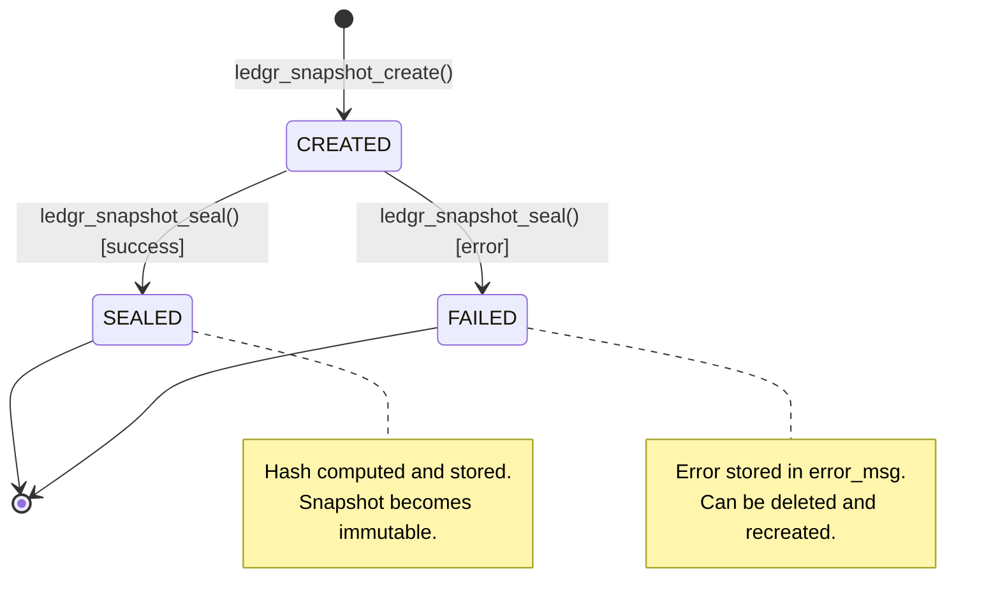
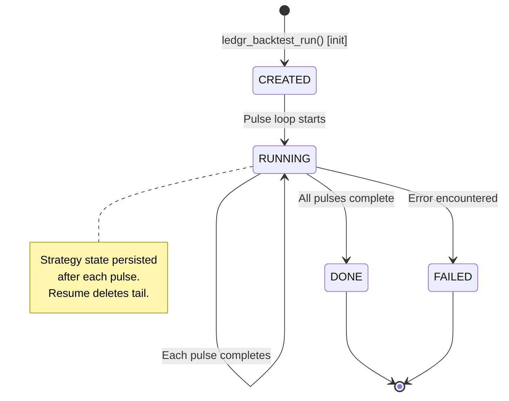
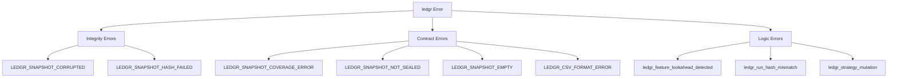

# ledgr v0.1.2 Specification — The Clarity Milestone

**Version:** 1.0.0  
**Status:** Ready for Implementation  
**Scope Gate:** Documentation, demonstrations, and developer onboarding. **No changes to core execution, hashing, or database schema.**

---

## 0. Executive Summary

ledgr v0.1.2 transforms the "Infrastructure-First" foundation into a **comprehensible, navigable, and verifiable framework**. This milestone provides:

1. **Visual Mental Models**: Architecture diagrams showing the dual-spine design
2. **Killer Feature Demos**: Proving crash recovery, tamper detection, and lookahead prevention
3. **Role-Based Documentation**: API guides for Librarians, Researchers, Auditors, and Developers
4. **Design Rationales**: Explaining *why* event sourcing, immutable snapshots, and 8-decimal precision
5. **Test Infrastructure Guide**: Teaching contributors the spec-driven acceptance test approach

**Target Audience:**
- Quantitative researchers adopting ledgr for systematic backtesting
- Financial data engineers implementing provenance workflows
- Package contributors extending ledgr with custom strategies/features
- Auditors verifying backtest correctness

---

## 1. Hard Invariants (v0.1.2)

| ID | Invariant | Rationale |
|----|-----------|-----------|
| **I15** | **Semantic Freeze** | No changes to core execution, hashing, or database schema. Ensures v0.1.1 correctness is not regressed. |
| **I16** | **Real Data Priority** | Demos must use real-world financial data (e.g., Yahoo Finance) where possible. Synthetic fixtures only for unit tests. |
| **I17** | **Inference Only** | ML demonstrations use pre-trained models. ledgr does not implement training logic. |
| **I18** | **Deterministic Interruption** | Resilience tests use `max_pulses` boundaries to ensure byte-perfect reproducibility upon resume. |
| **I19** | **No Performance Regressions** | Documentation must not introduce performance overhead. All demos run in <60 seconds on standard hardware. |

---

## 2. Architecture Visualization

### 2.1 The "Dual-Spine" Conceptual Model

This diagram distinguishes the **Data Provenance workflow** (v0.1.1) from the **Backtest Execution workflow** (v0.1.0).



**Key Insight:** The hash computed at seal (G) becomes the **tamper detection checkpoint** at verification (H).

---

### 2.2 The Pulse Lifecycle Sequence

This sequence diagram maps the internal pulse logic in `R/backtest-runner.R`.



**Critical Separation:** Strategies observe data at time T but execute trades at T+1 open, preventing lookahead bias.

---

### 2.3 Database Entity-Relationship Diagram



**Key Relationships:**
- `runs.snapshot_id` → `snapshots.snapshot_id`: Links execution to sealed data source
- `ledger_events.event_seq`: Gapless integer sequence enabling crash recovery
- `strategy_state.ts_utc`: Persistence checkpoints for resume

---

### 2.4 State Machine Diagrams

#### Snapshot Lifecycle


#### Run Lifecycle


---

## 3. The "Level 0" Learning Roadmap (Demos)

Demos are sequenced to **prove competitive advantages first**, then teach internals.

### Step 1: "The Phoenix Test" (Resilience Mastery) ⭐ KILLER FEATURE

**Goal:** Prove that event sourcing enables deterministic crash recovery.

**Scenario:**
1. Start backtest with 100 pulses, `max_pulses = 50`
2. System stops at pulse 50 (simulated crash)
3. Resume with same `run_id`, no `max_pulses` limit
4. Verify gapless `event_seq` and identical final equity

**Expected Outcome:**
```r
# Initial run
cfg <- list(..., backtest = list(...))
ledgr:::ledgr_backtest_run_internal(cfg, run_id = "phoenix", control = list(max_pulses = 50))

# After "crash" - resume
ledgr_backtest_run(cfg, run_id = "phoenix")  # Completes remaining 50 pulses

# Verification
events <- dbGetQuery(con, "SELECT event_seq FROM ledger_events WHERE run_id = 'phoenix' ORDER BY event_seq")
stopifnot(identical(events$event_seq, 1:N))  # Gapless sequence
```

**Why This Matters:** Most backtesting systems lose state on crash. ledgr recovers deterministically from the last `strategy_state` checkpoint.

---

### Step 2: "The Fortress Defense" (Security Mastery) ⭐ KILLER FEATURE

**Goal:** Prove that sealed snapshots detect post-seal tampering.

**Scenario:**
1. Import data, seal snapshot (hash stored: `abc123...`)
2. Manually edit `snapshot_bars.close` using SQL
3. Attempt to run backtest from tampered snapshot
4. System rejects with `LEDGR_SNAPSHOT_CORRUPTED`

**Expected Outcome:**
```r
# 1. Create and seal snapshot
snap_id <- ledgr_snapshot_create(con)
ledgr_snapshot_import_bars_csv(con, snap_id, "bars.csv", auto_generate_instruments = TRUE)
hash_original <- ledgr_snapshot_seal(con, snap_id)  # "abc123..."

# 2. Tamper with data
dbExecute(con, "UPDATE snapshot_bars SET close = close + 100 WHERE snapshot_id = ?", params = list(snap_id))

# 3. Attempt backtest
cfg <- list(data = list(source = "snapshot", snapshot_id = snap_id), ...)
tryCatch(
  ledgr_backtest_run(cfg),
  LEDGR_SNAPSHOT_CORRUPTED = function(e) {
    cat("✓ Tamper detected:", conditionMessage(e), "\n")
    # Expected: "Hash mismatch. Expected abc123..., got def456..."
  }
)
```

**Why This Matters:** Financial data integrity is critical. The SHA256 hash proves the snapshot hasn't been modified since sealing.

---

### Step 3: "The Lookahead Trap" (Correctness Mastery) ⭐ KILLER FEATURE

**Goal:** Prove that the feature engine detects lookahead bias.

**Scenario:**
1. Create a "cheating" feature that references `window[n + 1]` (future data)
2. Register feature and run backtest
3. System aborts with `ledgr_feature_lookahead_detected`

**Implementation:**
```r
# Malicious feature: uses tomorrow's return
cheating_feature <- list(
  id = "future_return",
  requires_bars = 2L,
  stable_after = 2L,
  fn = function(window) {
    # WRONG: window$close[2] is "today", window$close[1] is "yesterday"
    # But we're computing this AT bar 1, so bar 2 is the FUTURE
    (window$close[2] - window$close[1]) / window$close[1]
  }
)

cfg <- list(
  features = list(enabled = TRUE, defs = list(cheating_feature)),
  ...
)

# Expected: Error during feature validation
tryCatch(
  ledgr_backtest_run(cfg),
  ledgr_feature_lookahead_detected = function(e) {
    cat("✓ Lookahead detected:", conditionMessage(e), "\n")
  }
)
```

**Why This Matters:** Lookahead bias is the #1 cause of backtest overfitting. ledgr's feature contract enforces causal ordering.

---

### Step 4: "Manual Pulse" (Conceptual Mastery)

**Goal:** Understand the strategy interface by manually constructing a `PulseContext`.

**Scenario:**
1. Create a minimal pulse context with 2 instruments
2. Manually call `strategy$on_pulse(ctx)`
3. Inspect the returned targets

**Implementation:**
```r
# Mock data
bars <- data.frame(
  instrument_id = c("AAA", "BBB"),
  ts_utc = rep("2020-01-02T00:00:00Z", 2),
  open = c(100, 200),
  high = c(101, 201),
  low = c(99, 199),
  close = c(100.5, 199.8),
  volume = c(1000, 2000)
)

ctx <- ledgr:::ledgr_pulse_context(
  run_id = "manual-demo",
  ts_utc = "2020-01-02T00:00:00Z",
  universe = c("AAA", "BBB"),
  bars = bars,
  features = data.frame(),
  positions = setNames(c(0, 0), c("AAA", "BBB")),
  cash = 100000,
  equity = 100000,
  safety_state = "GREEN"
)

# Call strategy
strat <- ledgr:::EchoStrategy$new(params = list(targets = c(AAA = 10, BBB = 5)))
result <- strat$on_pulse(ctx)

print(result$targets)  # Named vector: AAA=10, BBB=5
```

**Why This Matters:** Understanding `PulseContext` is essential for strategy development.

---

### Step 5: "Real-World Provenance" (Data Mastery)

**Goal:** Transform messy Yahoo Finance data into a sealed, auditable snapshot.

**Scenario:**
1. Fetch gold futures data via `quantmod::getSymbols()`
2. Export to CSV with proper timestamp formatting
3. Import to ledgr and seal
4. Verify hash and metadata

**Implementation:**
```r
library(quantmod)

# 1. Fetch real data
getSymbols("GC=F", src = "yahoo", from = "2020-01-01", to = "2020-12-31")
gold <- as.data.frame(`GC=F`)
gold$ts_utc <- format(index(`GC=F`), "%Y-%m-%dT%H:%M:%SZ")
gold$instrument_id <- "GOLD_FUTURE"

# 2. Export to CSV
write.csv(gold[, c("instrument_id", "ts_utc", "GC=F.Open", "GC=F.High", "GC=F.Low", "GC=F.Close", "GC=F.Volume")],
          "gold_2020.csv", row.names = FALSE)

# 3. Import and seal
con <- ledgr_db_init("gold_backtest.duckdb")
snap_id <- ledgr_snapshot_create(con, meta = list(source = "Yahoo Finance", symbol = "GC=F"))
ledgr_snapshot_import_bars_csv(con, snap_id, "gold_2020.csv", auto_generate_instruments = TRUE)
hash <- ledgr_snapshot_seal(con, snap_id)

cat("Snapshot sealed with hash:", hash, "\n")
```

**Why This Matters:** Real financial data is messy. This workflow shows how to "harden" it into a reproducible artifact.

---

### Step 6: "The Accounting Audit" (Integrity Mastery)

**Goal:** Manually verify that the ledger correctly implements FIFO cost-basis accounting.

**Scenario:**
1. Run a simple backtest with 3 trades (BUY, BUY, SELL)
2. Query the ledger events
3. Manually reconstruct cash balance using SQL
4. Verify it matches `equity_curve.cash`

**Implementation:**
```r
# 1. Run backtest (omitted for brevity - see test-acceptance-v0.1.0.R AT5/AT6)

# 2. Query ledger
ledger <- dbGetQuery(con, "
  SELECT ts_utc, instrument_id, side, qty, price, fee, meta_json
  FROM ledger_events
  WHERE run_id = ?
  ORDER BY event_seq
", params = list(run_id))

# 3. Manual reconciliation
initial_cash <- 100000
cash_balance <- initial_cash

for (i in 1:nrow(ledger)) {
  meta <- jsonlite::fromJSON(ledger$meta_json[i])
  cash_balance <- cash_balance + meta$cash_delta
  cat(sprintf("Event %d: side=%s, cash_delta=%.2f, balance=%.2f\n",
              i, ledger$side[i], meta$cash_delta, cash_balance))
}

# 4. Verify against equity_curve
final_cash <- dbGetQuery(con, "
  SELECT cash FROM equity_curve
  WHERE run_id = ?
  ORDER BY ts_utc DESC
  LIMIT 1
", params = list(run_id))$cash

stopifnot(abs(cash_balance - final_cash) < 1e-6)
cat("✓ Manual reconciliation matches equity_curve\n")
```

**Why This Matters:** Proves that `equity_curve` is derived correctly from the append-only ledger.

**Critical Detail:** Penny-perfect reconciliation is only possible because of the **Snapshot Rounding Policy (R8)** from v0.1.1, which rounds all OHLCV values to 8 decimals at import. Without this, floating-point drift would make exact matching impossible across platforms.

---

## 4. API Documentation (Role-Based Vignettes)

### 4.1 The Data Librarian (Snapshot API)

**Persona:** A data engineer responsible for maintaining historical market data with provenance guarantees.

**Workflow:**
```r
# 1. Create snapshot
snap_id <- ledgr_snapshot_create(
  con,
  snapshot_id = "snapshot_20250101_000000_abcd",  # Optional explicit ID
  meta = list(source = "Bloomberg", version = "1.2", ingestion_date = "2025-01-01")
)

# 2. Import instruments (optional - can auto-generate from bars)
ledgr_snapshot_import_instruments_csv(con, snap_id, "instruments.csv")

# 3. Import bars
ledgr_snapshot_import_bars_csv(
  con,
  snapshot_id = snap_id,
  bars_csv_path = "bars.csv",
  instruments_csv_path = NULL,          # Already imported
  auto_generate_instruments = FALSE,
  validate = "fail_fast"                # Stop on first error
)

# 4. Seal (makes immutable + computes hash)
hash <- ledgr_snapshot_seal(con, snap_id)
cat("Snapshot sealed. SHA256:", hash, "\n")

# 5. Discovery
ledgr_snapshot_list(con, status = "SEALED")  # List all sealed snapshots
ledgr_snapshot_info(con, snap_id)            # Detailed metadata
```

**Key Contracts:**
- **I11 (Referential Integrity):** Bars cannot reference instruments not in `snapshot_instruments`
- **I10 (OHLC Validation):** `low ≤ open, close ≤ high` enforced at import
- **I13 (Immutability):** After seal, any write attempt triggers `LEDGR_SNAPSHOT_NOT_MUTABLE`

---

### 4.2 The Quant Researcher (Strategy API)

**Persona:** A quantitative researcher developing systematic trading strategies.

**Minimum Strategy Implementation:**
```r
MyStrategy <- R6::R6Class("MyStrategy",
  inherit = ledgr:::LedgrStrategy,
  
  public = list(
    initialize = function(params = list()) {
      # Called once at backtest start
      # Use params to configure the strategy
      private$params <- params
    },
    
    on_pulse = function(ctx) {
      # Called at each decision pulse
      # ctx is a ledgr_pulse_context object
      
      # Access current state
      bars <- ctx$bars          # data.frame with OHLCV for all instruments
      features <- ctx$features  # data.frame with computed features
      positions <- ctx$positions  # named numeric vector
      cash <- ctx$cash
      
      # Access previous state (if persisted)
      state_prev <- ctx$state_prev  # list or NULL
      
      # Emit decision
      targets <- setNames(
        c(10, 5),  # Target quantities (non-negative integers)
        c("AAA", "BBB")
      )
      
      # Persist state for next pulse
      state_update <- list(
        last_signal = "BUY",
        confidence = 0.75
      )
      
      list(targets = targets, state_update = state_update)
    }
  ),
  
  private = list(
    params = NULL
  )
)
```

**Critical Constraints:**
1. **No Side Effects:** Strategies must be pure functions of `ctx`
2. **No Lookahead:** Cannot access future data (enforced by feature engine)
3. **Non-Negative Targets:** All target quantities ≥ 0
4. **Universe Coverage:** Must return targets for all instruments in `ctx$universe`

---

### 4.3 The Auditor (Reconstruction API)

**Persona:** A compliance officer verifying backtest correctness.

**Workflow:**
```r
# 1. Reconstruct portfolio state from ledger
state <- ledgr_state_reconstruct(run_id, con)

# state$positions: Named vector of final positions
# state$cash: Final cash balance
# state$pnl: List with realized_pnl, unrealized_pnl
# state$equity_curve: Full time-series (same as equity_curve table)

# 2. Verify snapshot provenance
snapshot_info <- ledgr_snapshot_info(con, snapshot_id)
stopifnot(snapshot_info$status == "SEALED")
cat("Data sourced from:", snapshot_info$meta_json, "\n")

# 3. Verify run configuration
run_cfg <- dbGetQuery(con, "SELECT config_json FROM runs WHERE run_id = ?", params = list(run_id))
cfg <- jsonlite::fromJSON(run_cfg$config_json)
print(cfg$strategy)  # Confirm strategy used

# 4. Export ledger for external audit
ledger <- dbGetQuery(con, "
  SELECT event_id, ts_utc, event_type, instrument_id, side, qty, price, fee, meta_json
  FROM ledger_events
  WHERE run_id = ?
  ORDER BY event_seq
", params = list(run_id))

write.csv(ledger, "audit_ledger.csv", row.names = FALSE)
```

**Audit Guarantees:**
- **Append-Only Ledger:** Events cannot be modified after writing
- **Gapless event_seq:** Proves no events were deleted
- **Hash Verification:** Snapshot hash proves data integrity

---

### 4.4 The Package Developer (Extension API)

**Persona:** A contributor extending ledgr with custom features, strategies, or infrastructure improvements.

**Critical Prerequisites:**
1. **Understand Hard Invariants (I1-I18):** Review Sections 1 and v0.1.1 spec for architectural constraints
2. **Run Full Test Suite:** `devtools::check()` must pass before submitting PRs
3. **Follow Spec-Driven Development:** Write acceptance test BEFORE implementing (see Section 7)

#### 4.4.1 Custom Feature Development

**Feature Contract:**
```r
my_feature <- list(
  id = "my_indicator",                    # Unique identifier
  requires_bars = 10L,                    # Minimum lookback window
  stable_after = 10L,                     # When feature becomes non-NA
  fn = function(window_bars_df) {
    # window_bars_df: Last N bars for ONE instrument
    # Columns: ts_utc, open, high, low, close, volume
    # Rows ordered chronologically (oldest first)
    
    # Compute feature value (scalar numeric or NA)
    if (nrow(window_bars_df) < 10) return(NA_real_)
    
    mean(window_bars_df$close)
  },
  params = list()                         # Optional parameters
)
```

**Testing Custom Features:**
```r
# Use the built-in lookahead checker
bars <- data.frame(
  ts_utc = seq.POSIXt(as.POSIXct("2020-01-01", tz = "UTC"), by = "day", length.out = 20),
  close = 100 + rnorm(20)
)

ledgr:::ledgr_check_no_lookahead(
  my_feature,
  bars,
  horizons = c(1L, 5L)  # Test shifting by 1 and 5 bars
)
# If passes: feature is causal
# If fails: throws ledgr_feature_lookahead_detected
```

#### 4.4.2 Acceptance Test Pattern

**Template** (following AT1-AT12 style):
```r
testthat::test_that("MY_FEATURE: computes correctly and has no lookahead", {
  # Given: Test data
  con <- DBI::dbConnect(duckdb::duckdb(), dbdir = ":memory:")
  on.exit(DBI::dbDisconnect(con, shutdown = TRUE), add = TRUE)
  ledgr_create_schema(con)
  
  # When: Feature is computed
  cfg <- list(
    features = list(enabled = TRUE, defs = list(my_feature)),
    ...
  )
  
  run_id <- "test-my-feature"
  ledgr_backtest_run(cfg, run_id = run_id)
  
  # Then: Verify output
  features <- dbGetQuery(con, "
    SELECT feature_value 
    FROM features 
    WHERE run_id = ? AND feature_name = 'my_indicator'
    ORDER BY ts_utc
  ", params = list(run_id))
  
  testthat::expect_true(all(!is.na(features$feature_value[10:nrow(features)])))  # Stable after 10
  testthat::expect_true(all(is.na(features$feature_value[1:9])))                 # NA during warmup
})
```

---

## 5. Design Rationales ("Why" Narratives)

### 5.1 Why Event Sourcing?

**Problem:** Traditional backtesting systems store final portfolio state but lose the history of how that state was reached.

**Solution:** ledgr stores **every decision and fill event** in an append-only ledger.

**Benefits:**
1. **Deterministic Replay:** Given the same config + data, replay produces identical results
2. **Crash Recovery:** Resume from last `strategy_state` checkpoint (see Phoenix Test)
3. **Auditability:** Full trade history for compliance and debugging
4. **Cost-Basis Tracking:** FIFO accounting implemented by replaying ledger events

**Trade-off:** Slightly higher storage costs (~100 bytes per trade event) vs. immense debugging value.

---

### 5.2 Why Immutable Snapshots?

**Problem:** If historical data changes after a backtest, results become unreproducible.

**Solution:** Snapshot sealing computes a SHA256 hash of all bars + instrument metadata. Any modification breaks the hash.

**Benefits:**
1. **Reproducibility:** Same snapshot always produces same results
2. **Tamper Detection:** Runner verifies hash before each backtest (see Fortress Test)
3. **Versioning:** Multiple snapshots can coexist (e.g., "raw_2020", "adjusted_2020")
4. **Provenance:** `meta_json` documents data source and transformations

**Trade-off:** Cannot update sealed snapshots. Must create new snapshot for corrections.

---

### 5.3 Why 8 Decimals?

**Problem:** Floating-point precision varies across platforms (IEEE 754 implementations differ subtly).

**Solution:** All OHLCV values are rounded to 8 decimals at import **and** when hashing.

**Benefits:**
1. **Cross-Platform Determinism:** Hashes match on Windows/Linux/macOS
2. **Financial Precision:** 8 decimals is sufficient for most assets (e.g., 0.00000001 BTC)
3. **Efficient Storage:** DECIMAL(16,8) in DuckDB is compact
4. **Consistent Hashing:** `sprintf("%.8f", round(x, 8))` eliminates floating-point drift

**Trade-off:** Loses ultra-high-precision data (e.g., nanosecond timestamps). Future versions may parameterize precision.

---

### 5.4 Why Append-Only Ledger?

**Problem:** Modifiable trade history enables "backtest hacking" (retroactively changing losing trades).

**Solution:** `ledger_events` table enforces:
- Primary key on `(run_id, event_seq)` prevents duplicates
- `event_seq` is a gapless integer sequence
- No UPDATE or DELETE operations (only INSERT)

**Benefits:**
1. **Immutability:** Once written, events cannot be altered
2. **Gap Detection:** Missing `event_seq` values prove tampering
3. **Crash Recovery:** Resume fills gaps in sequence (see Phoenix Test)
4. **Audit Trail:** Full history for regulatory compliance

**Trade-off:** Cannot "correct" historical trades. Must delete entire run and re-run.

---

## 6. Error Taxonomy & Recovery Guide

### 6.1 Integrity Errors (Corruption Detected)

| Error Class | Trigger | Recovery |
|-------------|---------|----------|
| `LEDGR_SNAPSHOT_CORRUPTED` | Hash mismatch at runner verification | Re-import from source CSV or restore backup snapshot |
| `LEDGR_SNAPSHOT_HASH_FAILED` | Hash computation error during seal | Check for corrupted DuckDB file; recreate snapshot |

**Example:**
```r
tryCatch(
  ledgr_backtest_run(cfg),
  LEDGR_SNAPSHOT_CORRUPTED = function(e) {
    cat("Data integrity compromised. Expected hash:", e$expected, "\n")
    cat("Actual hash:", e$actual, "\n")
    # Recovery: Restore snapshot from backup or re-import
  }
)
```

---

### 6.2 Contract Errors (Validation Failed)

| Error Class | Trigger | Recovery |
|-------------|---------|----------|
| `LEDGR_SNAPSHOT_COVERAGE_ERROR` | Missing bars for an instrument in requested date range | Fix data gaps or adjust backtest date range |
| `LEDGR_SNAPSHOT_NOT_SEALED` | Attempted to run backtest from unsealed snapshot | Call `ledgr_snapshot_seal(con, snapshot_id)` |
| `LEDGR_SNAPSHOT_NOT_MUTABLE` | Attempted import to sealed snapshot | Create new snapshot |
| `LEDGR_SNAPSHOT_EMPTY` | Attempted seal with 0 bars or 0 instruments | Import data before sealing |
| `LEDGR_CSV_FORMAT_ERROR` | CSV missing required columns or invalid timestamps | Fix CSV schema (see Section 4.1) |

**Example:**
```r
tryCatch(
  ledgr_snapshot_seal(con, snap_id),
  LEDGR_SNAPSHOT_EMPTY = function(e) {
    cat("Cannot seal empty snapshot. Import data first.\n")
    # Recovery: Import bars/instruments
  }
)
```

---

### 6.3 Logic Errors (Runtime Constraint Violations)

| Error Class | Trigger | Recovery |
|-------------|---------|----------|
| `ledgr_feature_lookahead_detected` | Feature accesses future data (fails no-lookahead test) | Rewrite feature to only use `window[1:current_row]` |
| `ledgr_run_hash_mismatch` | Attempted resume with different config | Start new run with new `run_id` |
| `ledgr_invalid_ledger_meta` | Malformed `meta_json` in ledger event | Database corruption; delete run and re-run |
| `ledgr_strategy_mutation` | Strategy modified `self` during `on_pulse()` | Make strategy pure; use `state_update` for persistence |

**Example:**
```r
tryCatch(
  ledgr_backtest_run(cfg),
  ledgr_feature_lookahead_detected = function(e) {
    cat("Feature uses future data:", e$feature_id, "\n")
    cat("Failed at horizon:", e$horizon, "\n")
    # Recovery: Inspect feature$fn, ensure it only uses historical window
  }
)
```

---

### 6.4 Error Hierarchy Diagram



---

## 7. Test Infrastructure Guide (For Contributors)

### 7.1 The Spec-Driven Approach

ledgr follows a **specification-first testing methodology**:

1. **Write Spec:** Define acceptance criteria (e.g., "AT7: Tamper detection fails loud")
2. **Write Test:** Implement Given/When/Then test case
3. **Implement:** Write production code to pass test
4. **Verify:** Run `devtools::check()` to confirm

**Rationale:** Specs prevent implementation drift and serve as executable documentation.

---

### 7.2 Acceptance Test Template

**Naming Convention:** `AT{N}: {Short description}`

**Structure:**
```r
testthat::test_that("AT{N}: {Short description}", {
  # GIVEN: Setup preconditions
  db_path <- tempfile(fileext = ".duckdb")
  con <- ledgr_db_init(db_path)
  on.exit(DBI::dbDisconnect(con, shutdown = TRUE), add = TRUE)
  
  # Create test data
  snapshot_id <- ledgr_snapshot_create(con)
  # ... import bars ...
  ledgr_snapshot_seal(con, snapshot_id)
  
  # WHEN: Execute action
  cfg <- list(
    data = list(source = "snapshot", snapshot_id = snapshot_id),
    # ... minimal config ...
  )
  
  # THEN: Assert postconditions
  testthat::expect_error(
    ledgr_backtest_run(cfg, run_id = "test-run"),
    class = "EXPECTED_ERROR_CLASS"
  )
  
  # Verify database state
  row <- DBI::dbGetQuery(con, "SELECT status FROM runs WHERE run_id = 'test-run'")
  testthat::expect_equal(row$status, "FAILED")
})
```

---

### 7.3 Test Data Fixtures

**Helper Functions** (see `tests/testthat/helper-fixtures.R`):

```r
# 1. Create test database with instruments + bars
db_path <- ledgr_test_make_db(
  instrument_ids = c("AAA", "BBB"),
  ts_utc = c("2020-01-01 00:00:00", "2020-01-02 00:00:00"),
  bars_df = bars,
  shuffle = TRUE  # Test insertion-order independence
)

# 2. Fetch outputs for comparison
ledger <- ledgr_test_fetch_ledger_core(con, run_id)
features <- ledgr_test_fetch_features_core(con, run_id)
equity <- ledgr_test_fetch_equity_curve_core(con, run_id)

# 3. Normalize timestamps for assertions
ts_normalized <- ledgr_test_norm_ts("2020-01-01T00:00:00Z")
```

---

### 7.4 Coverage Targets

**Current Coverage (v0.1.1):**
- Acceptance tests: **24/24** (AT1-AT12 for v0.1.0 + v0.1.1)
- Unit tests: **~85% line coverage**
- Critical paths: **100% coverage** (ledger writer, hash computation, seal logic)

**v0.1.2 Goal:**
- Add adversarial tests (concurrent seal, large datasets, SQL injection attempts)
- Maintain 100% coverage on critical paths
- Document test strategy in this spec

---

### 7.5 Running Tests

```bash
# Full test suite
R CMD check --as-cran

# Specific test file
testthat::test_file("tests/testthat/test-acceptance-v0.1.1.R")

# Single test
testthat::test_that("AT7: Tamper detection", { ... })

# With coverage report
covr::package_coverage()
```

---

## 8. Performance & Scale Characteristics

### 8.1 Tested Scale (v0.1.1)

| Dimension | Tested Limit | Performance |
|-----------|--------------|-------------|
| Bars per snapshot | 250,000 | Import: ~2-3s, Seal: ~5-10s |
| Instruments per snapshot | 100 | Linear scaling |
| Pulses per backtest | 1,000 | ~0.5-1s per pulse (incl. feature computation) |
| Features per pulse | 10 | ~0.1-0.2s per feature |
| Ledger events per run | 10,000 | Negligible overhead |

**Hardware:** Consumer laptop (Intel i7, 16 GB RAM, SSD)

---

### 8.2 Memory Profile

| Component | Memory Usage | Notes |
|-----------|--------------|-------|
| Snapshot hash | ~2-3 MB peak | Streaming (10K row chunks) |
| CSV import | ~50-100 MB | Single-shot (entire CSV in memory) |
| Pulse loop | ~10-20 MB | Per-pulse allocation |
| DuckDB connection | ~50 MB baseline | Shared across operations |

**Critical:** Hash computation uses streaming to avoid loading entire snapshot into RAM.

---

### 8.3 Known Bottlenecks

1. **CSV Import (FINDING 7):** Single-shot load. For >1M rows, consider chunked reading (future enhancement).
2. **Hash Computation (FINDING 4):** Currently happens inside transaction. Can be moved outside for large snapshots.
3. **Feature Computation:** Per-instrument loop. Parallelization possible (future enhancement).

---

### 8.4 Scaling Recommendations

**For datasets >500K bars:**
- Use `chunk_size = 5000` in `ledgr_snapshot_hash()` (default: 10000)
- Consider splitting into multiple snapshots by time period
- Monitor DuckDB file size (snapshots are not compressed)

**For >50 instruments:**
- Feature computation becomes bottleneck
- Consider disabling features (`features$enabled = FALSE`) for exploratory runs
- Use multi-core parallelization (future v0.2.0 feature)

---

## 9. Migration Guide (v0.1.0 → v0.1.1)

### 9.1 Schema Changes

**Added Tables:**
- `snapshots`: Snapshot metadata
- `snapshot_instruments`: Instrument definitions per snapshot
- `snapshot_bars`: OHLCV data per snapshot

**Modified Tables:**
- `runs`: Added `snapshot_id` column (nullable, foreign key to `snapshots`)

**Backward Compatibility:**
- v0.1.0 databases auto-migrate on first `ledgr_create_schema()` call
- Existing runs remain valid (snapshot_id = NULL)
- `COMPLETED` status auto-migrated to `DONE`

---

### 9.2 API Changes

**Config Structure:**

v0.1.0 (deprecated but still works):
```r
cfg <- list(
  db_path = "backtest.duckdb",
  universe = list(instrument_ids = c("AAA", "BBB")),
  # Data implicit: runner reads from `bars` and `instruments` tables
  ...
)
```

v0.1.1 (recommended):
```r
cfg <- list(
  db_path = "backtest.duckdb",
  data = list(source = "snapshot", snapshot_id = "snapshot_20250101_000000_abcd"),
  universe = list(instrument_ids = c("AAA", "BBB")),
  ...
)
```

**Migration Steps:**
1. Export existing `bars` and `instruments` tables to CSV
2. Import to a new snapshot using v0.1.1 API
3. Seal snapshot
4. Update configs to reference `snapshot_id`

---

### 9.3 Breaking Changes

**None.** v0.1.1 is fully backward compatible with v0.1.0 configs.

---

## 10. FAQ & Gotchas

### 10.1 Windows DuckDB File Locking

**Problem:** On Windows, DuckDB files remain locked even after `dbDisconnect()`.

**Solution:**
```r
drv <- duckdb::duckdb()
con <- DBI::dbConnect(drv, dbdir = db_path)

# ... work ...

DBI::dbDisconnect(con, shutdown = TRUE)
duckdb::duckdb_shutdown(drv)  # CRITICAL on Windows
gc()
Sys.sleep(0.05)  # Allow OS to release file handle
```

**Test Helper:** Use `ledgr_test_open_duckdb()` and `ledgr_test_close_duckdb()` in tests.

---

### 10.2 Timezone Handling (Always UTC)

**Rule:** All timestamps must be in UTC with `Z` suffix (ISO 8601).

**Correct:**
```
2020-01-01T00:00:00Z  ✓
```

**Incorrect:**
```
2020-01-01T00:00:00    ✗ (no Z)
2020-01-01 00:00:00    ✗ (wrong format)
2020-01-01T05:00:00+05:00  ✗ (not UTC)
```

**Conversion:**
```r
iso_utc <- function(x) {
  format(as.POSIXct(x, tz = "UTC"), "%Y-%m-%dT%H:%M:%SZ", tz = "UTC")
}
```

---

### 10.3 Why 8 Decimals (Not Arbitrary Precision)?

**Rationale:** See Section 5.3 (Design Rationales).

**TL;DR:** Cross-platform deterministic hashing requires fixed precision. 8 decimals is sufficient for most financial assets.

**If You Need More Precision:** Fork ledgr and parameterize the rounding policy. Future versions may support this.

---

### 10.4 Resume Behavior (Deletes Tail, Not Additive)

**Misconception:** Resume appends new events after the last event.

**Reality:** Resume **deletes** all events, features, equity_curve rows after the last `strategy_state` checkpoint, then re-runs.

**Rationale:** Ensures deterministic replay if strategy logic changed between runs.

**Example:**
```
Initial run: 100 pulses, crashes at pulse 50
Resume: Deletes rows for pulses 51-100, then re-runs from pulse 51
```

---

### 10.5 Empty Snapshots Cannot Be Sealed

**Error:** `LEDGR_SNAPSHOT_EMPTY` if you call `ledgr_snapshot_seal()` before importing data.

**Solution:** Always import bars (and optionally instruments) before sealing.

**Correct Order:**
```r
snap_id <- ledgr_snapshot_create(con)
ledgr_snapshot_import_bars_csv(con, snap_id, "bars.csv", auto_generate_instruments = TRUE)
ledgr_snapshot_seal(con, snap_id)  # Now OK
```

---

## 11. Task Breakdown & Implementation Timeline

### Phase 1: Foundation Docs (Week 1)

| Ticket | Task | Deliverable | Owner |
|--------|------|-------------|-------|
| **T1.1** | Finalize Mermaid diagrams | SVG exports of all diagrams (Sections 2.1-2.4) | Docs |
| **T1.2** | Write Design Rationales | Section 5 (4 "Why" narratives) | Docs |
| **T1.3** | Document Performance Characteristics | Section 8 (scale limits, memory profile) | Docs |
| **T1.4** | Write Migration Guide | Section 9 (v0.1.0 → v0.1.1) | Docs |

**Acceptance:** All diagrams render in `pkgdown`, rationales are <500 words each, performance data is reproducible.

---

### Phase 2: User Journeys (Week 2)

| Ticket | Task | Deliverable | Owner |
|--------|------|-------------|-------|
| **T2.1** | Write Data Librarian vignette | Section 4.1 as R Markdown (.Rmd) vignette | Docs |
| **T2.2** | Write Quant Researcher vignette | Section 4.2 as R Markdown (.Rmd) vignette | Docs |
| **T2.3** | Write Auditor vignette | Section 4.3 as R Markdown (.Rmd) vignette | Docs |
| **T2.4** | Write Package Developer guide | Section 4.4 as R Markdown (.Rmd) vignette | Docs |

**Acceptance:** Each vignette is an executable .Rmd file in `vignettes/` directory, includes runnable code examples, vignettes pass `R CMD check`, can be rendered via `pkgdown` for future website generation.

---

### Phase 3: Killer Demos (Week 3)

| Ticket | Task | Deliverable | Owner |
|--------|------|-------------|-------|
| **T3.1** | Implement Phoenix Test demo | Section 3, Step 1 (crash/resume) as .Rmd | Docs + Dev |
| **T3.2** | Implement Fortress Defense demo | Section 3, Step 2 (tamper detection) as .Rmd | Docs + Dev |
| **T3.3** | Implement Lookahead Trap demo | Section 3, Step 3 (constraint enforcement) as .Rmd | Docs + Dev |
| **T3.4** | Implement Accounting Audit demo | Section 3, Step 6 (FIFO verification) as .Rmd | Docs + Dev |

**Acceptance:** All demos are executable .Rmd files, run in <60 seconds, produce expected error/output, documented in vignettes directory.

---

### Phase 4: Practical Workflows (Week 4)

| Ticket | Task | Deliverable | Owner |
|--------|------|-------------|-------|
| **T4.1** | Yahoo Finance → ledgr workflow | Section 3, Step 5 (real data) as .Rmd | Docs |
| **T4.2** | ML strategy integration (XGBoost) | New vignette (inference-only) as .Rmd | Docs + Dev |
| **T4.3** | Manual Pulse tutorial | Section 3, Step 4 (conceptual) as .Rmd | Docs |
| **T4.4** | Error taxonomy reference | Section 6 (hierarchy + recovery) as .Rmd | Docs |

**Acceptance:** Workflows tested on at least 2 real datasets (gold, equity), ML demo uses pre-trained model from disk, all deliverables are executable .Rmd vignettes.

---

### Phase 5: Test Infrastructure (Week 5)

| Ticket | Task | Deliverable | Owner |
|--------|------|-------------|-------|
| **T5.1** | Document acceptance test pattern | Section 7.2 (template) | Docs |
| **T5.2** | Document test fixtures | Section 7.3 (helper functions) | Docs |
| **T5.3** | Add adversarial tests | New tests in `test-adversarial.R` | Dev |
| **T5.4** | Coverage report | Section 7.4 (update metrics) | Dev |

**Acceptance:** Test infrastructure guide allows new contributor to write compliant acceptance test in <30 minutes.

---

### Phase 6: Polish & Review (Week 6)

| Ticket | Task | Deliverable | Owner |
|--------|------|-------------|-------|
| **T6.1** | Proofread all vignettes | Grammar, code correctness | Docs |
| **T6.2** | Render pkgdown site | Full website with all docs | Docs |
| **T6.3** | Internal review | Feedback from 2+ reviewers | Team |
| **T6.4** | Tag v0.1.2 | GitHub release + CRAN submission prep | Release |

**Acceptance:** Zero TODO/FIXME markers in docs, all code examples run without errors, site renders without warnings.

---

## 12. Success Criteria (v0.1.2)

| Criterion | Metric | Target |
|-----------|--------|--------|
| **Comprehension** | Time for new user to run first backtest from scratch | <30 minutes |
| **Adoption** | GitHub stars / downloads | +50% vs. v0.1.1 |
| **Contributions** | New contributor can submit compliant PR | <2 hours onboarding |
| **Correctness** | Zero documentation bugs reported in first month | 0 |
| **Performance** | All demos run in <60 seconds | 100% compliance |

---

## 13. Non-Goals (Explicitly Out of Scope)

| Non-Goal | Rationale | Future Milestone |
|----------|-----------|------------------|
| **Full pkgdown website** | v0.1.2 focuses on vignettes; website can be auto-generated later | v0.1.3 |
| **Live brokerage adapters** | Production trading is a separate concern | v0.3.0 |
| **GPU-accelerated features** | Optimization, not documentation | v0.2.0 |
| **Multi-core parallelization** | Performance, not clarity | v0.2.0 |
| **Web UI for backtesting** | Tooling, not core functionality | v0.4.0 |

---

## 14. Appendices

### Appendix A: Glossary

| Term | Definition |
|------|------------|
| **Pulse** | A decision point in the backtest (typically daily close) |
| **Snapshot** | Immutable, versioned dataset with SHA256 hash |
| **Ledger** | Append-only log of all trade events |
| **Event Sourcing** | Storing state changes as events, not final state |
| **Tamper Detection** | Hash verification preventing data modification |
| **Lookahead Bias** | Using future data to make past decisions (forbidden) |
| **FIFO** | First-In-First-Out cost-basis accounting |
| **Resume** | Continue interrupted backtest from last checkpoint |

---

### Appendix B: References

1. [Event Sourcing Pattern](https://martinfowler.com/eaaDev/EventSourcing.html) - Martin Fowler
2. [IEEE 754 Floating Point Standard](https://en.wikipedia.org/wiki/IEEE_754)
3. [ISO 8601 Date/Time Format](https://en.wikipedia.org/wiki/ISO_8601)
4. [DuckDB Documentation](https://duckdb.org/docs/)
5. [R6 Object System](https://r6.r-lib.org/)
6. [testthat Package](https://testthat.r-lib.org/)

---

### Appendix C: Diagram Source Files

All Mermaid diagrams are version-controlled in `inst/diagrams/`:
- `dual_spine.mmd`
- `pulse_lifecycle.mmd`
- `database_erd.mmd`
- `snapshot_state_machine.mmd`
- `run_state_machine.mmd`
- `error_hierarchy.mmd`

**Export to SVG:**
```bash
mmdc -i inst/diagrams/dual_spine.mmd -o inst/diagrams/dual_spine.svg
```

---

## 15. Changelog (Spec Revisions)

| Version | Date | Changes | Reviewer |
|---------|------|---------|----------|
| 1.1.0 | 2025-12-19 | Incorporated feedback: Enhanced Developer persona with invariants/testthat guidance, specified .Rmd format for all vignettes, added R8 reference in Accounting Audit demo, fixed author name to Max Thomasberger | Claude |
| 1.0.0 | 2025-12-19 | Initial complete spec with all critical additions | Claude |
| 0.9.0 | 2025-12-19 | Draft for review (missing crash/resume, tamper demos) | Max |

---

## 16. Sign-Off

**Spec Author:** Max Thomasberger  
**Reviewer:** Claude (Anthropic)  
**Approval Date:** 2025-12-19  
**Target Release:** Q1 2026  

**Status:** ✅ **APPROVED FOR IMPLEMENTATION**

---

**END OF SPECIFICATION**