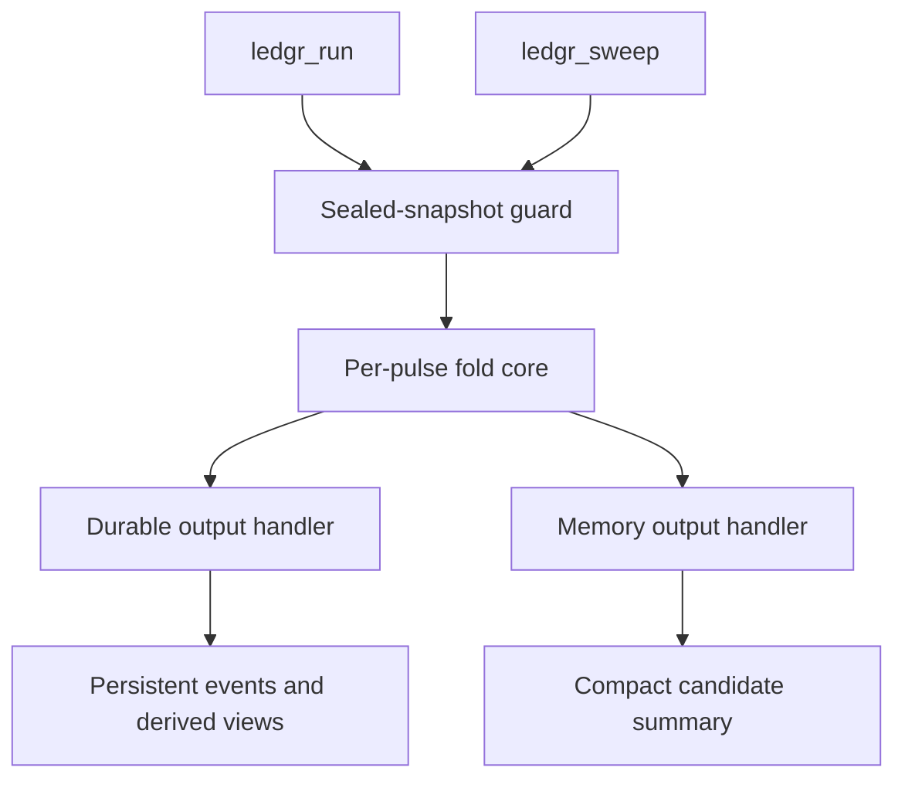

**Status:** Reviewable maintainer-manual article for LDG-2532.

**Authority:** Synthesis only. The binding execution contract is
`../contracts.md`; the detailed code trace is
`../maintainer_review/fold_core_workbook.qmd`.

You need to change execution code without creating a second engine, weakening
snapshot guards, or changing run/sweep semantics by accident. This article gives
you the mental model to review those changes: one fold core, guarded entry,
decision-time strategy context, semantic events, and output handlers that only
materialize evidence.

By the end, you should be able to trace a pulse from accepted snapshot input to
fill events and know which governance file controls each boundary.

::: {.callout-warning}
**Synthesis, not authority**

This manual explains accepted decisions. If it disagrees with `../contracts.md`,
an accepted RFC, an ADR, or a versioned packet, fix the manual.
:::

## The Short Version

ledgr has one execution engine: the fold core. `ledgr_run()` and
`ledgr_sweep()` prepare different output needs, but both must delegate to the
same per-pulse fold semantics.

The fold core owns:

- pulse order;
- no-lookahead strategy context construction;
- strategy invocation;
- full target validation;
- next-open fill timing;
- cost resolution;
- event emission;
- cash, position, and lot-state transitions;
- strategy state;
- telemetry checkpoints.

Output handlers own what happens after the fold has produced semantic events.
Durable runs write persistent artifacts; memory-backed sweeps accumulate ordered
events and compact candidate summaries. The handler may be cheaper or richer,
but it may not change strategy semantics, target validation, fill timing,
event meaning, cost semantics, or RNG semantics.

## Entry Points And Boundaries

The public single-run entry point is `ledgr_run()`. The public sweep entry point
is `ledgr_sweep()`. Both are governed by `../contracts.md` and by the topic map
in `../rfc/README.md`.

The execution boundary has three layers:



| Layer | Maintainer question | Primary authority |
| --- | --- | --- |
| Public entry point | Does the API preserve one execution path? | `../contracts.md` |
| Fold trust boundary | Has sealed snapshot input been accepted before fold entry? | `../architecture/fold_core_trust_boundary.md` |
| Per-pulse fold | Does the pulse produce the same semantic events regardless of output handler? | `../maintainer_review/fold_core_workbook.qmd` |

Production fold entry must be guarded by the sealed-snapshot trust boundary.
Committed runs recompute and compare the sealed snapshot hash before fold
construction. Sweep evaluation validates a sealed snapshot handle and carries
the stored snapshot hash through compact candidate provenance. After that
boundary, the fold hot path may treat bars, pulses, instruments, timestamps,
features, and universe membership as trusted normalized primitives.

Do not move expensive ingress validation into per-pulse loops. Do not remove the
entry guard to gain speed.

## Pulse Lifecycle

A normal pulse has this shape:

1. Build the current pulse view from already accepted bars, feature values,
   positions, cash, equity, seeds, and strategy state.
2. Attach strategy helpers such as scalar bar accessors, `ctx$feature()`,
   `ctx$idx()`, `ctx$vec`, `ctx$flat()`, and `ctx$hold()`.
3. Call `strategy_fn(ctx, params)`.
4. Validate the returned target shape.
5. Compare desired targets with current positions.
6. For non-zero deltas, use the next available bar for `next_open` fills.
7. Resolve costs before the output handler sees events.
8. Emit fill events through the output handler.
9. Mutate fold-owned cash, positions, lots, and strategy state.
10. Record telemetry and checkpoint/flush when needed.

The strategy sees decision-time data only. Fill pricing may use execution-bar
data, but that belongs outside the strategy context so next-bar data cannot leak
into strategy decisions. Final-bar target changes have no next bar and cannot
produce normal fills.

## Event Evidence

Events are the source of truth. Equity curves, fills tables, metrics,
comparison rows, and summaries are derived views. This matters because run and
sweep diverge mainly at output materialization:

- durable runs persist event rows and reconstruct views from stored artifacts;
- memory-backed sweeps keep ordered in-memory events and summarize candidates
  without full durable materialization.

The invariant is not "the two handlers look identical." The invariant is "the
same experiment, params, seed, snapshot, universe, feature definitions, and
date range produce semantically equivalent event streams."

## Strategy Contract At Fold Time

Modern strategy execution is functional. The fold expects a strategy with this
shape:

```r
strategy_shape <- function(ctx, params) {
  targets <- ctx$hold()
  targets[["AAA"]] <- 1
  targets
}
```

Strategies must return a full named numeric target vector, `ledgr_target`, or a
list containing `targets`. Names must exactly match `ctx$universe`; missing,
extra, duplicate, unnamed, `NA`, or non-finite targets fail loudly.

Do not silently treat missing targets as zero. Use `ctx$flat()` when the
strategy means flat-unless-signal. Use `ctx$hold()` when it means
hold-unless-signal.

Legacy strategy objects are not reauthorized by this manual. Historical
metadata may remain inspectable, but modern experiment execution uses the
function strategy contract.

## Determinism

Determinism is split across several surfaces:

- snapshot hashes and config hashes identify durable inputs;
- strategy provenance identifies executable logic and parameters;
- `execution_seed` records candidate/run seed identity;
- `ctx$pulse_seed` is the supported per-pulse stochastic input for paths that
  need resume or parallel equivalence;
- output-handler differences must not alter event meaning.

Ambient RNG calls may be tolerated for ordinary sequential runs according to
the strategy preflight contract, but they are not certified for resume or
parallel equivalence. Strategies that need stochastic pulse decisions in those
paths should derive them from `ctx$pulse_seed`.

## B2 And Compiled Accounting

The v0.1.8.10 B2 path is a scoped spot-asset FIFO fill-batch accelerator for
memory-backed sweeps. It is not a general compiled fold core and it is not the
default. See the horizon scope-guard entry (`../horizon.md`, 2026-06-02
`[architecture]` B2 spot-FIFO accelerator scope guard) and the
maintainer-decisions narrowing in
`../rfc/rfc_compiled_hot_frame_b2_v0_1_9_x_maintainer_decisions.md`.

The public opt-in is:

```r
ledgr_sweep(..., compiled_accounting_model = "spot_fifo")
```

`compiled_accounting_model = NULL` remains canonical R execution. Durable
`ledgr_run(..., compiled_accounting_model = "spot_fifo")`, non-spot accounting,
derivatives, margin, options, additional compiled accounting models, and default
compiled execution require fresh RFC and release-packet scope.

::: {.callout-important}
**B2 is intentionally narrow**

Do not make B2 the default, expose it through durable `ledgr_run()`, or expand it
beyond `"spot_fifo"` without a fresh RFC and release-packet scope.
:::

## Maintainer Checklist

Before changing execution code, answer these questions:

- Does this preserve one shared fold core for run and sweep?
- Does it keep snapshot sealing and fold-entry guard checks outside the hot
  pulse loop but before execution?
- Does the strategy context expose only decision-time data?
- Does every target still pass the same full-vector validation?
- Are costs resolved before output handlers see events?
- Are event streams still the canonical evidence?
- Are output-handler differences limited to persistence/materialization?
- Does the change keep `compiled_accounting_model` closed to `NULL` and
  `"spot_fifo"` unless a new RFC expands it?
- Does the change preserve deterministic replay and documented RNG boundaries?
- Is the manual merely explaining a decision, or is it trying to make one? If
  it is making one, stop and route through an RFC, ADR, contract, or packet.

## Source Links

- `../contracts.md`
- `../rfc/README.md`
- `../horizon.md` (2026-06-02 `[architecture]` B2 spot-FIFO accelerator scope guard)
- `../rfc/rfc_compiled_hot_frame_b2_v0_1_9_x_maintainer_decisions.md` (Decision 2 narrowing)
- `../architecture/fold_core_trust_boundary.md`
- `../maintainer_review/fold_core_workbook.qmd`
- `../ledgr_v0_1_8_10_spec_packet/v0_1_8_10_spec.md`
- `../ledgr_v0_1_8_11_spec_packet/contracts_audit.md`

## Where Next

- For the article order and bounded remainder, see `README.qmd`.
- For the detailed code trace, see `../maintainer_review/fold_core_workbook.qmd`.
- For the binding execution contracts, see `../contracts.md`.
