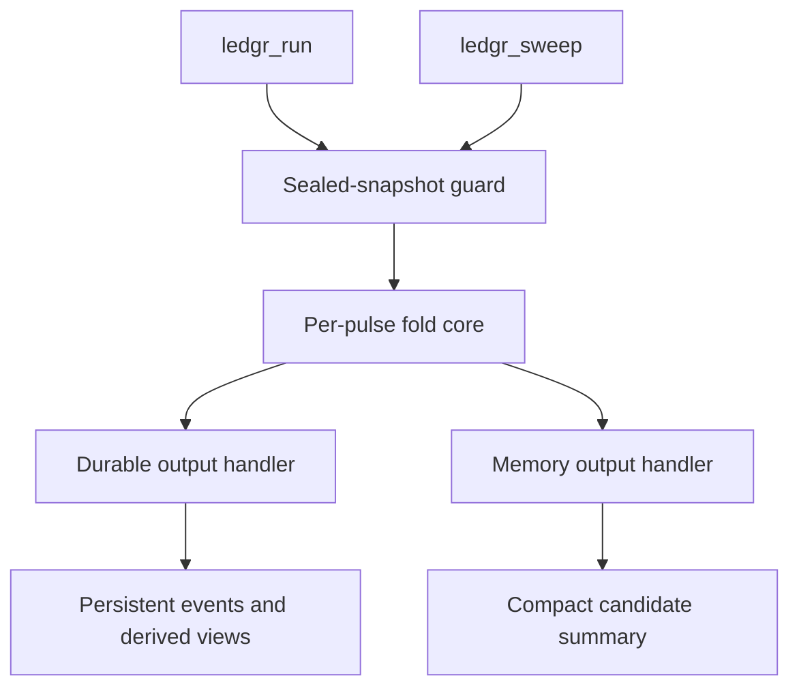

**Status:** Reviewable maintainer-manual article for LDG-2532.

**Authority:** Synthesis plus implementation trace. The binding execution
contract is `../contracts.md`; the trace below replaces the retired
fold-core workbook as the current code-reading map.

You need to change execution code without creating a second engine, weakening
snapshot guards, or changing run/sweep semantics by accident. This article gives
you the mental model to review those changes: one fold core, guarded entry,
decision-time strategy context, semantic events, and output handlers that only
materialize evidence.

By the end, you should be able to trace a pulse from accepted snapshot input to
fill events and know which governance file controls each boundary.

::: {.callout-warning}
**Synthesis, not authority**

This manual explains accepted decisions. If it disagrees with `../contracts.md`,
an accepted RFC, an ADR, or a versioned packet, fix the manual.
:::

## The Short Version

ledgr has one execution engine: the fold core. `ledgr_run()` and
`ledgr_sweep()` prepare different output needs, but both must delegate to the
same per-pulse fold semantics.

The fold core owns:

- pulse order;
- no-lookahead strategy context construction;
- strategy invocation;
- full target validation;
- next-open fill timing;
- cost resolution;
- event emission;
- cash, position, and lot-state transitions;
- strategy state;
- telemetry checkpoints.

Output handlers own what happens after the fold has produced semantic events.
Durable runs write persistent artifacts; memory-backed sweeps accumulate ordered
events and compact candidate summaries. The handler may be cheaper or richer,
but it may not change strategy semantics, target validation, fill timing,
event meaning, cost semantics, or RNG semantics.

## Entry Points And Boundaries

The public single-run entry point is `ledgr_run()`. The public sweep entry point
is `ledgr_sweep()`. Both are governed by `../contracts.md` and by the topic map
in `../rfc/README.md`.

The execution boundary has three layers:



| Layer | Maintainer question | Primary authority |
| --- | --- | --- |
| Public entry point | Does the API preserve one execution path? | `../contracts.md` |
| Fold trust boundary | Has sealed snapshot input been accepted before fold entry? | `snapshots_data.md` and `../contracts.md` |
| Per-pulse fold | Does the pulse produce the same semantic events regardless of output handler? | Implementation Trace below |

Production fold entry must be guarded by the sealed-snapshot trust boundary.
Committed runs recompute and compare the sealed snapshot hash before fold
construction. Sweep evaluation validates a sealed snapshot handle and carries
the stored snapshot hash through compact candidate provenance. After that
boundary, the fold hot path may treat bars, pulses, instruments, timestamps,
features, and universe membership as trusted normalized primitives.

Do not move expensive ingress validation into per-pulse loops. Do not remove the
entry guard to gain speed.

## Pulse Lifecycle

A normal pulse has this shape:

1. Build the current pulse view from already accepted bars, feature values,
   positions, cash, equity, seeds, and strategy state.
2. Attach strategy helpers such as scalar bar accessors, `ctx$feature()`,
   `ctx$idx()`, `ctx$vec`, `ctx$flat()`, and `ctx$hold()`.
3. Call `strategy_fn(ctx, params)`.
4. Validate the returned target shape.
5. Compare desired targets with current positions.
6. For non-zero deltas, use the next available bar for `next_open` fills.
7. Resolve costs before the output handler sees events.
8. Emit fill events through the output handler.
9. Mutate fold-owned cash, positions, lots, and strategy state.
10. Record telemetry and checkpoint/flush when needed.

The strategy sees decision-time data only. Fill pricing may use execution-bar
data, but that belongs outside the strategy context so next-bar data cannot leak
into strategy decisions. Final-bar target changes have no next bar and cannot
produce normal fills.

## Event Evidence

Events are the source of truth. Equity curves, fills tables, metrics,
comparison rows, and summaries are derived views. This matters because run and
sweep diverge mainly at output materialization:

- durable runs persist event rows and reconstruct views from stored artifacts;
- memory-backed sweeps keep ordered in-memory events and summarize candidates
  without full durable materialization.

The invariant is not "the two handlers look identical." The invariant is "the
same experiment, params, seed, snapshot, universe, feature definitions, and
date range produce semantically equivalent event streams."

## Strategy Contract At Fold Time

Modern strategy execution is functional. The fold expects a strategy with this
shape:

```r
strategy_shape <- function(ctx, params) {
  targets <- ctx$hold()
  targets[["AAA"]] <- 1
  targets
}
```

Strategies must return a full named numeric target vector, `ledgr_target`, or a
list containing `targets`. Names must exactly match `ctx$universe`; missing,
extra, duplicate, unnamed, `NA`, or non-finite targets fail loudly.

Do not silently treat missing targets as zero. Use `ctx$flat()` when the
strategy means flat-unless-signal. Use `ctx$hold()` when it means
hold-unless-signal.

Legacy strategy objects are not reauthorized by this manual. Historical
metadata may remain inspectable, but modern experiment execution uses the
function strategy contract.

## Function-Only Strategy Interface Rationale

The retired ADR-0004 decision paired dependency cleanup with a strategy
interface cleanup. The load-bearing strategy choice was simple: modern ledgr
execution uses plain functions, not R6 strategy objects, because the fold needs
one deterministic callback shape across original runs, replay, resume, and
sweep promotion.

The accepted function shape is still:

```r
strategy <- function(ctx, params) {
  targets <- ctx$hold()
  targets[["AAA"]] <- 1
  targets
}
```

That shape carries three maintenance advantages:

- the original run and replay can execute the same bare function instead of
  splitting across object and function paths;
- closure and config provenance can reason about one strategy callback
  contract;
- target validation remains fold-owned and identical across run and sweep.

Removing the historical R6 strategy surface also removes a latent divergence:
mutation-detection and replay behavior had applied inconsistently across the
old object path and direct function execution. The modern rule is more
boring and easier to audit. A strategy may close over helpers, return a
`ledgr_target`, or return a list with `targets` and `state_update`, but the
fold still normalizes that output into a full named numeric target vector and
validates it before accounting.

This rationale does not weaken the public strategy contract. It explains why
the old R6 surface stays retired and why new strategy-helper work should wrap
or produce the functional callback shape rather than adding a second execution
interface.

## Determinism

Determinism is split across several surfaces:

- snapshot hashes and config hashes identify durable inputs;
- strategy provenance identifies executable logic and parameters;
- `execution_seed` records candidate/run seed identity;
- `ctx$pulse_seed` is the supported per-pulse stochastic input for paths that
  need resume or parallel equivalence;
- output-handler differences must not alter event meaning.

Ambient RNG calls may be tolerated for ordinary sequential runs according to
the strategy preflight contract, but they are not certified for resume or
parallel equivalence. Strategies that need stochastic pulse decisions in those
paths should derive them from `ctx$pulse_seed`.

## B2 And Compiled Accounting

The v0.1.8.10 B2 path is a scoped spot-asset FIFO fill-batch accelerator for
memory-backed sweeps. It is not a general compiled fold core and it is not the
default. See the horizon scope-guard entry (`../horizon.md`, 2026-06-02
`[architecture]` B2 spot-FIFO accelerator scope guard) and the
maintainer-decisions narrowing in
`../rfc/rfc_compiled_hot_frame_b2_v0_1_9_x_maintainer_decisions.md`.

The public opt-in is:

```r
ledgr_sweep(..., compiled_accounting_model = "spot_fifo")
```

`compiled_accounting_model = NULL` remains canonical R execution. Durable
`ledgr_run(..., compiled_accounting_model = "spot_fifo")`, non-spot accounting,
derivatives, margin, options, additional compiled accounting models, and default
compiled execution require fresh RFC and release-packet scope.

::: {.callout-important}
**B2 is intentionally narrow**

Do not make B2 the default, expose it through durable `ledgr_run()`, or expand it
beyond `"spot_fifo"` without a fresh RFC and release-packet scope.
:::

## Implementation Trace

This layer is for maintainers and agents changing code. It follows the
two-layer manual standard in
`../ledgr_v0_1_8_11_spec_packet/v0_1_8_11_spec.md`, Section 3.7: synthesis
explains the contract; implementation trace names the concrete objects,
dispatch points, failure modes, and hot-path boundaries. It is an
implementation map, not a new contract.

### Data Structures

The fold receives a typed execution list from `ledgr_execution_spec()` in
`R/execution-spec.R:45`. Its load-bearing slots are assigned in
`R/execution-spec.R:76`: run and instrument identity, strategy function and
call signature, pulse vectors, checkpoint and telemetry settings, fold state,
source bars, matrix-backed bars, feature views, runtime projection,
`cost_resolver`, `event_seq_start`, `telemetry`, `event_mode`,
`use_fast_context`, and `compiled_accounting_model`. The validator keeps these
shapes strict across `R/execution-spec.R:113`, `R/execution-spec.R:180`,
`R/execution-spec.R:196`, `R/execution-spec.R:220`,
`R/execution-spec.R:224`, and `R/execution-spec.R:241`.

At each pulse, `R/fold-engine.R:227` constructs the strategy context as a plain
list with class `ledgr_pulse_context` at `R/fold-engine.R:241`. The runtime
shape is:

| Slot | Type / shape | Source anchor |
| --- | --- | --- |
| `run_id` | scalar character | `R/fold-engine.R:228` |
| `ts_utc` | scalar ISO UTC character | `R/fold-engine.R:229` |
| `universe` | character vector of instrument ids | `R/fold-engine.R:230` |
| `bars` | current-pulse bars view, never future bars | `R/fold-engine.R:231` |
| `feature_table` | current-pulse feature table | `R/fold-engine.R:232` |
| `positions` | named numeric snapshot before strategy call | `R/fold-engine.R:233` |
| `cash` / `equity` | numeric scalar fold state | `R/fold-engine.R:234`, `R/fold-engine.R:235` |
| `seed` | execution seed or `NULL` | `R/fold-engine.R:236` |
| `pulse_seed` | deterministic per-pulse seed or `NULL` | `R/fold-engine.R:237` |
| `state_prev` | prior strategy state object, JSON-derived list, or `NULL` | `R/fold-engine.R:238` |
| `safety_state` | scalar risk-state label | `R/fold-engine.R:239` |

`ctx` helper attachment is deliberately a dispatch choice, not a semantic
choice. Fast helpers are attached at `R/fold-engine.R:242`; regular helpers are
attached at `R/fold-engine.R:256`. Both operate over the same pulse data.

Strategy state is carried separately from portfolio state. On committed resume,
the previous strategy state is read before execution at
`R/backtest-runner.R:1236` and passed into the execution spec at
`R/backtest-runner.R:1261`. During the fold, a strategy `state_update` is
canonicalized at `R/fold-engine.R:531`, kept in memory at
`R/fold-engine.R:532`, and either persisted through
`output_handler$write_strategy_state()` at `R/fold-engine.R:533` or buffered via
`output_handler$buffer_strategy_state()` at `R/fold-engine.R:535`.

Telemetry is a mutable environment owned by the caller. Committed runs allocate
the telemetry fields at `R/backtest-runner.R:1021`; sweeps allocate the
same-style fields at `R/sweep.R:1575`. The common slots include `t_pre`,
`t_loop`, `t_engine`, `t_results`, `t_fills_extract`, the sampled pulse timers,
and feature-cache hit/miss counters.

Output handlers are the materialization boundary. Durable execution builds a
persistent handler at `R/backtest-runner.R:285` with pending event and state
buffers initialized at `R/backtest-runner.R:290`. Sweep execution builds the
memory handler at `R/sweep.R:990`; its typed event columns are allocated at
`R/sweep.R:999` and grown with the shared event-buffer capacity function from
`R/fold-event-buffer.R:7`.

### Code Anchors

| Boundary | Code anchor |
| --- | --- |
| Committed-run sealed snapshot guard | `R/backtest-runner.R:784` checks the source tables, sealed status, stored hash, and recomputed hash before fold construction. |
| Committed execution-spec construction | `R/backtest-runner.R:1247` passes state, source bars, runtime projection, telemetry, event mode, fast-context flag, and compiled model into the fold. |
| Shared fold entry | `R/fold-engine.R:63` validates the execution spec and unpacks the same fields for run and sweep. |
| B2 dispatch gate | `R/fold-engine.R:101` checks `"spot_fifo"` and calls `ledgr_require_compiled_spot_fifo_dispatch()`. |
| Context construction | `R/fold-engine.R:223` marks the no-lookahead current-pulse section; `R/fold-engine.R:227` builds `ctx`. |
| Strategy target validation | `R/fold-engine.R:296` normalizes strategy output; `R/fold-engine.R:312` calls `ledgr_validate_strategy_targets()`. |
| Next-open fill timing | `R/fold-engine.R:430` builds fill proposals from the next bar; `R/fold-engine.R:451` warns and skips final-bar deltas. |
| Accounting mutation and event emission | `R/fold-engine.R:481` applies lot accounting; `R/fold-engine.R:496` writes semantic fill events through the handler. |
| Strategy-state persistence | `R/fold-engine.R:529` handles `state_update`; durable strategy-state writes are implemented by `R/backtest-runner.R:502`. |
| Checkpoint and final flush | `R/fold-engine.R:562` performs checkpoint flushes; `R/fold-engine.R:580` performs the final flush. |
| Sweep candidate fold | `R/sweep.R:907` builds the same execution spec with `event_mode = "buffered"` and `use_fast_context = TRUE`. |
| Sweep summary materialization | `R/sweep.R:941` switches from engine timing to result reconstruction; `R/fold-reconstruction.R:409` derives sweep summaries from ordered events. |

### Lookup And Dispatch Mechanisms

Committed runs dispatch through `ledgr_run()` into the backtest runner, which
first accepts a sealed snapshot and then calls `ledgr_execute_fold()` with a
persistent output handler. The important separation is visible at
`R/backtest-runner.R:784` for the cold guard and `R/backtest-runner.R:1278` for
fold entry.

Sweeps dispatch through `ledgr_sweep()`. The public `compiled_accounting_model`
argument is normalized at `R/sweep.R:94`, carried into candidate tasks at
`R/sweep.R:176`, and passed to each candidate execution spec at
`R/sweep.R:935`. Candidate evaluation still calls `ledgr_execute_fold()` at
`R/sweep.R:938`.

The B2 dispatch chain is intentionally short. `R/compiled-spot-fifo.R:24`
normalizes the model to `NULL` or `"spot_fifo"`. `R/compiled-spot-fifo.R:62`
requires buffered event mode, a memory output handler with
`append_compiled_spot_batch`, and an available C++ symbol. Unsupported values
fail through `ledgr_unsupported_accounting_model_error()` at
`R/compiled-spot-fifo.R:1`; unavailable or wrong-surface requests fail through
`ledgr_compiled_spot_fifo_unavailable_error()` at
`R/compiled-spot-fifo.R:47`.

Event emission dispatch is handler-based. Durable runs implement
`write_fill_events()` at `R/backtest-runner.R:478` and persist rows through the
pending buffer flush at `R/backtest-runner.R:511`. Sweeps implement
`write_fill_events()` at `R/sweep.R:1367`, keep typed event metadata in memory,
and only serialize `meta_json` when callers materialize rows at
`R/sweep.R:1117`.

### Edge Cases

Fold-entry snapshot failures are loud before execution. A missing source row,
unsealed snapshot, missing stored hash, or recomputed-hash mismatch aborts in
the committed-run guard between `R/backtest-runner.R:800` and
`R/backtest-runner.R:817`.

Strategy return-shape failures are loud inside the fold. Intermediate strategy
returns abort at `R/fold-engine.R:296`; non-list target envelopes abort at
`R/fold-engine.R:302`; full target validation runs at `R/fold-engine.R:312`.
The manual contract is therefore not "missing target means zero." A strategy
that wants flat exposure must say so with `ctx$flat()`.

Final-bar target changes cannot fill because there is no next execution bar.
The warning path is `R/fold-engine.R:451`; it preserves no-lookahead timing
rather than falling back to current close.

B2 rejects unsupported surfaces rather than silently falling back. Durable use
fails because `R/compiled-spot-fifo.R:67` requires buffered event mode, and
unsupported accounting models fail at `R/compiled-spot-fifo.R:32`.

Resume and parallel equivalence are certified only for the documented
deterministic surfaces. Ordinary sequential strategies may have broader
preflight tolerance, but resume/parallel-safe stochastic behavior must use
`ctx$pulse_seed`; see `observability_determinism.qmd` for the RNG trace.

### Hot And Cold Paths

Cold work happens before the pulse loop: snapshot source preparation and hash
verification (`R/backtest-runner.R:784`), bars and feature projection assembly,
cost resolver construction, output-handler construction, and execution-spec
validation (`R/execution-spec.R:113`).

Hot work happens per pulse in `ledgr_execute_fold()`: current bars and features,
context construction, strategy call, target validation, non-zero delta
iteration, next-open fill proposal, cost resolution, lot mutation, event
emission, strategy-state update, and sampled telemetry. The fold records
subphase timers only when telemetry sampling is enabled; the per-sample writes
are guarded at `R/fold-engine.R:545`.

Warm materialization work happens after the fold. Durable callers reconstruct
views from stored events; sweep callers summarize ordered in-memory events at
`R/sweep.R:941`. The fast path distinction is important: optimizing result
materialization is not the same as changing execution semantics.

### Concrete Examples

A minimal context shape at pulse `i` looks like this:

```r
ctx <- list(
  run_id = "run_001",
  ts_utc = "2024-01-03T00:00:00Z",
  universe = c("AAA", "BBB"),
  bars = data.frame(instrument_id = c("AAA", "BBB"), close = c(101, 52)),
  feature_table = data.frame(instrument_id = c("AAA", "BBB"), sma_3 = c(100, 51)),
  positions = c(AAA = 1, BBB = 0),
  cash = 99890,
  equity = 99991,
  seed = 2026L,
  pulse_seed = 123456789L,
  state_prev = list(last_signal = "AAA"),
  safety_state = "GREEN"
)
class(ctx) <- "ledgr_pulse_context"
```

The strategy may return `ctx$hold()` with one changed target, or a list with
`targets` and `state_update`:

```r
list(
  targets = c(AAA = 1, BBB = 0),
  state_update = list(last_signal = "AAA", last_ts = ctx$ts_utc)
)
```

The state update is canonicalized once the strategy returns; it is not part of
the target vector and it does not relax target validation.

## Maintainer Checklist

Before changing execution code, answer these questions:

- Does this preserve one shared fold core for run and sweep?
- Does it keep snapshot sealing and fold-entry guard checks outside the hot
  pulse loop but before execution?
- Does the strategy context expose only decision-time data?
- Does every target still pass the same full-vector validation?
- Are costs resolved before output handlers see events?
- Are event streams still the canonical evidence?
- Are output-handler differences limited to persistence/materialization?
- Does the change keep `compiled_accounting_model` closed to `NULL` and
  `"spot_fifo"` unless a new RFC expands it?
- Does the change preserve deterministic replay and documented RNG boundaries?
- Is the manual merely explaining a decision, or is it trying to make one? If
  it is making one, stop and route through an RFC, ADR, contract, or packet.

## Source Links

- `../contracts.md`
- `../rfc/README.md`
- `../horizon.md` (2026-06-02 `[architecture]` B2 spot-FIFO accelerator scope guard)
- `../rfc/rfc_compiled_hot_frame_b2_v0_1_9_x_maintainer_decisions.md` (Decision 2 narrowing)
- `snapshots_data.md`
- `../ledgr_v0_1_8_10_spec_packet/v0_1_8_10_spec.md`
- `../ledgr_v0_1_8_11_spec_packet/contracts_audit.md`

## Where Next

- For the article order and bounded remainder, see `README.qmd`.
- For the detailed execution code trace, see the Implementation Trace above.
- For the binding execution contracts, see `../contracts.md`.
