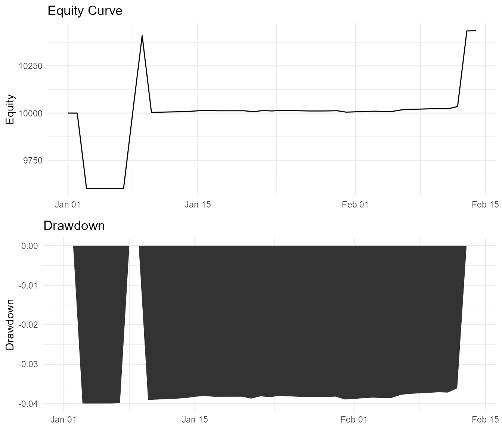

Getting Started with ledgr
================

This vignette walks through the ledgr research loop:

1.  create bar data;
2.  write a target-holdings strategy;
3.  run a backtest;
4.  inspect the recorded results;
5.  debug one decision point;
6.  move from exploratory data to durable research artifacts.

The goal is not to build a profitable strategy. The goal is to
understand how ledgr models decisions over time and why it records them
in an event ledger. The data is deliberately synthetic so the vignette
can run offline; the same workflow applies to real OHLCV bars.

## Step 1: Create Bar Data

``` r
library(ledgr)
library(tibble)
```

``` r
set.seed(20260425)
calendar <- seq.Date(as.Date("2020-01-01"), as.Date("2020-02-14"), by = "day")
dates <- calendar[!(weekdays(calendar) %in% c("Saturday", "Sunday"))]

make_bars <- function(instrument_id, start_price, drift) {
  n <- length(dates)
  close <- start_price + cumsum(drift + stats::rnorm(n, mean = 0, sd = 0.35))
  open <- c(start_price, close[-n])

  data.frame(
    ts_utc = as.POSIXct(dates, tz = "UTC"),
    instrument_id = instrument_id,
    open = round(open, 2),
    high = round(pmax(open, close) + 0.45, 2),
    low = round(pmin(open, close) - 0.45, 2),
    close = round(close, 2),
    volume = seq.int(1000L, 1000L + n - 1L),
    stringsAsFactors = FALSE
  )
}

bars <- rbind(
  make_bars("AAA", start_price = 100, drift = 0.18),
  make_bars("BBB", start_price = 80, drift = -0.04)
)

bars |> as_tibble() |> head(6)
#> # A tibble: 6 x 7
#>   ts_utc              instrument_id  open  high   low close volume
#>   <dttm>              <chr>         <dbl> <dbl> <dbl> <dbl>  <int>
#> 1 2020-01-01 00:00:00 AAA            100   101.  99.6  100.   1000
#> 2 2020-01-02 00:00:00 AAA            100.  101.  99.7  100.   1001
#> 3 2020-01-03 00:00:00 AAA            100.  101. 100.0  101.   1002
#> 4 2020-01-06 00:00:00 AAA            101.  101. 100.   101.   1003
#> 5 2020-01-07 00:00:00 AAA            101.  101. 100.   101.   1004
#> 6 2020-01-08 00:00:00 AAA            101.  102. 100.   101.   1005
```

This is the smallest useful shape for ledgr bar data. Each row is one
instrument at one timestamp.

Required columns are `ts_utc`, `instrument_id`, `open`, `high`, `low`,
and `close`. `volume` is optional. The timestamps in this example are
business days because that reads more like market data, but ledgr does
not require daily bars or a specific exchange calendar.

A backtest is only as auditable as its inputs. ledgr turns these rows
into a sealed snapshot before it runs the engine. A snapshot is the data
contract for a run.

## Step 2: Write A Strategy

``` r
strategy <- function(ctx) {
  targets <- ctx$targets()

  if (ctx$close("AAA") > 100.4) {
    targets["AAA"] <- 10
  }

  if (ctx$close("BBB") > 80.0) {
    targets["BBB"] <- 5
  }

  targets
}
```

Read the function as a short research rule:

- start from flat target holdings;
- own 10 units of `AAA` when its close is above 100.4;
- own 5 units of `BBB` when its close is above 80.0.

The helper calls keep strategy code readable. `ctx$targets()` creates a
named target vector over the full universe. `ctx$close("AAA")` reads the
close price at the current decision point. `ctx$position("AAA")`, which
we use later, reads the current held quantity.

## Step 3: Run The First Backtest

``` r
bt <- ledgr_backtest(
  data = bars,
  strategy = strategy,
  initial_cash = 10000,
  run_id = "getting-started-demo"
)

bt
#> ledgr Backtest Results
#> ======================
#>
#> Run ID:         getting-started-demo
#> Universe:       AAA, BBB
#> Date Range:     2020-01-01T00:00:00Z to 2020-02-14T00:00:00Z
#> Initial Cash:   $10000.00
#> Final Equity:   $10436.30
#> P&L:            $436.30 (4.36%)
#>
#> Use summary(bt) for detailed metrics
#> Use plot(bt) for equity curve visualization
```

`ledgr_backtest()` is the primary first-use path. It accepts a data
frame, creates a sealed snapshot internally, runs the strategy, and
returns a handle to one recorded run.

The fixed `run_id` makes printed output stable. In interactive work you
can omit it and ledgr will generate a unique one. A `ledgr_backtest`
object points to one run.

When `start` and `end` are omitted, ledgr uses the full timestamp range
in the snapshot. If you pass a narrower window, the snapshot can still
contain more data, but the run only iterates through pulses inside that
inclusive window.

## Step 4: Inspect The Result Views

``` r
summary(bt)
#> ledgr Backtest Summary
#> ======================
#>
#> Performance Metrics:
#>   Total Return:        4.36%
#>   Annualized Return:   39.98%
#>   Max Drawdown:        -4.00%
#>
#> Risk Metrics:
#>   Volatility (annual): 25.60%
#>
#> Trade Statistics:
#>   Total Trades:        4
#>   Win Rate:            0.00%
#>   Avg Trade:           $-0.34
#>
#> Exposure:
#>   Time in Market:      93.94%
```

In this toy run, total return is positive while win rate is 0%. That is
not a contradiction: win rate is computed from closed trades, and the
profitable `AAA` position remains open at the end. Its gain appears in
equity, not in the closed-trade win rate.

The summary is a derived view. It is useful for a quick read, but the
audit trail lives underneath it.

``` r
bt |> as_tibble(what = "trades")
#> # A tibble: 4 x 9
#>   event_seq ts_utc              instrument_id side    qty price   fee realized_pnl action
#>       <int> <dttm>              <chr>         <chr> <dbl> <dbl> <dbl>        <dbl> <chr>
#> 1         1 2020-01-03 00:00:00 AAA           BUY      10 100.      0         0    OPEN
#> 2         2 2020-01-07 00:00:00 BBB           BUY       5  80.2     0         0    OPEN
#> 3         3 2020-01-13 00:00:00 BBB           SELL      5  80.0     0        -1.35 CLOSE
#> 4         4 2020-01-14 00:00:00 BBB           BUY       5  80.8     0         0    OPEN
```

`trades` is the research-friendly fills table. It answers: what actually
got executed?

``` r
bt |> as_tibble(what = "ledger")
#> # A tibble: 4 x 11
#>   event_id     run_id ts_utc              event_type instrument_id side    qty price   fee
#>   <chr>        <chr>  <dttm>              <chr>      <chr>         <chr> <dbl> <dbl> <dbl>
#> 1 getting-sta~ getti~ 2020-01-03 00:00:00 FILL       AAA           BUY      10 100.      0
#> 2 getting-sta~ getti~ 2020-01-07 00:00:00 FILL       BBB           BUY       5  80.2     0
#> 3 getting-sta~ getti~ 2020-01-13 00:00:00 FILL       BBB           SELL      5  80.0     0
#> 4 getting-sta~ getti~ 2020-01-14 00:00:00 FILL       BBB           BUY       5  80.8     0
#> # i 2 more variables: meta_json <chr>, event_seq <int>
```

`ledger` is the raw event stream. It is the source of truth. Use it when
you need to audit the exact sequence of state changes.

``` r
bt |> as_tibble(what = "equity") |> tail(6)
#> # A tibble: 6 x 6
#>   ts_utc              equity  cash positions_value running_max drawdown
#>   <dttm>               <dbl> <dbl>           <dbl>       <dbl>    <dbl>
#> 1 2020-02-07 00:00:00 10020  8590.           1430.      10410.  -0.0375
#> 2 2020-02-10 00:00:00 10024. 8590.           1434.      10410.  -0.0371
#> 3 2020-02-11 00:00:00 10023. 8590.           1433.      10410.  -0.0372
#> 4 2020-02-12 00:00:00 10035. 8590.           1444.      10410.  -0.0361
#> 5 2020-02-13 00:00:00 10435. 8996.           1440.      10435.   0
#> 6 2020-02-14 00:00:00 10436. 8996.           1441.      10436.   0
```

`equity` is the portfolio value over time. It is also derived from
recorded state, not from a hidden intermediate calculation.

Trades, equity, and metrics are views over recorded history. If a number
looks strange, you can trace it back to the events that produced it.

``` r
plot(bt)
```



The plot is another derived view over the same recorded state. The top
panel shows equity over time. The bottom panel shows drawdown relative
to the running maximum.

## Step 5: Understand Pulses, Targets, And Fills

ledgr does not treat data as a static table. It simulates a system that
moves forward in time:

``` text
data.frame
-> sealed snapshot (immutable input)
-> pulse-by-pulse execution (time iteration)
-> event ledger (state changes recorded)
-> derived views (trades, equity, summary)
```

A pulse is one decision point. At each pulse, the strategy observes only
the current and past state, returns target holdings, and then the engine
records any position changes as events.

Every ledgr strategy returns target holding amounts:

``` r
c(AAA = 10, BBB = 0)
```

That means: hold 10 units of `AAA` and hold 0 units of `BBB`.

Names are part of the contract because ledgr must match each target to
`ctx$universe`. These are invalid strategy outputs:

``` r
c(10, 0)                  # missing instrument names
c(AAA = "LONG", BBB = 0)  # not numeric
```

ledgr expects a named numeric target vector with names matching
`ctx$universe`. It does not accept raw signal labels such as `"LONG"` or
`"FLAT"` as core strategy output.

The default fill model is next-open. A target change decided at pulse
`t` fills on the next available bar. If the strategy asks for a new
position on the final available pulse, there is no next bar to fill
against, so ledgr warns with `LEDGR_LAST_BAR_NO_FILL` and records no
fill for that final request.

Real trading systems receive information step by step. ledgr follows
that shape. The strategy does not get future prices. It gets the current
pulse, makes a decision, and the engine moves forward.

## Step 6: Add A Simple Indicator

Indicators are deterministic features computed at each pulse. The
strategy can read them from the same `ctx` object.

``` r
features <- list(ledgr_ind_sma(3))

sma_strategy <- function(ctx) {
  targets <- ctx$targets()
  sma_3 <- ctx$feature("AAA", "sma_3")

  if (is.finite(sma_3) && ctx$close("AAA") > sma_3) {
    targets["AAA"] <- 10
  }

  targets
}

bt_sma <- ledgr_backtest(
  data = bars,
  strategy = sma_strategy,
  features = features,
  end = as.POSIXct("2020-02-13", tz = "UTC"),
  initial_cash = 10000,
  run_id = "getting-started-sma"
)

bt_sma |> as_tibble(what = "trades") |> head(6)
#> # A tibble: 6 x 9
#>   event_seq ts_utc              instrument_id side    qty price   fee realized_pnl action
#>       <int> <dttm>              <chr>         <chr> <dbl> <dbl> <dbl>        <dbl> <chr>
#> 1         1 2020-01-06 00:00:00 AAA           BUY      10  101.     0         0    OPEN
#> 2         2 2020-01-13 00:00:00 AAA           SELL     10  101.     0         7.60 CLOSE
#> 3         3 2020-01-15 00:00:00 AAA           BUY      10  101.     0         0    OPEN
#> 4         4 2020-01-20 00:00:00 AAA           SELL     10  102.     0         2.90 CLOSE
#> 5         5 2020-01-23 00:00:00 AAA           BUY      10  102.     0         0    OPEN
#> 6         6 2020-01-28 00:00:00 AAA           SELL     10  101.     0        -3.40 CLOSE
```

The first few indicator values may be `NA` while the indicator warms up.
In the strategy above, `is.finite(sma_3)` prevents trading before the
SMA is available.

The example uses an explicit `end` one bar before the last available
bar. That keeps the example focused on indicator behavior rather than
the final-bar no-fill warning described above.

Indicators are part of the pulse context. ledgr computes the feature
values without lookahead and records the run through the same event
ledger.

## Step 7: Debug One Pulse

After a run, the most common debugging question is: why did the strategy
make that decision at that time?

The useful answer is a pulse snapshot: the exact context the strategy
saw at one timestamp. The first backtest created a snapshot internally.
Here we create one explicitly so the debugging tool has a snapshot
handle, then choose a readable timestamp.

``` r
snapshot <- ledgr_snapshot_from_df(
  bars,
  db_path = tempfile(fileext = ".duckdb")
)

decision_time <- as.POSIXct("2020-01-14", tz = "UTC")
decision_time
#> [1] "2020-01-14 UTC"
```

``` r
pulse <- ledgr_pulse_snapshot(
  snapshot = snapshot,
  universe = c("AAA", "BBB"),
  ts_utc = decision_time
)

pulse$ts_utc
#> [1] "2020-01-14T00:00:00Z"
pulse$bars
#>   instrument_id               ts_utc   open   high    low  close volume
#> 1           AAA 2020-01-14T00:00:00Z 101.29 101.92 100.84 101.47   1009
#> 2           BBB 2020-01-14T00:00:00Z  80.77  81.22  80.28  80.73   1009
pulse$close("AAA")
#> [1] 101.47
pulse$position("AAA")
#> [1] 0
strategy(pulse)
#> AAA BBB
#>  10   5
```

At this moment, the strategy only sees state available at
`pulse$ts_utc`. `strategy(pulse)` shows the target holdings the strategy
would request from that context.

A pulse snapshot is read-only. It is meant for research and debugging,
not for changing run state. The close calls release DuckDB connections.

``` r
close(pulse)
ledgr_snapshot_close(snapshot)
```

Debugging a backtest should not require guessing from final outputs. You
can inspect the decision context directly.

## Step 8: Use Yahoo As A Convenience Source

Yahoo is the quickest path from a ticker symbol to a sealed ledgr
snapshot. This path requires the optional `quantmod` package and network
access:

``` r
install.packages("quantmod")
```

``` r
library(quantmod)

yahoo_strategy <- function(ctx) {
  targets <- ctx$targets()

  if (ctx$close("AAPL") > ctx$open("AAPL")) {
    targets["AAPL"] <- 10
  }

  if (ctx$close("MSFT") > ctx$open("MSFT")) {
    targets["MSFT"] <- 5
  }

  targets
}

yahoo_snapshot <- ledgr_snapshot_from_yahoo(
  symbols = c("AAPL", "MSFT"),
  from = "2020-01-01",
  to = "2020-03-31",
  db_path = tempfile(fileext = ".duckdb")
)

yahoo_bt <- ledgr_backtest(
  snapshot = yahoo_snapshot,
  strategy = yahoo_strategy,
  universe = c("AAPL", "MSFT"),
  start = "2020-01-01",
  end = "2020-03-31",
  initial_cash = 10000
)

yahoo_bt
yahoo_bt |> as_tibble(what = "trades")
plot(yahoo_bt)

ledgr_snapshot_close(yahoo_snapshot)
```

The code above is meant to be run interactively. It is not defensive
because the dependency is part of the workflow: install `quantmod`,
attach it, fetch data, seal the result, then run ledgr.

The rendered vignette does not execute the live Yahoo chunk because live
API output is not a stable release artifact. Yahoo is convenient for
exploration, but it is provider-dependent and not deterministic as a
source. Providers can revise historical data.

For durable research, download once, seal the downloaded data into a
snapshot, and reuse that snapshot. The ledgr audit guarantees apply to
the sealed data, not to the external provider.

## Step 9: Make Research Durable

The quick path creates temporary storage for you. For research you want
to keep, choose the data file and DuckDB path yourself. This vignette
uses `tempfile()` for CRAN-safe examples; in real projects use a stable
path under your research directory.

``` r
bars_csv <- tempfile(fileext = ".csv")
artifact_db <- tempfile("ledgr_getting_started_", fileext = ".duckdb")

bars_for_csv <- bars
bars_for_csv$ts_utc <- format(bars_for_csv$ts_utc, "%Y-%m-%dT%H:%M:%SZ", tz = "UTC")

utils::write.csv(bars_for_csv, bars_csv, row.names = FALSE)

snapshot <- ledgr_snapshot_from_csv(
  csv_path = bars_csv,
  db_path = artifact_db
)

durable_bt <- ledgr_backtest(
  snapshot = snapshot,
  strategy = strategy,
  universe = c("AAA", "BBB"),
  initial_cash = 10000,
  run_id = "getting-started-durable"
)

basename(durable_bt$db_path)
#> [1] "ledgr_getting_started_1245865252409.duckdb"
file.exists(durable_bt$db_path)
#> [1] TRUE

durable_bt |> as_tibble(what = "trades")
#> # A tibble: 4 x 9
#>   event_seq ts_utc              instrument_id side    qty price   fee realized_pnl action
#>       <int> <dttm>              <chr>         <chr> <dbl> <dbl> <dbl>        <dbl> <chr>
#> 1         1 2020-01-03 00:00:00 AAA           BUY      10 100.      0         0    OPEN
#> 2         2 2020-01-07 00:00:00 BBB           BUY       5  80.2     0         0    OPEN
#> 3         3 2020-01-13 00:00:00 BBB           SELL      5  80.0     0        -1.35 CLOSE
#> 4         4 2020-01-14 00:00:00 BBB           BUY       5  80.8     0         0    OPEN
durable_bt |> as_tibble(what = "equity") |> tail(3)
#> # A tibble: 3 x 6
#>   ts_utc              equity  cash positions_value running_max drawdown
#>   <dttm>               <dbl> <dbl>           <dbl>       <dbl>    <dbl>
#> 1 2020-02-12 00:00:00 10035. 8590.           1444.      10410.  -0.0361
#> 2 2020-02-13 00:00:00 10435. 8996.           1440.      10435.   0
#> 3 2020-02-14 00:00:00 10436. 8996.           1441.      10436.   0

close(durable_bt)
ledgr_snapshot_close(snapshot)
```

The close calls at the end release file handles. They do not delete a
stable project database; this example uses temporary paths only so the
vignette can run cleanly during package checks.

CSV workflows should write timestamps as explicit UTC strings such as
`2020-01-01T00:00:00Z`. The parser is deliberately strict because
timestamp ambiguity is a common source of backtest drift.

This DuckDB file now contains:

- the sealed input snapshot;
- the recorded run events;
- derived views such as trades and equity.

Keeping this file means keeping the research artifact.

`run_id` names one run inside that artifact file. In v0.1.3 it is mainly
a stable label for reading run artifacts. The v0.1.4 experiment-store
work will make run discovery, reopening, metadata, labels, and archiving
first-class.

Reproducibility is not only about getting the same answer in one R
session. It is also about keeping the data and run artifacts that
explain where the answer came from.

## Step 10: Know The Scope

ledgr v0.1.3 focuses on deterministic research backtests.

It does not include:

- live trading;
- streaming data;
- broker integrations;
- paper-trading state;
- parameter optimization;
- walk-forward testing.

Those are different systems with different state and safety
requirements. This release keeps the onboarding path focused on
backtests that can be reproduced, inspected, and audited.
