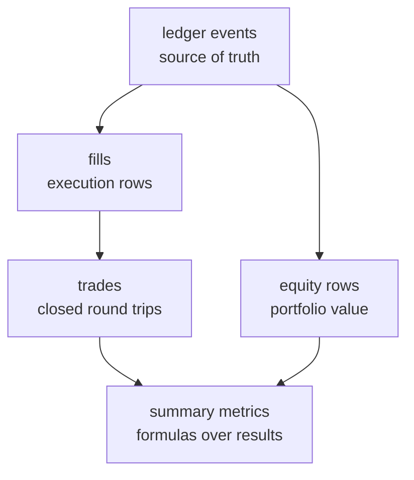

# The Accounting Model


<style>
.ledgr-diagram {
  margin: 1.25rem auto 1.5rem auto;
  text-align: center;
}
.ledgr-diagram .mermaid {
  display: inline-block;
  max-width: 760px;
  width: 100%;
}
.ledgr-diagram .node text,
.ledgr-diagram .edgeLabel {
  font-size: 18px !important;
}
</style>

ledgr records a backtest as accounting evidence first and summary
metrics second.

The useful reading order is:

<div class="ledgr-diagram ledgr-accounting-hierarchy">



</div>

1.  ledger events say what actually filled;
2.  fills are execution rows derived from those events;
3.  trades are only the fill rows that close quantity;
4.  equity rows value the portfolio through time;
5.  summary metrics are formulas over those public result tables.

That order matters. A strategy can open a position without closing it.
That run has fills and equity exposure, but zero closed trades. In that
case `n_trades = 0` and `win_rate = NA` are correct, not missing data.

## Prerequisites

``` r
library(ledgr)
library(dplyr)
library(tibble)
```

## Inspection Surfaces

Use the narrowest inspection surface that answers the question:

| Question | Public surface | Shape |
|----|----|----|
| What happened at a glance? | `print(bt)` | printed run header with final equity |
| What are the standard metrics? | `summary(bt)` | printed interpretation; returns `bt` invisibly |
| What metric values can code consume? | `ledgr_compute_metrics(bt)` | list-like `ledgr_metrics` object with raw numeric values |
| What rows value the portfolio? | `ledgr_results(bt, what = "equity")` | classed tibble |
| What executed? | `ledgr_results(bt, what = "fills")` | classed tibble |
| What closed quantity? | `ledgr_results(bt, what = "trades")` | classed tibble |
| What did the event ledger record? | `ledgr_results(bt, what = "ledger")` | classed tibble |
| How do stored runs compare? | `ledgr_run_compare(snapshot, run_ids = ...)` | classed comparison tibble |
| What did a sweep candidate summarize? | `ledgr_sweep()` result rows | classed sweep tibble |
| What context was stored by promotion? | `ledgr_promotion_context(bt)` or `ledgr_run_promotion_context()` | nested list |

The result-table helpers return structured objects. Their print methods
may format timestamps for readability, but `as_tibble()` gives raw
columns for programmatic use. The stable programming contract is the
column meaning, not the number of rows: a valid run can have zero fills,
zero closed trades, or a final open position.

Two things are not in the standard result tables.

`final_equity` is not a field in the `ledgr_compute_metrics()` list.
Read it from the last equity row, from `print(bt)`, from comparison
rows, or from sweep rows.

There is no committed `ledgr_results(bt, what = "features")` table.
Feature values are inspected at pulse time with `ledgr_pulse_snapshot()`
or through sweep/precompute provenance, not through a persisted
feature-result table accessor.

Metric assumptions are inspectable through `ledgr_metric_context()`. Use
it on a backtest, `ledgr_metrics` object, comparison table, sweep result
table, or promotion context to see the risk-free-rate and annualization
context that produced that surface.

## A Tiny Run

Use a five-bar in-memory fixture so the accounting can be checked by
hand. OHLC values are equal per bar so the example focuses on accounting
arithmetic; real bars use the same code with ordinary intra-bar
movement. This article uses `ledgr_backtest()` as a compact fixture
helper for accounting examples. The canonical research workflow remains:
snapshot -\> `ledgr_experiment()` -\> `ledgr_run()`.

``` r
bars <- data.frame(
  ts_utc = as.POSIXct("2020-01-01", tz = "UTC") + 86400 * 0:4,
  instrument_id = "AAA",
  open = c(100, 101, 105, 106, 106),
  high = c(100, 101, 105, 106, 106),
  low = c(100, 101, 105, 106, 106),
  close = c(100, 101, 105, 106, 106),
  volume = 1
)

one_day_strategy <- function(ctx, params) {
  targets <- ctx$flat()
  if (ledgr_utc(ctx$ts_utc) == ledgr_utc("2020-01-01")) {
    targets["AAA"] <- 1
  }
  targets
}

bt <- ledgr_backtest(
  data = bars,
  strategy = one_day_strategy,
  initial_cash = 1000,
  run_id = "accounting_example",
  cost_model = ledgr_cost_zero()
)
```

The strategy asks to hold one share on the first pulse and then returns
to flat. In these examples, decisions fill at the next open. The buy
therefore fills on the second bar, and the exit fills on the third bar.

## Timing, Spread, And Fees

Timing and cost are separate execution steps. `ledgr_timing_next_open()`
decides where a target change can fill: the next available open after
the strategy decision. A cost model then resolves the proposed fill
price and explicit fee. Strategies do not receive cost state, and cost
models do not change side, quantity, instrument, or execution timestamp.

`ledgr_cost_spread_bps()` uses a quoted bid/ask-spread convention. A buy
crosses half the quoted spread above the reference open:
`open * (1 + spread_bps / 20000)`. A sell crosses half below it:
`open * (1 - spread_bps / 20000)`. For the same reference price, a
buy/sell round trip therefore crosses approximately `spread_bps` basis
points before explicit fees.

``` r
spread_bps <- 25
reference_price <- 100
buy_cross <- reference_price * (1 + spread_bps / 20000)
sell_cross <- reference_price * (1 - spread_bps / 20000)
round_trip_bps <- (buy_cross - sell_cross) / reference_price * 10000
round(round_trip_bps, 6)
#> [1] 25
```

Price transforms and explicit fees are different.
`ledgr_cost_spread_bps()` changes the fill price.
`ledgr_cost_fixed_fee()` and `ledgr_cost_notional_bps_fee()` add values
to the fill `fee` column after any price transforms have resolved.

Target risk, timing, and cost are separate layers. A `risk_chain` can
transform validated strategy target quantities before fill proposals
exist. The timing model decides which bar is used for execution. The
cost model then adjusts price and fee on the accepted fill proposal; it
does not decide whether a target is affordable or liquid.

``` r
example_cost_model <- ledgr_cost_chain(
  ledgr_cost_spread_bps(25),
  ledgr_cost_fixed_fee(0.50),
  ledgr_cost_notional_bps_fee(1)
)

ledgr_cost_steps(example_cost_model)
ledgr_cost_describe(example_cost_model)
```

<div class="ledgr-callout ledgr-callout-important">

**What costs do not model**

Cost models are deterministic research assumptions over accepted fill
proposals. They do not implement liquidity or capacity limits,
financing, transaction-cost analysis, taxes, OMS lifecycle behavior, or
broker reconciliation. Those are separate future layers, not hidden
behavior in the cost API.

</div>

## Ledger Events

A **ledger event** is the append-only accounting record written when
execution changes cash, positions, or run state. Fills, trades, equity,
and metrics are derived views over ledger-backed evidence. The ledger is
the most literal view; the friendlier result tables below are derived
from these events.

``` r
ledger <- ledgr_results(bt, what = "ledger")
ledger
#> # A tibble: 2 x 11
#>   event_id    run_id ts_utc     event_type instrument_id side    qty price   fee meta_json
#>   <chr>       <chr>  <date>     <chr>      <chr>         <chr> <dbl> <dbl> <dbl> <chr>
#> 1 accounting~ accou~ 2020-01-02 FILL       AAA           BUY       1   101     0 "{\"cash~
#> 2 accounting~ accou~ 2020-01-03 FILL       AAA           SELL      1   105     0 "{\"cash~
#> # i 1 more variable: event_seq <int>
```

## Fills And Trades

A **fill** is an execution row: direction, quantity, price, fee, and
action. A **trade** is the subset of fill evidence that closes quantity
and realizes P&L. `what = "fills"` returns execution fill rows. Opening
and closing fills both appear here.

``` r
fills <- ledgr_results(bt, what = "fills")
fills
#> # A tibble: 2 x 9
#>   event_seq ts_utc     instrument_id side    qty price   fee realized_pnl action
#>       <int> <date>     <chr>         <chr> <dbl> <dbl> <dbl>        <dbl> <chr>
#> 1         1 2020-01-02 AAA           BUY       1   101     0            0 OPEN
#> 2         2 2020-01-03 AAA           SELL      1   105     0            4 CLOSE
```

The important columns are:

| Column         | Meaning                                      |
|----------------|----------------------------------------------|
| `side`         | execution direction, such as `BUY` or `SELL` |
| `qty`          | absolute fill quantity                       |
| `price`        | fill price                                   |
| `fee`          | execution fee charged on the fill            |
| `action`       | whether the fill opened or closed quantity   |
| `realized_pnl` | profit or loss booked by closing quantity    |

`what = "trades"` keeps only closed trade rows. That is the table used
by `n_trades`, `win_rate`, and `avg_trade`.

``` r
trades <- ledgr_results(bt, what = "trades")
trades
#> # A tibble: 1 x 9
#>   event_seq ts_utc     instrument_id side    qty price   fee realized_pnl action
#>       <int> <date>     <chr>         <chr> <dbl> <dbl> <dbl>        <dbl> <chr>
#> 1         2 2020-01-03 AAA           SELL      1   105     0            4 CLOSE
```

This run has two fill rows but one closed trade row. Counting fills as
trades would double-count the round trip.

## Equity Rows

An **equity row** values the portfolio at one timestamp. It combines
cash, current position value, and total equity, including open-position
exposure. The equity curve records portfolio state through time.

``` r
equity <- ledgr_results(bt, what = "equity")
equity
#> # A tibble: 5 x 6
#>   ts_utc     equity  cash positions_value running_max drawdown
#>   <date>      <dbl> <dbl>           <dbl>       <dbl>    <dbl>
#> 1 2020-01-01   1000  1000               0        1000        0
#> 2 2020-01-02   1000   899             101        1000        0
#> 3 2020-01-03   1004  1004               0        1004        0
#> 4 2020-01-04   1004  1004               0        1004        0
#> 5 2020-01-05   1004  1004               0        1004        0
```

Open positions affect `positions_value` and therefore equity even before
any trade closes. Realized P&L belongs to closed quantity; open-position
gains and losses stay in the equity curve until a closing fill realizes
them.

``` r
ggplot2::ggplot(equity, ggplot2::aes(x = ts_utc, y = equity)) +
  ggplot2::geom_line(linewidth = 0.8, color = "#1f77b4") +
  ggplot2::labs(
    title = "Equity curve",
    x = NULL,
    y = "Equity"
  ) +
  ggplot2::theme_minimal(base_size = 12)
```


## Recompute The Metrics

The summary metrics can be recomputed from public result tables.

``` r
equity_values <- equity$equity
period_returns <- equity_values[-1] / equity_values[-length(equity_values)] - 1
bars_per_year <- 252
rf_annual <- 0
rf_period_return <- (1 + rf_annual)^(1 / bars_per_year) - 1
excess_returns <- period_returns - rf_period_return

metric_check <- tibble(
  total_return =
    equity_values[length(equity_values)] / equity_values[1] - 1,
  annualized_return =
    (1 + total_return)^(
      1 / ((length(equity_values) - 1) / bars_per_year)
    ) - 1,
  volatility =
    sd(period_returns) * sqrt(bars_per_year),
  sharpe_ratio =
    mean(excess_returns) / sd(excess_returns) * sqrt(bars_per_year),
  max_drawdown =
    min(equity_values / cummax(equity_values) - 1),
  n_trades =
    nrow(trades),
  win_rate =
    if (nrow(trades) > 0) mean(trades$realized_pnl > 0) else NA_real_,
  avg_trade =
    if (nrow(trades) > 0) mean(trades$realized_pnl) else NA_real_,
  time_in_market =
    mean(abs(equity$positions_value) > 1e-6)
)

metric_check
#> # A tibble: 1 x 9
#>   total_return annualized_return volatility sharpe_ratio max_drawdown n_trades win_rate
#>          <dbl>             <dbl>      <dbl>        <dbl>        <dbl>    <int>    <dbl>
#> 1      0.00400             0.286     0.0317         7.94            0        1        1
#> # i 2 more variables: avg_trade <dbl>, time_in_market <dbl>
```

Those are the same definitions used by `summary(bt)` and
`ledgr_compute_metrics(bt)`. The first public equity row is the initial
equity for return calculations. Max drawdown is the maximum
peak-to-trough decline in the public equity rows. Time in market is the
share of equity rows with absolute `positions_value > 1e-6`.

`ledgr_results()` returns persisted result tables: `equity`, `fills`,
`trades`, or `ledger`. There is no `what = "metrics"` result table. Use
`summary(bt)` for printed interpretation, or `ledgr_compute_metrics(bt)`
when you need the named metric values in code.

This small example uses `bars_per_year <- 252` because the bars are
daily. ledgr detects bar frequency for `ledgr_compute_metrics()` and
snaps common cadences, such as daily and weekly, to standard
annualization constants. Use the detected value if you need an external
calculation to match ledgr exactly on non-daily data.

<div class="ledgr-callout ledgr-callout-tip">

**Try it**

Change `bars_per_year` in the recompute chunk from `252` to `365`. Which
metrics change? Why does `total_return` stay the same?

</div>

## Zero Trades Can Be Correct

A flat strategy produces no fills and no closed trades. The result
tables still keep their schemas, so downstream code can rely on the same
column names.

``` r
flat_strategy <- function(ctx, params) ctx$flat()

flat_bt <- ledgr_backtest(
  data = bars,
  strategy = flat_strategy,
  initial_cash = 1000,
  run_id = "flat_accounting_example",
  cost_model = ledgr_cost_zero()
)

ledgr_results(flat_bt, what = "fills")
#> # A tibble: 0 x 9
#> # i 9 variables: event_seq <int>, ts_utc <date>, instrument_id <chr>, side <chr>,
#> #   qty <dbl>, price <dbl>, fee <dbl>, realized_pnl <dbl>, action <chr>
ledgr_results(flat_bt, what = "trades")
#> # A tibble: 0 x 9
#> # i 9 variables: event_seq <int>, ts_utc <date>, instrument_id <chr>, side <chr>,
#> #   qty <dbl>, price <dbl>, fee <dbl>, realized_pnl <dbl>, action <chr>
ledgr_compute_metrics(flat_bt)[c("n_trades", "win_rate", "avg_trade")]
#> $n_trades
#> [1] 0
#>
#> $win_rate
#> [1] NA
#>
#> $avg_trade
#> [1] NA
```

`win_rate` and `avg_trade` are `NA` because there are no closed trade
rows to evaluate. That is different from a zero percent win rate, which
would mean there were trades and none of them were profitable.

## Open Positions And Final-Bar Targets

An open-only run is also valid. It has an opening fill and equity
exposure, but no closed trade rows. The unrealized result belongs in
equity, not in `realized_pnl`.

``` r
open_only_strategy <- function(ctx, params) {
  targets <- ctx$flat()
  targets["AAA"] <- 1
  targets
}

open_bt <- ledgr_backtest(
  data = bars,
  strategy = open_only_strategy,
  initial_cash = 1000,
  run_id = "open_accounting_example",
  cost_model = ledgr_cost_zero()
)

ledgr_results(open_bt, what = "fills")
#> # A tibble: 1 x 9
#>   event_seq ts_utc     instrument_id side    qty price   fee realized_pnl action
#>       <int> <date>     <chr>         <chr> <dbl> <dbl> <dbl>        <dbl> <chr>
#> 1         1 2020-01-02 AAA           BUY       1   101     0            0 OPEN
ledgr_results(open_bt, what = "trades")
#> # A tibble: 0 x 9
#> # i 9 variables: event_seq <int>, ts_utc <date>, instrument_id <chr>, side <chr>,
#> #   qty <dbl>, price <dbl>, fee <dbl>, realized_pnl <dbl>, action <chr>
ledgr_compute_metrics(open_bt)[c("n_trades", "win_rate", "avg_trade")]
#> $n_trades
#> [1] 0
#>
#> $win_rate
#> [1] NA
#>
#> $avg_trade
#> [1] NA
```

A final-bar target under a next-open fill model can also be valid
research input while producing no fill. There is no later bar available
for execution, so ledgr warns and leaves the ledger unchanged for that
last target change.

``` r
final_bar_strategy <- function(ctx, params) {
  targets <- ctx$flat()
  if (ledgr_utc(ctx$ts_utc) == ledgr_utc("2020-01-05")) {
    targets["AAA"] <- 1
  }
  targets
}

final_bar_bt <- ledgr_backtest(
  data = bars,
  strategy = final_bar_strategy,
  initial_cash = 1000,
  run_id = "final_bar_accounting_example",
  cost_model = ledgr_cost_zero()
)

ledgr_results(final_bar_bt, what = "fills")
#> # A tibble: 0 x 9
#> # i 9 variables: event_seq <int>, ts_utc <date>, instrument_id <chr>, side <chr>,
#> #   qty <dbl>, price <dbl>, fee <dbl>, realized_pnl <dbl>, action <chr>
```

## Cleanup

``` r
close(bt)
close(flat_bt)
close(open_bt)
close(final_bar_bt)
```

## Where Next

- `vignette("metric-contexts-and-conventions", package = "ledgr")`
  covers metric contexts, annualization, and diagnostics.
- `vignette("execution-semantics", package = "ledgr")` explains why
  fills happen on the next bar and why the final decision bar cannot
  fill.
- `?ledgr_cost_spread_bps` and `?ledgr_cost_fixed_fee` describe public
  transaction-cost model declarations.
