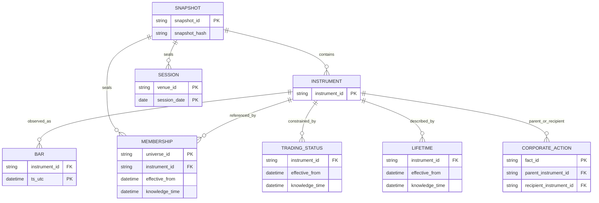

# Preparing Point-In-Time Inputs


Bars tell you what was observed. They do not tell you whether a venue
was open, which instruments belonged to a research universe, whether an
instrument could trade, or when evidence became knowable.

This article adds those claims one at a time. By the end, you will have
sealed and run one point-in-time bundle, seen a late-known halt change
the public decision view, and have a reference map for every accepted
input family.

``` r
library(ledgr)
library(dplyr)
data("ledgr_demo_pit_inputs", package = "ledgr")

pit <- ledgr_demo_pit_inputs
pit$cases
```

                     type instrument_id       date
    1       venue_closure          <NA> 2020-01-06
    2 missing_observation       DEMO_04 2020-01-09
    3           delisting       DEMO_01 2020-01-14
    4                halt       DEMO_02 2020-01-03
    5       cash_dividend       DEMO_03 2020-01-10

The bundle is synthetic and self-contained. Its bars, physical
instrument master, calendar, and facts describe the same five `DEMO_*`
instruments over the same window. Do not attach its facts to an
unrelated observation panel.

## Start With The Missing Observation

The manifest says `DEMO_04` has no bar on an otherwise open date.

``` r
gap <- pit$cases |>
  filter(type == "missing_observation")

tibble(
  instrument_id = gap$instrument_id,
  session_date = gap$date,
  observation_present = with(
    pit$bars,
    any(
      instrument_id == gap$instrument_id &
        as.Date(ts_utc) == gap$date
    )
  )
)
```

    # A tibble: 1 x 3
      instrument_id session_date observation_present
      <chr>         <date>       <lgl>
    1 DEMO_04       2020-01-09   FALSE

A price file alone cannot distinguish this gap from a venue closure. The
independent session calendar makes that distinction.

``` r
session_facts <- ledgr_facts_sessions(
  pit$sessions,
  venue_id = "DEMO_VENUE",
  knowledge = "evidenced",
  timezone = "America/New_York"
)

pit$sessions |>
  filter(session_date %in% c(as.Date("2020-01-06"), gap$date)) |>
  select(session_date, status, session_close)
```

      session_date status session_close
    1   2020-01-06 closed          <NA>
    2   2020-01-09   open      16:00:00

The closure is declared `closed`; the gap date remains `open`. ledgr can
now advance the expected-session clock without manufacturing a price.

## Add A Point-In-Time Universe

Universe membership answers a different question: which physical
instruments were eligible for this research population? This bundle
declares one complete membership set.

``` r
membership_facts <- ledgr_facts_membership_snapshots(
  pit$membership,
  universe_id = "demo_members",
  complete = TRUE,
  knowledge = "evidenced"
)

pit$membership |>
  select(effective_from, knowledge_time, instrument_id)
```

           effective_from      knowledge_time instrument_id
    1 2020-01-01 21:00:00 2019-12-31 05:00:00       DEMO_01
    2 2020-01-01 21:00:00 2019-12-31 05:00:00       DEMO_02
    3 2020-01-01 21:00:00 2019-12-31 05:00:00       DEMO_03
    4 2020-01-01 21:00:00 2019-12-31 05:00:00       DEMO_04
    5 2020-01-01 21:00:00 2019-12-31 05:00:00       DEMO_05

Because the set is complete, omission means non-membership for that
effective set. Use interval assertions instead when your source supplies
individual membership changes rather than complete lists.

## Effective Time Is Not Knowledge Time

`DEMO_02` was halted from 3 January, but the bundle says that evidence
became knowable only on 7 January. The fact must not change decisions
made earlier.

``` r
halt <- pit$trading_status |>
  filter(status == "halted")

halt |>
  select(
    instrument_id,
    effective_from,
    effective_to,
    knowledge_time,
    status,
    precedence
  )
```

      instrument_id      effective_from        effective_to      knowledge_time status
    1       DEMO_02 2020-01-03 21:00:00 2020-01-08 21:00:00 2020-01-07 21:00:00 halted
      precedence
    1          1

The open-ended active assertion has precedence zero. The overlapping
halt has precedence one and wins only after it is known.

``` r
status_facts <- ledgr_facts_trading_status(
  pit$trading_status,
  knowledge = "evidenced"
)
```

This separation is the core point-in-time rule: effective time says when
the world changed; knowledge time says when the backtest may use the
evidence.

## Add Lifetime And Economic Events When Needed

Lifetime facts distinguish an instrument that ceased to exist from one
that merely lacks a bar. Corporate-action facts record evidenced
economic events.

``` r
lifetime_facts <- ledgr_facts_lifetime(
  pit$lifetime,
  knowledge = "evidenced"
)

corporate_action_facts <- ledgr_facts_equity_corporate_actions(
  pit$corporate_actions
)

pit$lifetime |>
  filter(assertion == "known_inactive") |>
  select(instrument_id, effective_from, knowledge_time, terminal_event)
```

      instrument_id      effective_from      knowledge_time terminal_event
    1       DEMO_01 2020-01-14 21:00:00 2020-01-14 21:00:00       delisted

``` r
pit$corporate_actions |>
  select(
    subtype,
    parent_instrument_id,
    entitlement_time,
    effective_time,
    knowledge_time,
    payment_time
  )
```

            subtype parent_instrument_id    entitlement_time      effective_time
    1 cash_dividend              DEMO_03 2020-01-10 21:00:00 2020-01-10 21:00:00
           knowledge_time        payment_time
    1 2020-01-09 21:00:00 2020-01-13 21:00:00

Corporate actions have four clocks because entitlement, market effect,
knowledge, and payment need not coincide. Do not collapse them into one
vendor date during preparation.

## Seal And Run The Combined Evidence

Combine the fact families, then pass the plain bundle through the
ordinary snapshot API. The scope and knowledge choices are explicit in
the code above; they are not hidden inside the bundle’s recipe.

``` r
pit_facts <- ledgr_facts(
  session_facts,
  membership_facts,
  status_facts,
  lifetime_facts,
  corporate_action_facts
)

pit_path <- ledgr_temp_store(file.path(tempdir(), "ledgr_pit_demo.duckdb"))
pit_snapshot <- ledgr_snapshot_from_df(
  pit$bars,
  instruments_df = pit$instruments,
  facts = pit_facts,
  db_path = pit_path,
  snapshot_id = "pit_demo_snapshot",
  price_basis = "split_adjusted"
)

pit_snapshot_id <- pit_snapshot$snapshot_id
ledgr_snapshot_close(pit_snapshot)
pit_snapshot <- ledgr_snapshot_open(
  pit_path,
  snapshot_id = pit_snapshot_id,
  verify = TRUE
)
```

Availability-aware runs require an explicit stale-mark policy. The flat
strategy below makes no trades; its purpose is to show what the decision
view knows at the three halt boundaries.

``` r
flat_strategy <- function(ctx, params) ctx$flat()
pit_experiment <- ledgr_experiment(
  pit_snapshot,
  flat_strategy,
  universe = ledgr_universe_members("demo_members"),
  valuation_policy = ledgr_valuation_stale(2),
  cost_model = ledgr_cost_zero()
)
pit_run <- ledgr_run(pit_experiment, run_id = "pit-demo-run")

halt_view <- bind_rows(
  ledgr_run_explain(
    pit_run,
    halt$instrument_id[[1]],
    halt$effective_from[[1]]
  ) |>
    mutate(moment = "effective, not yet known"),
  ledgr_run_explain(
    pit_run,
    halt$instrument_id[[1]],
    halt$knowledge_time[[1]]
  ) |>
    mutate(moment = "known"),
  ledgr_run_explain(
    pit_run,
    halt$instrument_id[[1]],
    halt$effective_to[[1]]
  ) |>
    mutate(moment = "interval ended")
)

halt_view |>
  select(moment, target_restricted, target_restriction_reason)
```

    # A tibble: 3 x 3
      moment                   target_restricted target_restriction_reason
      <chr>                    <lgl>             <chr>
    1 effective, not yet known FALSE             ""
    2 known                    TRUE              "trading_halted"
    3 interval ended           FALSE             ""

``` r
unlist(ledgr_run_completion(pit_run)[
  c("completion_status", "complete_performance")
])
```

       completion_status complete_performance
                  "DONE"               "TRUE"

The first decision remains unrestricted because the halt was not yet
known. The second is restricted for `trading_halted`. The excluded
interval end is active again.

## Data Dictionary

Use this section as a reference after you understand why each family
exists. Constructor help remains authoritative for exhaustive optional
columns and accepted values.

| Input | Row grain and identity | Required core columns or shape | Scope and time | Constructor help |
|----|----|----|----|----|
| Bars | One row per `(instrument_id, ts_utc)` | `instrument_id`, `ts_utc`, OHLC; `volume` optional | Physical instrument; observation clock | [`ledgr_snapshot_from_df()`](../reference/ledgr_snapshot_from_df.html) |
| Instruments | One row per `instrument_id` | `instrument_id`; descriptive fields optional | Physical master; stable identity | [`ledgr_snapshot_from_df()`](../reference/ledgr_snapshot_from_df.html) |
| Sessions | One row per civil date in a venue range | `session_date`, `status`; open/close times for open rows | `venue_id`; calendar and knowledge time | [`ledgr_facts_sessions()`](../reference/ledgr_facts.html) |
| Membership intervals | One assertion per instrument interval | `instrument_id`, `effective_from`, `member`; optional `effective_to` | `universe_id`; effective and knowledge time | [`ledgr_facts_membership_intervals()`](../reference/ledgr_facts.html) |
| Complete membership snapshots | One complete set per effective/knowledge/source group | `effective_from` plus row-wise ids or one `members` list-column | `universe_id`; omission has meaning only when complete | [`ledgr_facts_membership_snapshots()`](../reference/ledgr_facts.html) |
| Trading status | One sourced assertion per instrument interval and precedence | `instrument_id`, `effective_from`, `status`, `source` | Physical instrument; effective and knowledge time | [`ledgr_facts_trading_status()`](../reference/ledgr_facts.html) |
| Lifetime | One assertion per instrument interval | `instrument_id`, `effective_from`, `assertion` | Physical instrument; effective and knowledge time | [`ledgr_facts_lifetime()`](../reference/ledgr_facts.html) |
| Equity corporate actions | One identified economic fact | `subtype`, parent id, completeness, provenance; conditional terms | Physical parent/recipient; four event clocks | [`ledgr_facts_equity_corporate_actions()`](../reference/ledgr_facts.html) |

Every interval is half-open: `effective_from` is included and
`effective_to` is excluded. Across families:

- identifiers stay stable for the history being sealed;
- observation and fact timestamps are whole-second UTC instants; and
- knowledge is declared per family rather than assumed to precede
  effect.

## Entity Relationships

The physical instrument master, venue calendar, and research universe
are different scopes.

<div class="ledgr-diagram ledgr-input-entities">



</div>

Corporate-action parent and optional recipient ids resolve against the
physical master, not universe membership. Trading-status and lifetime
facts also refer to physical instruments; neither makes an instrument a
universe member.

## What A Seal Establishes

After a successful seal, ledgr can rely on stable physical ids,
whole-second bar timestamps, unique bar keys, fact referential
integrity, validated family structure, and an immutable snapshot hash.

A seal does not imply a dense instrument-by-session rectangle, current
membership, continuously fresh prices, inferred corporate-action terms,
or knowledge before effectiveness. Those remain explicit evidence or
policy questions.

## Cleanup

``` r
close(pit_run)
ledgr_snapshot_close(pit_snapshot)
```

## Where Next

- `vignette("missing-data-and-sessions", package = "ledgr")` follows a
  real price gap through valuation and execution.
- `vignette("survivorship-bias", package = "ledgr")` shows the
  consequence of replacing historical membership with today’s survivors.
- `vignette("corporate-action-cash", package = "ledgr")` shows a cash
  distribution changing portfolio accounting.
- `vignette("data-input-and-snapshots", package = "ledgr")` covers CSV
  and Yahoo imports, quarantine, and reopening.
