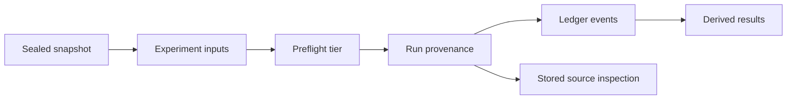

# On Reproducibility: Provenance and Strategy Tiers


ledgr treats a backtest result as an experiment artifact. The question
is not only “what was the return?” The question is:

``` text
which sealed data, which strategy, which parameters, which features,
which opening state, and which execution assumptions produced this run?
```

By the end of this article you can tell which of your runs ledgr can
replay exactly, which depend on code outside the run, and how to move a
strategy into the self-contained tier. It is about provenance and replay
boundaries, not whether a strategy has predictive edge.

> [!WARNING]
>
> ### Evidence is not validation
>
> Provenance records what ran. It does not prove that a selected strategy
> will generalize. A promoted candidate, a verified strategy hash, and a
> sealed snapshot are evidence-capture tools, not statistical validation
> of the selection rule.


## Setup

``` r
library(ledgr)
library(dplyr)
data("ledgr_demo_bars", package = "ledgr")

bars <- ledgr_demo_bars |>
  filter(
    instrument_id %in% c("DEMO_01", "DEMO_02"),
    between(
      ts_utc,
      ledgr_utc("2019-01-01"),
      ledgr_utc("2019-06-30")
    )
  )
```

## The Experiment Model

A ledgr run is produced from explicit inputs. The experiment fixes:

- a sealed snapshot;
- a strategy function;
- registered feature definitions;
- an opening state;
- a universe and execution options.

`ledgr_run()` then supplies strategy parameters and an immutable
`run_id`. The run derives fills, ledger events, equity, trades, metrics,
and comparison tables from those inputs. The sealed snapshot is the
evidence base. The strategy declares desired holdings at each pulse. The
feature list declares which derived values are available to the
strategy. The opening state declares cash and any starting positions.

That shape matters because each part has a different reproducibility
role. Market data are sealed. Parameters are stored and hashed. Strategy
source is captured when possible. Results are derived from ledger events
rather than remembered from an in-memory session.

## Why `params` Is The Boundary

Use `params` for strategy variation. Parameters are canonicalized,
hashed, and stored with the run. Hidden globals are not.

``` r
strategy <- function(ctx, params) {
  above <- ctx$vec$close > params$threshold
  targets <- ctx$flat()
  targets[above] <- params$qty
  targets
}
```

The same rule matters for every saved run and sweep row: explicit values
can be canonicalized and hashed; an arbitrary interactive session
cannot.

``` r
snapshot <- ledgr_snapshot_from_df(bars, snapshot_id = "research_snapshot")

features <- list(ledgr_ind_returns(5))

strategy <- function(ctx, params) {
  rising <- ledgr_signal_return(ctx, lookback = 5) > params$min_return
  ctx |>
    ledgr_selection(where = rising, missing = "exclude") |>
    ledgr_target_quantity(ctx, params$qty)
}

exp <- ledgr_experiment(
  snapshot = snapshot,
  strategy = strategy,
  features = features,
  opening = ledgr_opening(cash = 10000),
  cost_model = ledgr_cost_zero()
)

bt <- ledgr_run(
  exp,
  params = list(min_return = 0, qty = 10),
  run_id = "qty_10"
)
```

    Warning: LEDGR_LAST_BAR_NO_FILL: target changed on the final available bar, but the
    next-open fill model requires a following bar. No fill was emitted for this target
    change. Check the strategy's final-pulse behavior or extend the snapshot if this trade
    should be fillable.

The `LEDGR_LAST_BAR_NO_FILL` warning means the rule changed its target
on the last bar, where no later open exists to fill it. It does not
affect what the run records;
`vignette("execution-semantics", package = "ledgr")` explains it.

## The Provenance Model

For completed runs, ledgr stores run provenance alongside the result
tables. The provenance record includes the captured strategy source
where available, source hash, parameter JSON and parameter hash,
dependency-version metadata, ledgr version, R version, and
reproducibility tier.

Those fields do not make every run perfectly replayable. They make the
claim inspectable. A run should be explainable later: what source text
ledgr captured, which parameters were supplied, whether the source hash
still verifies, and what reproducibility tier ledgr assigned before
execution.

``` r
ledgr_run_info(snapshot, "qty_10")
```

    ledgr Run Info
    ==============

    Run ID:           qty_10
    Label:            NA
    Status:           DONE
    Archived:         FALSE
    Tags:             NA
    Snapshot:         research_snapshot
    Snapshot Hash:    6eeff5ca520c516a61e0228c5ac06d22548c9d74e4e98d1e9f71fccdd2b8a87e
    Feature Set Hash: fca1ef954400ce7477424f60b32a500cb8bd7665882cfdf37f0ee409e7d6ac5f
    Risk Chain Hash:  71863d276abfadf01e5451b8feb3ae38690b42c350db22b2740bf990358c0a11
    Config Hash:      8478a6dab28b464e8686f9f396a204e1f51ec2a2c7215990dd5a721dea053f38
    Strategy Hash:    bacaf6e70817b64d2a9221bc85f88607caed1e47d1da0e4a1bad4f61567f2989
    Params Hash:      3220f4b13aab31b2d35b6044d9d6e143ac6a8c9de9edd3353936006a683abdb9
    Reproducibility:  tier_1
    Execution Mode:   audit_log
    Fill Timing:      dense_bar_timestamp
    Timing Version:   N/A
    Elapsed Sec:      1.050
    Persist Features: TRUE
    Cache Hits:       0
    Cache Misses:     2

## Extract Stored Strategy Source

`ledgr_run_strategy()` inspects stored strategy provenance for a run.
The default is intentionally read-only:

``` r
stored <- ledgr_run_strategy(snapshot, "qty_10", trust = FALSE)
stored
```

    ledgr Extracted Strategy
    ========================

    Run ID:           qty_10
    Reproducibility:  tier_1
    Source Hash:      bacaf6e70817b64d2a9221bc85f88607caed1e47d1da0e4a1bad4f61567f2989
    Params Hash:      3220f4b13aab31b2d35b6044d9d6e143ac6a8c9de9edd3353936006a683abdb9
    Hash Verified:    TRUE
    Trust:            FALSE
    Source Available: TRUE

``` r
writeLines(stored$strategy_source_text)
```

    function (ctx, params)
    {
        rising <- ledgr_signal_return(ctx, lookback = 5) > params$min_return
        ledgr_target_quantity(ledgr_selection(ctx, where = rising, missing = "exclude"), ctx, params$qty)
    }

``` r
names(stored[c("R_version", "ledgr_version", "dependency_versions")])
```

    [1] "R_version"           "ledgr_version"       "dependency_versions"

``` r
dependencies <- names(stored$dependency_versions)
dependencies[order(tolower(dependencies), method = "radix")]
```

    [1] "collapse" "DBI"      "digest"   "duckdb"   "ledgr"    "R"        "tibble"
    [8] "TTR"      "yyjsonr"

The compact print emphasizes source identity. The field names above show
where the recorded runtime and dependency versions live without making
this article’s render depend on whichever package versions happen to be
installed today. Those versions are metadata, not a promise that every
external system library can be reconstructed.

`trust = FALSE` returns source text and metadata without parsing,
evaluating, or executing the stored source. In this mode, the source
text is just data.

Use `trust = TRUE` only when you explicitly trust the experiment store
and intentionally want ledgr to parse and evaluate the stored text into
a function object.

``` r
trusted <- ledgr_run_strategy(snapshot, "qty_10", trust = TRUE)
is.function(trusted$strategy_function)
```

    [1] TRUE

``` r
rerun_exp <- ledgr_experiment(
  snapshot = snapshot,
  strategy = trusted$strategy_function,
  features = features,
  opening = ledgr_opening(cash = 10000),
  cost_model = ledgr_cost_zero()
)

ledgr_run(
  rerun_exp,
  params = trusted$strategy_params,
  run_id = "qty_10_rerun"
)
```

    Warning: LEDGR_LAST_BAR_NO_FILL: target changed on the final available bar, but the
    next-open fill model requires a following bar. No fill was emitted for this target
    change. Check the strategy's final-pulse behavior or extend the snapshot if this trade
    should be fillable.

    ledgr Backtest Results
    ======================

    Run ID:                            qty_10_rerun
    Period:                            2019-01-01 to 2019-06-28
    Opening Cash:                      $10000.00
    Final Equity:                      $10119.69
    Total Return:                      1.20%
    Max Drawdown:                      -0.82%
    Closed Trades:                     20

    Corporate actions: NOT SUPPLIED - returns may omit distributions
    Price basis: UNDECLARED - distribution double counting cannot be ruled out

    Use summary(bt) for metrics and evidence

Hash verification proves stored-text identity, not code safety. A
verified hash means the stored text matches the stored hash. It does not
mean the source is safe to evaluate, economically sensible, or
independent from external state.

Runs created by older versions of ledgr, and strategy types whose source
cannot be captured, may report `strategy_source_text = NA`. Those runs
can still be inspected through `ledgr_run_info()` and result tables, but
the strategy function cannot be recovered from provenance alone.

Stored source is a strong audit artifact, but it is only one part of
reproducibility. A strategy may call external packages. It may close
over data objects. It may rely on package versions, system libraries, or
runtime state outside ledgr’s database. That is why ledgr classifies
strategies before execution.

## Reproducibility Tiers

### Tier 1: Self-Contained

> [!NOTE]
>
> ### Definition
>
> Tier 1 means ledgr can inspect the strategy from stored source and
> explicit parameters under its static preflight rules. The strategy
> depends only on ledgr, base/recommended R, and declared run inputs.


Tier 1 is self-contained under ledgr’s static preflight rules. The
strategy can be understood from stored source and explicit parameters,
using base/recommended R references and ledgr’s exported public
namespace.

``` r
tier_1_strategy <- function(ctx, params) {
  targets <- ctx$flat()
  targets[] <- params$qty
  targets
}

ledgr_strategy_preflight(tier_1_strategy)
```

    ledgr Strategy Preflight
    =========================

    Tier:    tier_1
    Allowed: TRUE
    Reason:  Strategy is self-contained under ledgr's static preflight rules.

### Tier 2: Inspectable With User-Managed Environment

> [!WARNING]
>
> ### Definition
>
> Tier 2 means ledgr can inspect and run the strategy, but full replay
> also depends on environment details outside ledgr’s store, such as
> package installation, package versions, system libraries, or immutable
> captured values.


Tier 2 is inspectable but needs environment management outside ledgr.
Examples include package-qualified calls outside the active R
distribution and resolved immutable non-function objects captured from
the strategy environment.

#### Package Dependencies

``` r
tier_2_strategy <- function(ctx, params) {
  TTR::SMA(c(1, 2, 3), n = 2)
  ctx$flat()
}

ledgr_strategy_preflight(tier_2_strategy)
```

    ledgr Strategy Preflight
    =========================

    Tier:    tier_2
    Allowed: TRUE
    Reason:  Strategy uses package dependency outside the active R distribution: TTR.
    Package Dependencies: TTR

The `TTR::SMA()` call is written this way on purpose. Namespace
qualification tells ledgr which package supplies the function. That
makes the dependency visible in the preflight result and keeps the
strategy inspectable. The run can proceed, but ledgr cannot preserve the
installed `TTR` version or its system requirements by itself.

#### Captured Values

Resolved external scalar values are also Tier 2, not Tier 3. They are
visible to the preflight because they exist in the strategy closure, but
ledgr does not turn them into replayable run parameters. Prefer putting
values that define the research question into `params`, especially for
sweeps.

``` r
captured_threshold <- 100

tier_2_captured <- function(ctx, params) {
  above <- ctx$vec$close > captured_threshold
  targets <- ctx$flat()
  targets[above] <- params$qty
  targets
}

tier_1_parameterized <- function(ctx, params) {
  above <- ctx$vec$close > params$threshold
  targets <- ctx$flat()
  targets[above] <- params$qty
  targets
}

list(
  captured_value = ledgr_strategy_preflight(tier_2_captured)$tier,
  explicit_parameter = ledgr_strategy_preflight(tier_1_parameterized)$tier
)
```

    $captured_value
    [1] "tier_2"

    $explicit_parameter
    [1] "tier_1"

Both functions are inspectable, but only the second makes the threshold
a declared run input. That is why the tier changes even though the
arithmetic is the same.

Captured mutable environments may be classified as Tier 2 because ledgr
can resolve that the object exists. Do not treat that classification as
approval. If the object can change between runs or workers, move the
value into `params` or freeze it before running.

#### What ledgr Preserves And What You Own

Tier 2 is allowed for ordinary runs and sequential sweeps. It is not
fully reproducible by ledgr alone. Users own package installation,
package version parity, system libraries, and any other runtime
environment needed by their strategy.

Common environment-management approaches in R projects include `renv`,
Docker, `{rix}` (<https://github.com/ropensci/rix>), and `{uvr}`
(<https://github.com/nbafrank/uvr>). ledgr does not require those tools
and this article does not teach them. The point is simpler: if a
strategy is Tier 2, ledgr can preserve the run evidence, but the user
must preserve the surrounding environment.

### Tier 3: Rejected External State

> [!IMPORTANT]
>
> ### Definition
>
> Tier 3 means the strategy depends on external state ledgr cannot recover
> or execute safely. The run is rejected before execution; there is no
> `force = TRUE` override.


Tier 3 is external state ledgr cannot recover or execute safely. Common
examples are unqualified helper functions from the interactive session,
wall-clock or process-environment calls such as `Sys.time()`,
`Sys.Date()`, and `Sys.getenv()`, and global assignment with `<<-`.

``` r
my_helper <- function(ctx) ctx$flat()

tier_3_strategy <- function(ctx, params) {
  my_helper(ctx)
}

ledgr_strategy_preflight(tier_3_strategy)
```

    ledgr Strategy Preflight
    =========================

    Tier:    tier_3
    Allowed: FALSE
    Reason:  Strategy references unresolved symbol(s): my_helper.
    Unresolved Symbols: my_helper

Tier 3 strategies fail before execution. There is no `force = TRUE`
override on `ledgr_run()` or `ledgr_sweep()`. Move scalar configuration
into `params`, qualify package calls, or place a small helper inside the
strategy body so its source is captured. Do not put function objects in
`params`; run parameters must remain JSON-safe values.

``` r
repaired_strategy <- function(ctx, params) {
  choose_targets <- function(context, quantity) {
    above <- context$vec$close > params$threshold
    targets <- context$flat()
    targets[above] <- quantity
    targets
  }

  choose_targets(ctx, params$qty)
}

ledgr_strategy_preflight(repaired_strategy)
```

    ledgr Strategy Preflight
    =========================

    Tier:    tier_1
    Allowed: TRUE
    Reason:  Strategy is self-contained under ledgr's static preflight rules.

Preflight rejection comes first. A Tier 3 strategy stops before the run
starts: before any pulse executes and before anything is written, so the
preflight error is the first one you see. The condition class chain
includes `ledgr_strategy_tier3` and `ledgr_strategy_preflight_error`.

The most common hard rejections are:

| Pattern | Example | Why it fails |
|----|----|----|
| wall-clock access | `Sys.time()` or `do.call("Sys.time", list())` | runtime date/time is not stored run input |
| process environment | `Sys.getenv("TOKEN")` | external process state is not stored run input |
| dynamic evaluation | `get("x")`, `eval(expr)`, `assign("x", 1)` | preflight cannot recover the value path as stored metadata |
| global assignment | `x <<- 1` | strategy mutates state outside the run artifact |
| context mutation | `attr(ctx, "secret") <- 1` | strategy mutates ledgr’s execution context |
| unresolved helper | `my_helper(ctx)` | helper source is not stored as part of the strategy |

Recommended-R functions such as `stats::median()` remain Tier
1-compatible when called explicitly or resolved through R’s
base/recommended namespace. They are not package dependencies outside
the active R distribution.

Ambient strategy RNG calls such as `runif(1)` are a separate case. They
are allowed as Tier 2 for ordinary sequential runs because ledgr’s
execution seed contract can make a continuous strategy run repeatable,
but they are not certified for resume or parallel equivalence. A resumed
run reconstructs positions and cash from events; it does not restore
`.Random.seed` to the exact point a continuous run would have reached
before the next pulse.

Strategies that need pulse-specific stochastic inputs in resume-safe or
parallel-safe paths should derive those inputs from `ctx$pulse_seed`.
The field is a stable integer derived from the execution seed and the
1-based pulse position in the run’s pulse sequence, so it does not
depend on worker order, timestamps, event sequence numbers, or ambient
RNG state. `ctx$seed` remains the per-execution seed; `ctx$pulse_seed`
is the per-pulse derivative.

This is different from custom-indicator RNG restrictions: feature
generation must be deterministic for a given snapshot and feature
definition. Prefer making random decisions explicit in the research
design. A seeded decision may be repeatable, but it is still part of the
decision process.

## Hidden Mutable State

Static analysis is not proof of semantic reproducibility. Patterns such
as `<<-`, mutable captured environments, dynamic dispatch, and
dynamically constructed calls can make a strategy order-dependent or
worker-dependent even when some symbols resolve.

``` r
counter <- 0

bad_strategy <- function(ctx, params) {
  counter <<- counter + 1
  ctx$flat()
}

ledgr_strategy_preflight(bad_strategy)$tier
```

    [1] "tier_3"

The global assignment is caught here, but preflight cannot see every
form of hidden state, such as a mutable object reached through a
captured environment. Avoid this pattern. Store intentional strategy
variation in `params`, and let ledgr record decisions and state changes
through the run artifacts.

## What To Remember

Reproducibility in ledgr is a chain:



Tier 1 is the cleanest path. Tier 2 is allowed but requires user-managed
environment parity. Tier 3 fails because ledgr cannot recover what the
strategy depended on.

> [!TIP]
>
> ### Try it
>
> Write a strategy that calls `Sys.time()` and run
> `ledgr_strategy_preflight()`. What tier does ledgr assign, and what
> dependency did the preflight reject?


## Where Next

- `vignette("research-workflow", package = "ledgr")` follows a research
  idea through code iterations, sweeps, and promotion.
- `vignette("strategy-authoring-tools", package = "ledgr")` covers
  helper pipelines, one-pulse testing, and strategy state.
- `vignette("experiment-store", package = "ledgr")` covers store-level
  source inspection and reopening.
