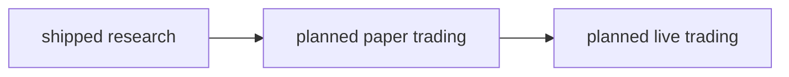
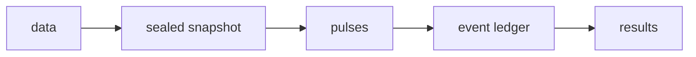

# Design Philosophy: From Research to Production

ledgr currently ships a research engine. Its durable experiments, pulse
contract, and event-derived accounting are designed so later paper and
live systems do not have to discard the research model. Those later
systems have not shipped.

This article starts with the research workflow you can use now, then
shows the longer arc the architecture is intended to support. A design
direction is not a claim that paper or live execution already exists.

## The Arc

The first box is the product today. ledgr seals inputs, runs research
strategies, stores accounting evidence, and reopens results. The arrows
are an architectural goal: future execution modes should reuse a
compatible strategy and accounting boundary instead of treating a CSV of
returns as the production handoff.

## The Ledger Is The Bridge

In ledgr, fills and other accounting effects are appended to a ledger.
Equity, trades, and metrics are derived from that evidence. A target
vector is a pulse decision, not itself a promise that every intermediate
choice becomes an immutable ledger row.

This is both a correctness choice and a useful future boundary; the
planned operational boundary below says what a live system would still
need.

## Research Evidence Is Durable

Before a strategy is trusted, its research evidence should be
inspectable, not just one remembered number from one R session. A sealed
snapshot pins the market data, a `run_id` names each committed
experiment, and the strategy’s source and parameters are captured with
it, so every run stays auditable after the R session ends.
`vignette("experiment-store", package = "ledgr")` covers listing,
labelling, comparing and reopening runs, and
`vignette("sweeps", package = "ledgr")` covers exploring a grid and
promoting one candidate into a committed run.

Self-contained `function(ctx, params)` strategies with explicit
parameters get the strongest identity;
`vignette("reproducibility", package = "ledgr")` explains the tiers and
what each one can reproduce.

## The Planned Operational Boundary

R and DuckDB can run on small servers and edge hardware, but portability
of the research store is not a trading system. A future paper or live
mode would need broker order state, partial fills, rejection handling,
reconciliation, safety gates, recovery, and observability. The ledger
and reconstruction model are useful foundations for that work; they are
not substitutes for it.

## Execution Assumptions Are Explicit

Timing and transaction costs are explicit parts of experiment
construction: `ledgr_experiment()` takes a `timing_model` and a
`cost_model`. Use `ledgr_cost_zero()` when a zero-cost baseline is
intentional; that choice is still recorded as a cost model, with its own
`cost_model_hash` and `cost_plan_json`, so a no-cost run is not confused
with an omitted-cost run. `vignette("risk-and-cost", package = "ledgr")`
teaches the spread convention, fees and target-risk layers.

## What The Current Research Layer Delivers

The v0.2.1.0 release line is a correctness-first research layer. It
covers:

- sealed snapshots, hash verification, and deterministic replay across
  machines and R sessions;
- project-local DuckDB stores with run discovery, labels, tags,
  archival, comparison, reopening, and strategy-source inspection;
- deterministic pulse execution with no-lookahead `ctx`, full target
  holdings, next-open fills, final-bar no-fill warnings, and an
  append-only ledger;
- accounting surfaces for ledger events, fills, trades, equity rows,
  summary metrics, and explicit metric contexts;
- built-in indicators, TTR-backed indicators, multi-output bundles,
  feature maps, warmup diagnostics, pulse inspection, and active
  aliases;
- feature and strategy grids, sweep execution, candidate rows, compact
  saved sweeps, retained return series, promotion context, and explicit
  selection-is-not-validation framing;
- public cost-model constructors, timing-model identity, explicit costs,
  target-risk transforms with risk-chain identity, reproducibility
  tiers, strategy preflight, stored strategy source, and a deterministic
  demo dataset for documentation and examples.

It also includes walk-forward and selection-integrity surfaces:

- walk-forward evaluation runs over the existing sweep and run surfaces,
  consuming cost identity, saved-sweep retention infrastructure, and
  risk-chain identity;
- DSR, PBO/CSCV, MinTRL, and deterministic effective-trial clustering
  operate over retained return panels;
- point-in-time inputs, availability-aware universes, missing-session
  rules, cash distributions, and bounded terminal settlement make
  stronger evidence possible when the research claim requires it.

The target-risk layer is intentionally narrow: it transforms target
quantities before timing and cost. It does not implement affordability
enforcement, liquidity/capacity policy, margin, shorting or borrow
policy, OMS lifecycle behavior, or broker-grade controls.

Paper/live execution, broker adapters, and operational observability
remain roadmap work. The research layer is intended to be reusable
foundation, but no release date or operational capability is implied by
this article.

## Where Next

- `vignette("research-workflow", package = "ledgr")` shows the current
  project-local research loop.
- `vignette("walk-forward", package = "ledgr")` shows held-out
  evaluation over sweep and run surfaces.
- `vignette("risk-and-cost", package = "ledgr")` explains the
  target-risk, timing, cost, liquidity, and OMS boundaries.
- `vignette("reproducibility", package = "ledgr")` covers strategy
  source, tiers, and trust boundaries.
