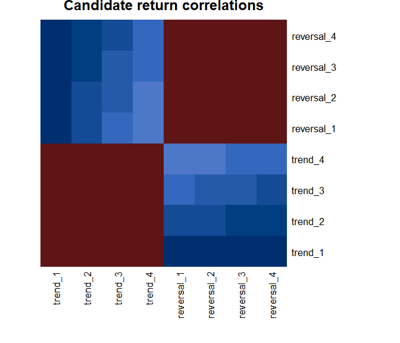

# Selection Integrity


``` r
library(ledgr)
library(dplyr)
```

You have run a family of strategy variants. Several look attractive. The
hard question is no longer which row has the largest Sharpe ratio; it is
whether the search, sample length, return path, and number of trials
give you enough reason to trust any of them.

When you test many variants on one history, the best-looking result
reflects both any real edge and noise that happened to favor that
variant. The larger the search, the more opportunity there is to select
favorable noise. Backtest overfitting is this adaptation of a strategy
or selection rule to historical accidents that do not persist outside
the data used to choose it.

This article turns one candidate-return panel into four kinds of
evidence. You will use PBO/CSCV to inspect the search, Minimum Track
Record Length to inspect sample sufficiency, K-Ratio to inspect path
consistency, and Deflated Sharpe Ratio with effective trials to inspect
multiple-testing pressure. You will then see how those diagnostics can
inform explicit eligibility requirements without becoming a
winner-selection rule.

<div class="ledgr-callout ledgr-callout-warning">

**Evidence is not selection**

These diagnostics can challenge a result that looks persuasive. They do
not choose a candidate, promote one, or prove future profitability. A
low-risk diagnostic result is a reason to continue the research process,
not permission to stop it.

</div>

## Start With The Evidence

All four diagnostics consume a `ledgr_return_panel`: one ordered return
series per candidate. That shared object matters because validation
happens once and a deterministic `panel_hash` follows the exact evidence
through every result.

Here is a deliberately difficult search. Three candidates win in
different three-period segments. A fourth candidate earns a smaller but
steadier return:

``` r
rotating_returns <- tibble(
  early = c(rep(0.05, 3), rep(-0.01, 9)),
  middle = c(rep(-0.01, 3), rep(0.05, 3), rep(-0.01, 6)),
  late = c(rep(-0.01, 6), rep(0.05, 3), rep(-0.01, 3)),
  steady = rep(0.012, 12)
)

rotating_returns |>
  mutate(period = row_number(), .before = 1) |>
  knitr::kable()
```

| period | early | middle |  late | steady |
|-------:|------:|-------:|------:|-------:|
|      1 |  0.05 |  -0.01 | -0.01 |  0.012 |
|      2 |  0.05 |  -0.01 | -0.01 |  0.012 |
|      3 |  0.05 |  -0.01 | -0.01 |  0.012 |
|      4 | -0.01 |   0.05 | -0.01 |  0.012 |
|      5 | -0.01 |   0.05 | -0.01 |  0.012 |
|      6 | -0.01 |   0.05 | -0.01 |  0.012 |
|      7 | -0.01 |  -0.01 |  0.05 |  0.012 |
|      8 | -0.01 |  -0.01 |  0.05 |  0.012 |
|      9 | -0.01 |  -0.01 |  0.05 |  0.012 |
|     10 | -0.01 |  -0.01 | -0.01 |  0.012 |
|     11 | -0.01 |  -0.01 | -0.01 |  0.012 |
|     12 | -0.01 |  -0.01 | -0.01 |  0.012 |

``` r

rotating_panel <- ledgr_return_panel(rotating_returns)
```

User-supplied panels contain clean period returns, without a leading
structural `NA`. If timestamps are omitted, ledgr assigns deterministic
labels such as `period_000001`. You can instead pass ascending, unique
`Date` or `POSIXct` labels through `ts`.

A retained sweep reaches the same object through
`ledgr_sweep_returns_panel(sweep)`, which returns every completed
candidate with retained returns. Raw matrices and data frames are not
passed directly to the diagnostics: wrap them once with
`ledgr_return_panel()` and reuse the validated evidence.

For the full retained-sweep contract, read
`vignette("sweeps", package = "ledgr")`.

## Four Questions, Not Four Scores

The methods overlap, but they do not answer the same question. Two axes
organize them: where the evidence lives, and what kind of doubt it
tests. Too few observations points to MinTRL; an unreliable path points
to K-Ratio; too many attempts points to PBO at the search-family level
and DSR at the surviving candidate-Sharpe level.

| Diagnostic | Unit of evidence | Research question | Important assumption |
|:---|:---|:---|:---|
| PBO/CSCV | Candidate family | Does the in-sample winner repeatedly lose rank out of sample? | The candidate family and temporal partition represent the search you actually ran. |
| MinTRL | One candidate | Is the observed track record long enough to clear a reference Sharpe? | The return process remains sufficiently comparable beyond the observed sample. |
| K-Ratio | One candidate | Did cumulative performance advance along a stable fitted path? | Observation frequency and the selected K-Ratio definition are comparable. |
| DSR + effective trials | Candidate within a family | Does Sharpe evidence survive non-normality and multiple testing? | The effective-trial count is a defensible description of the search family. |

Read the diagnostics together. PBO can criticize a search even when one
candidate has a long track record. MinTRL can reject a short candidate
from an otherwise stable family. K-Ratio can expose an erratic path
without correcting selection bias. DSR can reduce Sharpe confidence even
when PBO is low.

## When The Winner Keeps Changing: PBO/CSCV

A search is suspicious when every historical segment crowns a different
winner. Combinatorially Symmetric Cross Validation (CSCV) recombines
contiguous segments into symmetric in-sample and out-of-sample cases. In
each case it selects the winner on the in-sample segments, then
evaluates that same candidate on out-of-sample segments that were held
back from the choice.

`ledgr_pbo()` diagnoses the candidate family and search process. It does
not declare one candidate overfit. It consumes returns only; it does not
inspect fills, positions, promotion records, walk-forward folds, or
strategy source.

For this 12-period example, `S = 4` means four contiguous three-period
subsets. `S` must be even and divide the observation count. In real
research, choose the temporal granularity before reading the result and
check whether reasonable choices change the conclusion; do not tune `S`
to obtain a preferred PBO.

The contrast is a stable-ranking family in which the same ordering
survives every segment:

``` r
stable_returns <- tibble(
  candidate_1 = rep(0.012, 12),
  candidate_2 = rep(0.009, 12),
  candidate_3 = rep(0.006, 12),
  candidate_4 = rep(0.003, 12)
)

pbo_rotating <- ledgr_pbo(rotating_panel, S = 4)
pbo_stable <- ledgr_pbo(ledgr_return_panel(stable_returns), S = 4)

tibble(
  scenario = c("rotating winner", "stable ranking"),
  pbo = c(as_tibble(pbo_rotating)$pbo, as_tibble(pbo_stable)$pbo)
) |>
  knitr::kable()
```

| scenario        | pbo |
|:----------------|----:|
| rotating winner |   1 |
| stable ranking  |   0 |

The headline values become auditable through the CSCV cases. Each row
shows which subsets selected the winner and which subsets tested it:

``` r
as_tibble(pbo_rotating, what = "cases") |>
  transmute(
    case,
    in_sample = vapply(
      in_sample_subsets,
      function(x) paste0("{", paste(x, collapse = ", "), "}"),
      character(1)
    ),
    out_of_sample = vapply(
      out_of_sample_subsets,
      function(x) paste0("{", paste(x, collapse = ", "), "}"),
      character(1)
    ),
    winner = winner_candidate_id,
    oos_rank = round(oos_rank, 2),
    relative_rank = round(omega_bar, 3),
    lambda = round(lambda, 3),
    below_threshold
  ) |>
  knitr::kable()
```

| case | in_sample | out_of_sample | winner | oos_rank | relative_rank | lambda | below_threshold |
|---:|:---|:---|:---|---:|---:|---:|:---|
| 1 | {1, 2} | {3, 4} | early | 1.5 | 0.375 | -0.511 | TRUE |
| 2 | {1, 3} | {2, 4} | early | 1.5 | 0.375 | -0.511 | TRUE |
| 3 | {1, 4} | {2, 3} | early | 1.0 | 0.250 | -1.099 | TRUE |
| 4 | {2, 3} | {1, 4} | middle | 1.5 | 0.375 | -0.511 | TRUE |
| 5 | {2, 4} | {1, 3} | middle | 1.0 | 0.250 | -1.099 | TRUE |
| 6 | {3, 4} | {1, 2} | late | 1.0 | 0.250 | -1.099 | TRUE |

The out-of-sample rank is the winner’s position among all candidates,
from 1 for the lowest score to the candidate count for the highest.
`relative_rank` is that rank divided by the candidate count. `lambda` is
its log-odds, `log(relative_rank / (1 - relative_rank))`, so
`lambda <= 0` means the winner landed in the bottom half. With the
default threshold of zero, PBO is the share of cases marked
`below_threshold`.

The rotating family produces a high PBO because the in-sample winner
usually loses out of sample. The stable family produces a low PBO
because its ordering survives recombination. Neither result establishes
profitability. Constant rankings can arise from unrealistic data, and a
low PBO cannot repair survivorship bias, point-in-time mistakes,
revised-data leakage, or a candidate family that omits the variants you
discarded earlier.

The `steady` candidate is the useful complication: it has the highest
full-sample mean return, 0.012 versus 0.005 for each rotating candidate,
yet it never wins one of the six in-sample contests. A full-sample
leader and a segment-wise winner are different claims.

ledgr fails closed when the panel has too few candidates or
observations, contains non-finite returns, cannot be divided by `S`, or
a custom metric fails to return one finite score per candidate.

The method follows Bailey, Borwein, Lopez de Prado, and Zhu’s published
CSCV and PBO framework. The complete citation appears in [Primary
References](#primary-references).

## When The Track Record Is Too Short: MinTRL

A positive Sharpe ratio can still be too short to distinguish from a
reference Sharpe. Here Sharpe means mean excess return divided by its
standard deviation, in the same per-period units as the input.
`ledgr_min_track_record()` combines that observed Sharpe with skewness
and kurtosis, which describe return asymmetry and tail weight, and a
requested confidence level to estimate the minimum number of
observations required under the method.

The confidence level sets the one-sided evidence threshold in that
required- length calculation. A value of 0.95 does not mean the strategy
has a 95% probability of future profitability.

The reference Sharpe and risk-free return use the same per-period units
as the input. Passing an annualized reference Sharpe against daily or
monthly returns silently asks the wrong question. MinTRL also assumes
the relevant return properties remain sufficiently stable; it does not
discover regime changes or serial dependence for you.

This example simulates 80 fresh daily observations from one fixed
process. The short panel is the first 12 observations of that history,
not a smaller sample copied repeatedly to manufacture a larger count:

``` r
set.seed(5)
candidate_returns <- rnorm(80, mean = 0.003, sd = 0.012)
comparison_returns <- rnorm(80, mean = 0.001, sd = 0.012)
daily_dates <- seq.Date(as.Date("2025-01-01"), by = "day", length.out = 80)

short_panel <- ledgr_return_panel(
  tibble(
    candidate = candidate_returns[1:12],
    comparison = comparison_returns[1:12]
  ),
  ts = daily_dates[1:12]
)
long_panel <- ledgr_return_panel(
  tibble(candidate = candidate_returns, comparison = comparison_returns),
  ts = daily_dates
)

short_min_trl <- as_tibble(
  ledgr_min_track_record(short_panel, reference_sharpe = 0)
) |>
  filter(candidate_id == "candidate")
long_min_trl <- as_tibble(
  ledgr_min_track_record(long_panel, reference_sharpe = 0)
) |>
  filter(candidate_id == "candidate")

bind_rows(
  mutate(short_min_trl, scenario = "first 12 observations"),
  mutate(long_min_trl, scenario = "full 80 observations")
) |>
  transmute(
    scenario,
    observations,
    observed_sharpe = round(observed_sharpe, 3),
    required_observations = round(min_track_record_length, 1),
    extra_needed = extra_observations_needed,
    status
  ) |>
  knitr::kable()
```

| scenario | observations | observed_sharpe | required_observations | extra_needed | status |
|:---|---:|---:|---:|---:|:---|
| first 12 observations | 12 | 0.226 | 46.1 | 35 | needs_more_observations |
| full 80 observations | 80 | 0.269 | 38.6 | 0 | significant |

The first 12 observations look positive but do not clear the required
track length. The full history does. That is evidence about sample
sufficiency under the method’s assumptions, not evidence that the
process is causal, robust, or deployable. When observed Sharpe does not
exceed the reference, ledgr keeps the candidate and reports an infinite
requirement rather than dropping weak evidence.

The diagnostic also fails closed on too few observations, constant or
non-finite returns, and invalid confidence, reference-Sharpe, or
risk-free-rate inputs.

The calculation follows Bailey and Lopez de Prado’s Sharpe-ratio
uncertainty and minimum-track-record framework.
`PerformanceAnalytics::MinTrackRecord()` is optional numerical
verification evidence, not ledgr’s methodological authority. Both
sources are listed in [Primary References](#primary-references).

## When The Endpoint Hides The Path: K-Ratio

Two strategies can finish near the same endpoint while taking very
different paths. `ledgr_k_ratio()` fits a trend to cumulative log
wealth, the running sum of log returns, and compares the slope with its
standard error. The standard error measures how precisely that slope is
estimated, making K-Ratio a signal-to-noise measure rather than a growth
measure. ledgr implements the compounded-return Kestner 2013 variant,
including its sample-length and observation-frequency scaling.

This is a path-consistency diagnostic. It penalizes deviations both
above and below the fitted line, does not distinguish welcome upside
variation from drawdowns, and does not correct selection bias. It is
also separate from the shipped `positive_trajectory` business-objective
criterion: that criterion tests a minimum slope, while K-Ratio compares
slope with estimation uncertainty.

The observations below are explicitly monthly, so
`periods_per_year = 12` is part of the evidence rather than an
unexplained annualization constant:

``` r
monthly_returns <- tibble(
  smooth_growth = c(
    0.015, -0.002, 0.012, 0.004, 0.011, 0.003,
    0.013, 0.005, 0.010, 0.004, 0.012, 0.006
  ),
  noisy_same_endpoint = exp(c(
    0.080, -0.070, 0.070, -0.060, 0.060, -0.050,
    0.050, -0.040, 0.040, -0.030, 0.030, 0.012
  )) - 1
)
monthly_dates <- seq.Date(as.Date("2025-01-01"), by = "month", length.out = 12)

ledgr_k_ratio(
  ledgr_return_panel(monthly_returns, ts = monthly_dates),
  periods_per_year = 12
) |>
  as_tibble() |>
  transmute(
    scenario = recode(
      candidate_id,
      smooth_growth = "smooth growth",
      noisy_same_endpoint = "same endpoint, noisy path"
    ),
    cumulative_log_return = round(cumulative_log_return, 3),
    slope = round(slope, 5),
    slope_std_error = round(slope_std_error, 6),
    k_ratio = round(k_ratio, 3)
  ) |>
  knitr::kable()
```

| scenario | cumulative_log_return | slope | slope_std_error | k_ratio |
|:---|---:|---:|---:|---:|
| smooth growth | 0.092 | 0.00752 | 0.000247 | 8.788 |
| same endpoint, noisy path | 0.092 | 0.00273 | 0.002344 | 0.337 |

The endpoints are nearly identical, but the noisy path has a smaller
fitted slope, a much larger slope standard error, and therefore a much
smaller K-Ratio. Compare K-Ratios only across compatible frequencies and
the same published variant. ledgr fails closed on fewer than three
observations, non-finite inputs, excess returns at or below `-1`, or a
cumulative path whose slope uncertainty cannot be estimated.

The definition and scaling follow Kestner’s 2013 paper cited in [Primary
References](#primary-references).

## When Many Candidates Are Variations Of The Same Idea: DSR

A high Sharpe is less surprising after a large search because multiple
testing creates more opportunities for an extreme result to arise by
chance. Deflated Sharpe Ratio (DSR) asks how much candidate-level Sharpe
evidence remains after accounting for non-normal returns and the
effective number of independent trials.

The raw number of columns can overstate that trial count when many
candidates are close parameter variations. If you do not supply
`effective_trials`, `ledgr_dsr()` calls `ledgr_effective_trials()`.
ledgr computes `1 - correlation` distance and applies deterministic
complete-linkage clustering: candidates can share a cluster only when
every required pairwise distance stays within the threshold. This
clustering rule is a ledgr operationalization; Bailey and Lopez de Prado
motivate the need for effectively independent trials but do not
prescribe this exact estimator.

The example represents eight variants from two related strategy ideas.
Within each idea, candidates differ only by a small perturbation:

``` r
trend_shape <- c(
  -0.020, -0.010, 0.000, 0.010, 0.020, 0.030,
  0.010, -0.020, 0.000, 0.020, 0.015, -0.005
)
reversal_shape <- c(
  0.030, -0.020, 0.025, -0.015, 0.020, -0.010,
  0.015, -0.005, 0.010, 0.000, 0.005, -0.005
)
perturbation <- c(0.001, -0.001, 0.001, -0.001, 0.001, -0.001)

trend_family <- vapply(
  1:4,
  function(i) trend_shape + rep(perturbation * i, 2),
  numeric(12)
)
reversal_family <- vapply(
  1:4,
  function(i) reversal_shape - rep(perturbation * i, 2),
  numeric(12)
)
dsr_returns <- as.data.frame(cbind(trend_family, reversal_family))
names(dsr_returns) <- c(paste0("trend_", 1:4), paste0("reversal_", 1:4))
dsr_panel <- ledgr_return_panel(dsr_returns)
```

The correlation map makes the two candidate families visible before the
clustering result reduces them to a count:

``` r
return_correlation <- cor(dsr_returns)
heatmap(
  return_correlation,
  Rowv = NA,
  Colv = NA,
  scale = "none",
  col = hcl.colors(32, "Blue-Red 3"),
  margins = c(8, 8),
  main = "Candidate return correlations"
)
```



`distance_threshold = 0.15` means candidates can share a
complete-linkage cluster only when all required within-cluster
correlation distances stay at or below 0.15. Equivalently, the relevant
correlations must be at least 0.85. It is an analyst policy, not a
discovered truth. A stricter threshold changes the estimated trial
count:

``` r
strict_trials <- as_tibble(
  ledgr_effective_trials(dsr_panel, distance_threshold = 0.01)
)
family_clustering <- ledgr_effective_trials(
  dsr_panel,
  distance_threshold = 0.15
)
family_trials <- as_tibble(family_clustering)

tibble(
  policy = c("distance threshold 0.01", "distance threshold 0.15"),
  effective_trials = c(strict_trials$effective_trials, family_trials$effective_trials),
  raw_trials = c(strict_trials$raw_trials, family_trials$raw_trials)
) |>
  knitr::kable()
```

| policy                  | effective_trials | raw_trials |
|:------------------------|-----------------:|-----------:|
| distance threshold 0.01 |                3 |          8 |
| distance threshold 0.15 |                2 |          8 |

The selected policy’s exact membership remains available as evidence:

``` r
as_tibble(family_clustering, what = "membership") |>
  knitr::kable()
```

| candidate_id | cluster_index | cluster_id  |
|:-------------|--------------:|:------------|
| trend_1      |             1 | cluster_001 |
| trend_2      |             1 | cluster_001 |
| trend_3      |             1 | cluster_001 |
| trend_4      |             1 | cluster_001 |
| reversal_1   |             2 | cluster_002 |
| reversal_2   |             2 | cluster_002 |
| reversal_3   |             2 | cluster_002 |
| reversal_4   |             2 | cluster_002 |

Now compare the first candidate under the two-family estimate with the
conservative assumption that all eight columns are independent:

``` r
two_trial_dsr <- as_tibble(ledgr_dsr(dsr_panel, effective_trials = 2))
eight_trial_dsr <- as_tibble(ledgr_dsr(dsr_panel, effective_trials = 8))

tibble(
  assumption = c("two effective families", "all columns independent"),
  effective_trials = c(2L, 8L),
  observed_sharpe = round(
    c(two_trial_dsr$observed_sharpe[1], eight_trial_dsr$observed_sharpe[1]),
    3
  ),
  expected_max_sharpe = round(
    c(
      two_trial_dsr$expected_max_sharpe[1],
      eight_trial_dsr$expected_max_sharpe[1]
    ),
    3
  ),
  first_candidate_dsr = round(
    c(two_trial_dsr$dsr_probability[1], eight_trial_dsr$dsr_probability[1]),
    3
  ),
  significant = c(two_trial_dsr$significant[1], eight_trial_dsr$significant[1])
) |>
  knitr::kable()
```

| assumption | effective_trials | observed_sharpe | expected_max_sharpe | first_candidate_dsr | significant |
|:---|---:|---:|---:|---:|:---|
| two effective families | 2 | 0.259 | 0.015 | 0.784 | FALSE |
| all columns independent | 8 | 0.259 | 0.043 | 0.757 | FALSE |

`expected_max_sharpe` is the reference level the method expects for the
best result among that many independent trials. It rises with the trial
count, narrowing the gap to the unchanged observed Sharpe and lowering
the DSR probability. The `significant` flag is a reporting threshold,
not a promotion rule. Record the trial-count policy and test reasonable
alternatives; an estimated cluster count cannot reconstruct undocumented
experiments that happened before the panel was assembled.

DSR and effective-trial estimation fail closed on too few candidates or
observations, constant or non-finite returns, invalid trial counts, or a
clustering result with fewer than two effective trials.

The DSR formula follows Bailey and Lopez de Prado. The complete-linkage
estimator is ledgr-owned policy implemented with base R hierarchical
clustering. Both boundaries are documented in [Primary
References](#primary-references).

## Turn Diagnostics Into Eligibility, Not A Pick

Diagnostics become more useful when you state requirements before
inspecting the final candidate table. A `ledgr_business_objective` is an
ordered, all-pass eligibility plan. It can combine already-computed DSR
or MinTRL evidence with drawdown, minimum-trade, trade-distribution,
profit-distribution, run-stability, positive-trajectory, and
strict-lattice stable-region criteria.

Assume you already have a retained sweep called `objective_sweep`. The
executed setup behind this example runs four named SMA candidates on the
package’s demo bars. It is hidden here because snapshot, experiment,
grid, and sweep construction are the preceding workflow, not part of
declaring an eligibility policy. Return retention is explicit because
both DSR and `positive_trajectory` consume the retained candidate paths.
Read `vignette("sweeps", package = "ledgr")` for the full construction,
retention, and reopening workflow.

The DSR criterion records the already-computed diagnostic rather than
recomputing it inside the objective. The example treats all four
candidates as independent trials and uses four deliberately visible
requirements: DSR at least 0.5, drawdown no greater than 5%, at least
five closed trades, and a non-negative fitted equity-path slope. These
are example policies, not package defaults or universal research
thresholds.

``` r
objective_dsr <- ledgr_dsr(objective_sweep, effective_trials = 4L)
objective <- ledgr_business_objective(
  ledgr_objective_diagnostic_threshold(
    objective_dsr,
    column = "dsr_probability",
    threshold = 0.5
  ),
  ledgr_objective_max_drawdown(0.05),
  ledgr_objective_min_trades(5),
  ledgr_objective_positive_trajectory(0)
)

eligibility <- ledgr_sweep_filter(objective_sweep, objective)
```

The result retains the complete criterion and identity evidence. To keep
the rendered table readable, the view below shows the seven columns
needed to interpret the eligibility decision; the projection changes
only presentation, not the result object.

    #> # A tibble: 16 x 7
    #>    candidate_id  criterion_id                   observed_value threshold passed
    #>    <chr>         <chr>                                   <dbl> <chr>     <lgl>
    #>  1 fast5_slow20  diagnostic_dsr_dsr_probability     0.4979     0.5       FALSE
    #>  2 fast5_slow20  max_drawdown                       0.005284   0.05      TRUE
    #>  3 fast5_slow20  min_trades                         6          5         TRUE
    #>  4 fast5_slow20  positive_trajectory                0.00002179 0         TRUE
    #>  5 fast5_slow40  diagnostic_dsr_dsr_probability     0.721      0.5       TRUE
    #>  6 fast5_slow40  max_drawdown                       0.003469   0.05      TRUE
    #>  7 fast5_slow40  min_trades                         3          5         FALSE
    #>  8 fast5_slow40  positive_trajectory                0.00006957 0         TRUE
    #>  9 fast10_slow20 diagnostic_dsr_dsr_probability     0.809      0.5       TRUE
    #> 10 fast10_slow20 max_drawdown                       0.003438   0.05      TRUE
    #> 11 fast10_slow20 min_trades                         5          5         TRUE
    #> 12 fast10_slow20 positive_trajectory                0.00008895 0         TRUE
    #> 13 fast10_slow40 diagnostic_dsr_dsr_probability     0.7121     0.5       TRUE
    #> 14 fast10_slow40 max_drawdown                       0.003837   0.05      TRUE
    #> 15 fast10_slow40 min_trades                         2          5         FALSE
    #> 16 fast10_slow40 positive_trajectory                0.00006668 0         TRUE
    #>    evidence_source                eligible
    #>    <chr>                          <lgl>
    #>  1 diagnostic.dsr.dsr_probability FALSE
    #>  2 summary.max_drawdown           FALSE
    #>  3 summary.n_trades               FALSE
    #>  4 retained_equity                FALSE
    #>  5 diagnostic.dsr.dsr_probability FALSE
    #>  6 summary.max_drawdown           FALSE
    #>  7 summary.n_trades               FALSE
    #>  8 retained_equity                FALSE
    #>  9 diagnostic.dsr.dsr_probability TRUE
    #> 10 summary.max_drawdown           TRUE
    #> 11 summary.n_trades               TRUE
    #> 12 retained_equity                TRUE
    #> 13 diagnostic.dsr.dsr_probability FALSE
    #> 14 summary.max_drawdown           FALSE
    #> 15 summary.n_trades               FALSE
    #> 16 retained_equity                FALSE

The output has 16 rows because four candidates are evaluated against
four criteria. Read each column as follows:

- `candidate_id` identifies the declared SMA parameter combination.
- `criterion_id` names the requirement being evaluated. The diagnostic
  row is the DSR probability captured above; the other rows are drawdown
  magnitude, closed-trade count, and retained-equity trajectory.
- `observed_value` is the evidence for this candidate. Drawdown is shown
  as a positive magnitude, so `0.00528` means about 0.53%. The
  trajectory value is the fitted cumulative-log-equity slope per
  retained observation.
- `threshold` is the criterion’s declared boundary. DSR, trade count,
  and trajectory pass at or above their thresholds; maximum drawdown
  passes at or below its threshold.
- `passed` is the criterion-level verdict. One failed row is enough to
  make the candidate ineligible because the objective uses all-pass
  composition.
- `evidence_source` states where ledgr obtained the value: a named
  diagnostic column, the sweep summary, or retained equity. It is the
  audit trail linking the verdict back to its evidence.
- `eligible` is the candidate-level all-pass result, repeated on each of
  that candidate’s criterion rows so the long table stays
  self-contained.

The table therefore says that `fast5_slow20` misses the DSR threshold,
`fast5_slow40` and `fast10_slow40` miss the minimum-trade threshold, and
`fast10_slow20` clears all four requirements. That final `TRUE` is still
not a selection or profitability claim. `ledgr_sweep_filter()` preserves
every candidate and failed criterion; it does not rank rows, support
`ledgr_candidate()`, promote a result, or enter walk-forward selection.
The full unselected tibble also carries criterion and objective hashes
plus sweep identity fields. Those fields are evidence provenance, not
execution or selection identity: they make the decision reproducible
without changing the run or choosing a candidate.

<div class="ledgr-callout ledgr-callout-tip">

**Try it**

Rerun the DSR contrast with four effective trials. Then change the
clustering distance threshold. If your interpretation changes, what
trial-count policy would you be prepared to state before seeing the
candidate returns?

</div>

## Primary References

- Bailey, D. H., Borwein, J. M., Lopez de Prado, M., and Zhu, Q. J.
  (2017). “The Probability of Backtest Overfitting.” *Journal of
  Computational Finance*, 20(4), 39-69.
  [doi:10.21314/JCF.2016.322](https://doi.org/10.21314/JCF.2016.322).
- Bailey, D. H., and Lopez de Prado, M. (2012). “The Sharpe Ratio
  Efficient Frontier.” *Journal of Risk*, 15(2), 3-44.
  [doi:10.21314/JOR.2012.255](https://doi.org/10.21314/JOR.2012.255).
- Bailey, D. H., and Lopez de Prado, M. (2014). “The Deflated Sharpe
  Ratio: Correcting for Selection Bias, Backtest Overfitting, and
  Non-Normality.” *Journal of Portfolio Management*, 40(5), 94-107.
  [doi:10.3905/jpm.2014.40.5.094](https://doi.org/10.3905/jpm.2014.40.5.094).
- Kestner, L. N. (2013). “(Re)Introducing the K-Ratio.”
  [doi:10.2139/ssrn.2230949](https://doi.org/10.2139/ssrn.2230949).

Implementation cross-checks are deliberately secondary evidence:

- The CRAN [`pbo` reference
  manual](https://cran.r-project.org/web/packages/pbo/pbo.pdf) documents
  the external PBO implementation used as an optional test oracle.
- The CRAN [`PerformanceAnalytics` reference
  manual](https://cran.r-project.org/web/packages/PerformanceAnalytics/PerformanceAnalytics.pdf)
  documents `MinTrackRecord()`, used as an optional numerical
  cross-check.
- Base R [`hclust()`
  documentation](https://stat.ethz.ch/R-manual/R-devel/library/stats/html/hclust.html)
  documents the clustering primitive. The choice to turn
  complete-linkage clusters over `1 - correlation` into effective trials
  remains ledgr policy.

## Where Next

- For candidate grids, retention, review, and promotion mechanics, read
  `vignette("sweeps", package = "ledgr")`.
- For train/test degradation evidence, read
  `vignette("walk-forward", package = "ledgr")`.
- For lookahead and preprocessing failures these diagnostics cannot
  repair, read `vignette("leakage", package = "ledgr")`.
