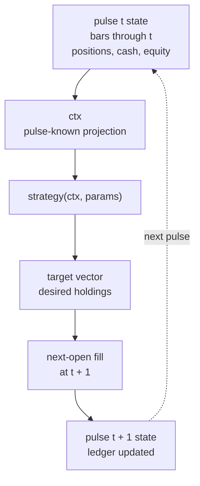

# Strategy Basics


<style>
.ledgr-diagram {
  margin: 1.25rem auto 1.5rem auto;
  text-align: center;
}
.ledgr-diagram .mermaid {
  display: inline-block;
  max-width: 760px;
  width: 100%;
}
.ledgr-diagram .node text,
.ledgr-diagram .edgeLabel {
  font-size: 18px !important;
}
</style>

This article teaches the strategy contract from the user side: what a
strategy can see, what it must return, and how to run a first backtest
without hidden lookahead. For testing a strategy on one pulse, helper
pipelines, share sizing, and strategy state, read
`vignette("strategy-authoring-tools", package = "ledgr")`.

## Prerequisites

The examples use `dplyr` for demo-data preparation. Strategy functions
use ledgr’s pulse context rather than data-frame operations. The article
assumes basic familiarity with sealed snapshots
(`vignette("data-input-and-snapshots", package = "ledgr")`); it
introduces feature IDs where the first strategy needs one.

``` r
library(ledgr)
library(dplyr)
data("ledgr_demo_bars", package = "ledgr")
```

A backtest in ledgr is a sequence of decision moments. At each pulse,
ledgr shows the strategy only what could have been known at that time.
The strategy answers with desired holdings. ledgr records the decision,
applies the fill model, and moves to the next pulse.

This matters because leakage is easy. If future information enters a
historical decision, the backtest can look profitable for the wrong
reason. ledgr’s strategy interface is built to make one common mistake
harder: your strategy receives one pulse context, not the whole future.
For the broader leakage model, including feature-construction leakage
and remaining user responsibilities, see
`vignette("leakage", package = "ledgr")`.

## Wrong And Right: Leakage

The tempting vectorized pattern is to compute a future-looking column
first and then trade from it. In the example below, `lead(close)` shifts
tomorrow’s close onto today’s row. The resulting `buy_signal` looks like
an ordinary column, but it answers a question the strategy could not
have answered at today’s decision time: “will tomorrow’s close be higher
than today’s close?” Trading from that column lets the backtest use
future market data as if it were already known.

``` r
leaky_signals <- ledgr_demo_bars |>
  group_by(instrument_id) |>
  arrange(ts_utc, .by_group = TRUE) |>
  mutate(
    tomorrow_close = lead(close),
    buy_signal = tomorrow_close > close
  )
```

The ledgr version expresses the rule at one pulse. The strategy can read
the current bar for every instrument, and nothing later. Later sections
add registered features to the same pulse model. The strategy has no
market-data table from which it can casually index tomorrow’s bar. That
is the same information shape a live trading strategy gets as time
passes: each pulse is a new slice of the knowable universe.

``` r
no_leak_bar_strategy <- function(ctx, params) {
  targets <- ctx$flat()
  targets[which(ctx$vec$close > ctx$vec$open)] <- 1
  targets
}
```

The next sections explain each piece of that function.

This removes one common source of leakage, but it does not certify that
snapshots, feature definitions, event timestamps, universe construction,
or parameter selection are causally clean.

With that boundary in mind, start with the simplest possible strategy.

## What Is `ctx`?

`ctx` is the **pulse context**: the information packet ledgr gives your
strategy at one decision time. It contains the current timestamp,
current bars, current features, positions, cash, equity, and small
helper functions for accessing those values. It is deliberately not the
full future dataset.

| Expression | Meaning at one pulse |
|----|----|
| `ctx$ts_utc` | current decision timestamp |
| `ctx$universe` | instruments in the run |
| `ctx$idx(id)` | 1-based universe position for one instrument |
| `ctx$open(id)`, `ctx$close(id)` | current bar values for one instrument |
| `ctx$vec$close` | current close values for the full universe |
| `ctx$feature(id, feature_id)` | current indicator value for one instrument by engine feature ID |
| `ctx$vec$feature(feature_id)` | current indicator values for the full universe by engine feature ID |
| `ctx$features(id, feature_map)` | mapped indicator values for one instrument by alias, using the supplied feature map |
| `ctx$position(id)` | current simulated position |
| `ctx$vec$position` | current simulated positions aligned to `ctx$universe` |
| `ctx$cash`, `ctx$equity` | current simulated portfolio state |
| `ctx$state_prev` | what the strategy returned as `state_update` at the previous pulse |
| `ctx$flat()` | target zero positions unless changed |
| `ctx$hold()` | target current positions unless changed |

For the installed accessor reference, see `?ledgr_strategy_context`.

> [!TIP]
>
> ### One instrument or everyone
>
> The `ctx$vec$` forms return a value for the whole universe in one read.
> The scalar forms answer for one instrument you have already singled out.
> Both are correct; only the first is cheap when you want every name,
> because the scalar form costs per call and a universe-wide loop pays it
> once per instrument per pulse.
> `vignette("strategy-authoring-tools", package = "ledgr")` shows the
> plane-based pattern and documents the `ledgr_scalar_accessor_loop`
> warning emitted for that shape on large universes.


The pulse loop is the contract in motion:

<div class="ledgr-diagram ledgr-pulse-loop">



</div>

`ctx` is the no-lookahead handoff. It gives the strategy the current
pulse projection, the strategy returns a target vector, and ledgr
handles validation, fill timing, ledger events, and the next pulse.

The two target starters have different economic meanings:

| Helper | Starts from | Economic meaning |
|----|----|----|
| `ctx$flat()` | zero positions | only hold what this pulse explicitly selects |
| `ctx$hold()` | current positions | keep existing positions unless changed |

For example, this policy starts from current holdings and only changes
the book when it sees an exit reason. Economically, it means: “keep what
I already own, unless today’s bar gives me a reason to leave.”

``` r
hold_unless_down <- function(ctx, params) {
  targets <- ctx$hold()
  targets[which(ctx$vec$close < ctx$vec$open)] <- 0
  targets
}
```

`ctx$vec$close < ctx$vec$open` compares every instrument at once, in the
order of `ctx$universe`. `which()` turns that comparison into the
positions where it is `TRUE`, skipping any missing value, so exactly
those entries of the target change and every other instrument keeps its
current quantity.

## A Strategy That Does Nothing

The simplest economic policy is: hold cash and own no instruments.

``` r
flat_strategy <- function(ctx, params) {
  ctx$flat()
}
```

`ctx$flat()` creates a full target vector with one entry for every
instrument in the run and every value set to zero. Economically, this
means: after the next fill opportunity, hold no positions.

This is a complete ledgr strategy: useful for understanding the
contract, not for making money.

The return value is a named numeric vector. Names are instrument IDs
from `ctx$universe`, values are desired quantities. `ctx$flat()`
produces the full-universe shape with every entry at zero.

A **target vector** is the strategy’s requested holdings for the full
universe at one pulse. It is named by instrument ID, numeric, and
complete. It is not an order list, a signal table, or a partial update.
The deeper mental model is that a strategy is a **policy**, not a
sequence of orders. At each pulse, it declares a desired state: “I want
to hold this many shares of each instrument.” The engine compares that
against current holdings and fills the gap.

That distinction keeps strategies free from execution-state bookkeeping.

> [!WARNING]
>
> ### Affordability is not automatic
>
> Raw target vectors are desired holdings. ledgr does not check
> affordability before filling them; if a target requires more cash than
> the simulated portfolio has, the run can fill anyway and cash can go
> negative. Use `ledgr_target_rebalance(equity_fraction = ...)` or size
> directly from `ctx$cash` and `ctx$equity` when you need capital-aware
> targets. A `risk_chain` can transform validated targets before fill
> timing and cost resolution – for example `ledgr_risk_long_only()` can
> clip short targets and `ledgr_risk_max_weight()` can cap per-instrument
> target exposure. It is not a cash-affordability, margin, liquidity, or
> broker-risk engine.


## A First Trading Rule

Now add one small economic idea:

> If an instrument closes above its open, own one share. Otherwise own
> nothing.

This is still a teaching strategy, not investment advice. It shows how
observable data becomes a target.

``` r
buy_if_up <- function(ctx, params) {
  targets <- ctx$flat()
  targets[which(ctx$vec$close > ctx$vec$open)] <- 1
  targets
}
```

Read it as one decision for the whole universe: start from zero for
every instrument, then set the instruments whose close is above their
open to one share.

Targets are desired quantities, not orders, signals, or portfolio
weights. A target of `1` means “after the next fill opportunity, hold
one share.” A target of `0` means “hold no shares.”

In these examples, decisions fill at the next open: a decision made at
pulse `t` fills at the next available bar. That keeps the strategy from
deciding and filling on the same close.

A rule like this reads current values directly. When a rule needs to
rank instruments or size positions from the account, the helper pipeline
later in this article does that work.

> [!TIP]
>
> ### Try it
>
> Change `buy_if_up()` so it starts from `ctx$hold()` instead of
> `ctx$flat()`. Which positions would persist after a down bar, and why
> does that change the economic meaning of the strategy?


## Why `params` Exists

`params` is the run’s **strategy configuration**. Put research choices
you want to compare, store, or sweep into `params`; do not hide them in
globals or inside feature declarations. Hard-coded constants make
experiments awkward. Parameters let one economic idea run under
different assumptions.

``` r
buy_if_up_qty <- function(ctx, params) {
  targets <- ctx$flat()
  targets[which(ctx$vec$close > ctx$vec$open)] <- params$qty
  targets
}
```

Strategies use `function(ctx, params)`. `ctx` is the pulse. `params` is
the experimenter’s chosen configuration for this run. Keeping them
separate makes the strategy easier to test, compare, and store.
`vignette("sweeps", package = "ledgr")` runs one strategy across many
`params` values.

## Remembering Between Pulses

Most strategies decide from the current pulse alone. A strategy that has
to remember something between pulses, such as how many pulses have
passed or the price at which it bought, returns
`list(targets = ..., state_update = ...)` instead of a bare target.
ledgr stores the `state_update` with the run and hands it back as
`ctx$state_prev` at the next pulse.

The state must be plain data: numbers, strings, logical values, and
lists of them. A new `state_update` replaces the previous one; returning
a bare target keeps it. On the first pulse there is nothing to remember
yet, so check each field for `NULL` before using it.

`vignette("strategy-authoring-tools", package = "ledgr")` builds a
strategy that uses state step by step. `?ledgr_strategy_context` states
the full rules, including the per-instrument `asset_state` of
availability-aware runs.

## Prepare A Small Experiment

Use two instruments from the offline demo data so the first full
backtest can run anywhere. The detailed pulse-inspection and
helper-pipeline walkthrough lives in
`vignette("strategy-authoring-tools", package = "ledgr")`; this article
keeps only the compact setup needed to run one strategy.

``` r
bars <- ledgr_demo_bars |>
  filter(
    instrument_id %in% c("DEMO_01", "DEMO_02"),
    between(
      ts_utc,
      ledgr_utc("2019-01-01"),
      ledgr_utc("2019-06-30")
    )
  )

snapshot <- ledgr_snapshot_from_df(
  bars,
  snapshot_id = "strategy_chapter_snapshot"
)

features <- list(ledgr_ind_returns(5))

ledgr_feature_id(features)
#> [1] "return_5"
```

The snapshot seals the market data. `features` declares the pulse-known
return input the strategy will read. Feature IDs are exact: a typo is an
unknown feature, not warmup.

``` r
top_return_strategy <- function(ctx, params) {
  weights <- ctx |>
    ledgr_signal_return(lookback = params$lookback) |>
    ledgr_select_top_n(n = params$n) |>
    ledgr_weight_equal()

  weights |>
    ledgr_target_rebalance(ctx, equity_fraction = params$equity_fraction)
}
```

Economically, this scores each instrument by recent return, keeps the
top name, splits the selected allocation equally, and converts the
weights into floored share targets. No helper registers indicators
automatically; the experiment must still declare `features`.

| Step | Use |
|----|----|
| `ledgr_signal_return()` or `ledgr_signal_feature()` | read one registered feature as comparable scores |
| `ledgr_select_top_n(..., partial = )` or `ledgr_selection(..., missing = )` | choose instruments and state how incomplete inputs behave |
| `ledgr_weight_equal()` or `ledgr_weights()` | divide the allocation budget |
| `ledgr_target_rebalance(..., keep = )` | convert weights into shares using the current account context |

The weights carry only relative allocations. Rebalancing needs `ctx`
again because current equity, prices, and holdings determine the share
quantities. The focused authoring article develops each step and its
missing-input policy.

``` r
exp <- ledgr_experiment(
  snapshot = snapshot,
  strategy = top_return_strategy,
  features = features,
  opening = ledgr_opening(cash = 10000),
  cost_model = ledgr_cost_zero()
)
```

## Run One Backtest

``` r
bt_top_1 <- exp |>
  ledgr_run(
    params = list(lookback = 5, n = 1, equity_fraction = 0.1),
    run_id = "top_return_1"
  )

summary(bt_top_1)
#> ledgr Backtest Summary
#> ======================
#>
#> Performance Metrics:
#>   Total Return:        0.45%
#>   Annualized Return:   0.89%
#>   Max Drawdown:        -1.12%
#>
#> Risk Metrics:
#>   Risk-Free Rate:      0.00% annual
#>   Annualization:       252 periods/year (US equity daily)
#>   Volatility (annual): 2.02%
#>   Sharpe Ratio:        0.450
#>
#> Trade Statistics:
#>   Closed Trades:       24
#>   Win Rate:            45.83%
#>   Avg Trade:           $2.15
#>
#> Exposure:
#>   Time in Market:      95.35%
#>
#> Execution Evidence:
#>   Fill Timing:         dense_bar_timestamp
#>
#> Corporate-Action Evidence:
#> Corporate actions: NOT SUPPLIED - returns may omit distributions
#> Price basis: UNDECLARED - distribution double counting cannot be ruled out
#>   Full policy record: ledgr_corporate_action_summary(bt)
```

The summary is portfolio-level: total return, max drawdown, and trade
count are computed from the completed run. In ledgr, trades are closed
round trips; the fills table can contain more rows because opening fills
and closing fills are both recorded.

The annualized volatility is high because this toy strategy switches
positions often on a tiny two-instrument demo universe. Treat it as a
warning about the example, not as a property you should expect from the
same idea on real data. The drawdown is disproportionate to the final
loss for the same reason: a small, concentrated portfolio can swing hard
during the run even if it ends roughly flat.

Do not expect a teaching strategy to be good. A weak or unattractive
result is still useful evidence: ledgr records failed ideas with the
same care as successful ones, which is part of not fooling yourself.

Inspecting trades shows the actions produced by the target decisions.

``` r
ledgr_results(bt_top_1, what = "trades")
#> # A tibble: 24 x 10
#>    event_seq ts_utc     recording_pulse_ts_utc instrument_id side    qty price   fee
#>        <int> <date>     <dttm>                 <chr>         <chr> <dbl> <dbl> <dbl>
#>  1         3 2019-01-14 2019-01-14 00:00:00    DEMO_02       SELL     13  72.8     0
#>  2         4 2019-01-18 2019-01-18 00:00:00    DEMO_01       SELL     11  86.2     0
#>  3         7 2019-01-21 2019-01-21 00:00:00    DEMO_02       SELL     13  70.2     0
#>  4         8 2019-01-25 2019-01-25 00:00:00    DEMO_01       SELL      1  90.7     0
#>  5         9 2019-02-08 2019-02-08 00:00:00    DEMO_01       SELL     10  92.6     0
#>  6        13 2019-02-13 2019-02-13 00:00:00    DEMO_02       SELL     15  66.2     0
#>  7        14 2019-02-20 2019-02-20 00:00:00    DEMO_01       SELL     10  96.9     0
#>  8        17 2019-02-25 2019-02-25 00:00:00    DEMO_02       SELL     14  67.5     0
#>  9        18 2019-02-27 2019-02-27 00:00:00    DEMO_01       SELL      1 100.      0
#> 10        19 2019-03-11 2019-03-11 00:00:00    DEMO_01       SELL      9 106.      0
#> # i 14 more rows
#> # i 2 more variables: realized_pnl <dbl>, action <chr>
```

The trade table only includes closed round trips. Small one-share rows
appear when integer sizing and price movement leave a tiny adjustment
after a previous target. Larger rows are the ordinary position exits.
`realized_pnl` is the profit or loss booked when that position closes.

If a run has zero trades, inspect fills before assuming nothing
happened:

``` r
ledgr_results(bt_top_1, what = "fills")
#> # A tibble: 50 x 10
#>    event_seq ts_utc     recording_pulse_ts_utc instrument_id side    qty price   fee
#>        <int> <date>     <dttm>                 <chr>         <chr> <dbl> <dbl> <dbl>
#>  1         1 2019-01-09 2019-01-09 00:00:00    DEMO_02       BUY      13  74.6     0
#>  2         2 2019-01-14 2019-01-14 00:00:00    DEMO_01       BUY      11  87.9     0
#>  3         3 2019-01-14 2019-01-14 00:00:00    DEMO_02       SELL     13  72.8     0
#>  4         4 2019-01-18 2019-01-18 00:00:00    DEMO_01       SELL     11  86.2     0
#>  5         5 2019-01-18 2019-01-18 00:00:00    DEMO_02       BUY      13  72.6     0
#>  6         6 2019-01-21 2019-01-21 00:00:00    DEMO_01       BUY      11  87.4     0
#>  7         7 2019-01-21 2019-01-21 00:00:00    DEMO_02       SELL     13  70.2     0
#>  8         8 2019-01-25 2019-01-25 00:00:00    DEMO_01       SELL      1  90.7     0
#>  9         9 2019-02-08 2019-02-08 00:00:00    DEMO_01       SELL     10  92.6     0
#> 10        10 2019-02-08 2019-02-08 00:00:00    DEMO_02       BUY      14  67.2     0
#> # i 40 more rows
#> # i 2 more variables: realized_pnl <dbl>, action <chr>
```

Zero fills means no execution occurred. Non-empty fills with zero trades
means positions opened but did not close. `n_trades` counts closed round
trips, while the fills table shows both opening and closing execution
rows.

If you want to compare variants, keep the strategy authoring question
separate from the research-comparison question. Use
`vignette("experiment-store", package = "ledgr")` for stored-run
comparison and `vignette("research-workflow", package = "ledgr")` for
promotion and review.

## When ledgr Complains

ledgr tries to fail loudly when an error would make a backtest
misleading. A strategy that forgets an instrument is the most common
case. ledgr rejects the target instead of silently treating the missing
instrument as zero:

``` r
only_one_name <- function(ctx, params) {
  c(DEMO_01 = 1)
}

tryCatch(
  ledgr_experiment(
    snapshot = snapshot,
    strategy = only_one_name,
    opening = ledgr_opening(cash = 10000),
    cost_model = ledgr_cost_zero()
  ) |>
    ledgr_run(run_id = "incomplete_target"),
  error = conditionMessage
)
#> [1] "`targets` must be a named numeric target vector, or ledgr_target, with names matching ctx$universe; missing instruments: DEMO_02."
```

The message names the instrument that is missing. Starting from
`ctx$flat()` or `ctx$hold()` avoids this mistake, because both already
contain every instrument. The other common failures are just as
specific: a mistyped feature ID is reported together with the IDs that
are registered, and `ledgr_target_rebalance()` refuses negative or
over-allocated weights before turning them into share quantities.

Those errors are part of the design. They are meant to catch research
mistakes while the mistake is still small enough to understand.

## Cleanup

``` r
close(bt_top_1)
ledgr_snapshot_close(snapshot)
```

## Where Next

- `vignette("strategy-authoring-tools", package = "ledgr")` goes deeper
  on testing on one pulse, helper pipelines, share sizing, and strategy
  state.
- `vignette("indicators", package = "ledgr")` explains feature identity
  and strategy-time feature access.
- `vignette("sweeps", package = "ledgr")` runs one strategy across a
  grid of `params` and features.
- `vignette("execution-semantics", package = "ledgr")` explains the fold
  lifecycle and no-lookahead execution model.
- `vignette("experiment-store", package = "ledgr")` shows how committed
  run evidence is stored and reopened.
