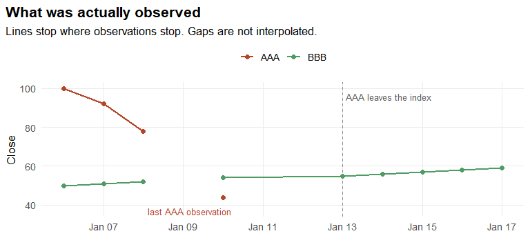
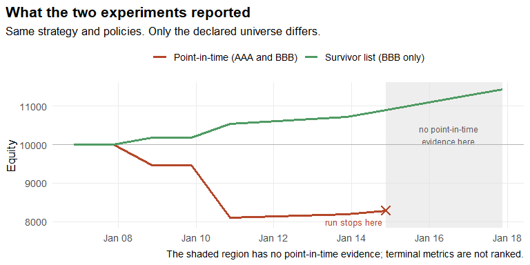
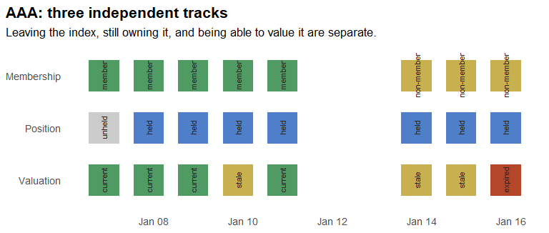

# Survivorship Bias And Point-In-Time Universes


``` r
library(ledgr)
library(dplyr)
```

You pull today’s index constituents, fetch history for each one, and
backtest a simple rule. The equity curve looks good. You check the
arithmetic, reseal the snapshot, confirm the hashes. Everything
reproduces.

The number is still wrong, and nothing in the output says so.

The file you downloaded lists the companies that are in the index
*today*. The ones that were dropped along the way never appear in it.
Your strategy was never offered the chance to lose money on them. You
didn’t choose to exclude them. The data did, using information from the
end of your sample.

<div class="ledgr-callout ledgr-callout-warning">

**Survivorship bias**

Selection on what remained observable. When a sample is truncated by
survival, the surviving history can show returns the strategy could not
have earned. Brown, Goetzmann, Ibbotson, and Ross (1992) measured the
effect on performance studies. Shumway (1997) documented the related
delisting bias that appears when large negative delisting returns are
missing from equity data.

</div>

By the end of this article you will be able to declare a universe-aware
experiment, explain the assumptions it rests on, and say why its
positions, fills, and reported horizon differ from what you asked for.

## Two Companies, Ten Sessions

The example is synthetic and small enough to read in full. `DEMO` is an
illustrative venue, not a real exchange, and none of these rows are
redistributed vendor data.

Two instruments are listed on January 6. `AAA` loses more than half its
value over five sessions and stops trading. `BBB` grinds upward and is
still listed at the end of the window.

``` r
session_dates <- seq(as.Date("2020-01-06"), as.Date("2020-01-17"), by = "day")
open_day <- as.integer(format(session_dates, "%u")) <= 5L
open_dates <- session_dates[open_day]

prices <- tibble(
  date = open_dates,
  AAA = c(100, 92, 78, 61, 44, NA, NA, NA, NA, NA),
  BBB = c(50, 51, 52, NA, 54, 55, 56, 57, 58, 59)
)

prices
#> # A tibble: 10 x 3
#>    date         AAA   BBB
#>    <date>     <dbl> <dbl>
#>  1 2020-01-06   100    50
#>  2 2020-01-07    92    51
#>  3 2020-01-08    78    52
#>  4 2020-01-09    61    NA
#>  5 2020-01-10    44    54
#>  6 2020-01-13    NA    55
#>  7 2020-01-14    NA    56
#>  8 2020-01-15    NA    57
#>  9 2020-01-16    NA    58
#> 10 2020-01-17    NA    59
```

<div id="fig-prices">



Figure 1

</div>

Two holes matter later, and they are not the same kind of hole. `AAA`
stops printing prices after January 10. `BBB` is missing a single
session on January 9 and then resumes.

<div class="ledgr-callout ledgr-callout-note">

**A missing price is not a reason**

Nothing in this table says *why* an observation is absent. A delisting,
a trading halt, and a vendor feed gap all look identical here. This
example declares no lifetime or trading-status facts, so ledgr is never
told which one occurred. The prose below supplies that story; the data
does not.

</div>

## The Selection Problem

Before any ledgr call, do the arithmetic by hand.

A researcher who starts from today’s index list sees only `BBB`, because
`AAA` is no longer a constituent. A researcher who asks what the index
actually held on January 6 sees both.

``` r
first_price <- function(x) x[is.finite(x)][1]
last_price <- function(x) x[is.finite(x)][sum(is.finite(x))]
simple_return <- function(x) last_price(x) / first_price(x) - 1

returns <- c(AAA = simple_return(prices$AAA), BBB = simple_return(prices$BBB))
round(returns, 3)
#>   AAA   BBB
#> -0.56  0.18

tibble(
  view = c("Survivor list (BBB only)", "Point-in-time (AAA and BBB)"),
  equal_weight_return = c(returns[["BBB"]], mean(returns))
)
#> # A tibble: 2 x 2
#>   view                        equal_weight_return
#>   <chr>                                     <dbl>
#> 1 Survivor list (BBB only)                   0.18
#> 2 Point-in-time (AAA and BBB)               -0.19
```

One view reports a gain, the other a loss, from the same file. That is
the shape of the problem.

It is only a sketch, and one assumption is doing quiet work: it treats
`AAA`’s last observed price as its ending value. No settlement was
observed. Nobody told us what a holder actually received. Hold onto
that, because it is exactly the point at which ledgr later refuses to
produce a number.

## The Objects You Are About To Build

ledgr splits this problem across a few objects. Each has one job, and
they fall into three groups: what the world supplied, what you chose,
and what the run recorded.

| Object | Its job in this example |
|----|----|
| **Bars** | The prices actually observed for `AAA` and `BBB`. |
| **Facts** | Declared expected sessions and dated membership, including when each assertion became knowable. |
| **Snapshot** | A sealed version of those inputs, so a run can be reproduced and reopened. |
| **Strategy** | The positions you want at each decision. |
| **Experiment** | The snapshot and strategy combined with a universe rule, a valuation policy, and cost rules. |
| **Run** | The execution of that configuration, plus the evidence and explanations it retained. |

Bars and facts are **source evidence**. The universe rule, valuation
policy, and strategy are **your choices**. Everything a run reports
afterwards is a **recorded outcome** of those two. Most confusion about
point-in-time backtesting comes from mixing the three, which a single
wide price table encourages you to do.

## Declaring The Facts

Everything below is something *you* assert about the world. The
mechanical reshaping is folded away; the claims are not.

<details class="code-fold">
<summary>Turning the wide price table into bars (mechanical)</summary>

``` r
bars_from <- function(prices) {
  bind_rows(
    tibble(instrument_id = "AAA", date = prices$date, close = prices$AAA),
    tibble(instrument_id = "BBB", date = prices$date, close = prices$BBB)
  ) |>
    filter(is.finite(close)) |>
    transmute(
      instrument_id,
      ts_utc = date,
      open = close,
      high = close + 1,
      low = close - 1,
      close,
      volume = 1000
    )
}
```

</details>

### Which sessions were expected?

A **session** is one trading day at one venue: the day the venue was
open, and the hours it was open for. It is a property of the venue, not
of your data. A venue has sessions on days when nothing you own happened
to trade.

So the calendar is declared, not inferred from the rows you received. If
you infer sessions from observations, a day with no rows never existed,
and your history silently shortens. Build it as an ordinary table first:

``` r
calendar <- tibble(
  session_date = session_dates,
  status = if_else(open_day, "open", "closed"),
  session_open = if_else(open_day, "14:30:00", NA_character_),
  session_close = if_else(open_day, "21:00:00", NA_character_)
)

calendar
#> # A tibble: 12 x 4
#>    session_date status session_open session_close
#>    <date>       <chr>  <chr>        <chr>
#>  1 2020-01-06   open   14:30:00     21:00:00
#>  2 2020-01-07   open   14:30:00     21:00:00
#>  3 2020-01-08   open   14:30:00     21:00:00
#>  4 2020-01-09   open   14:30:00     21:00:00
#>  5 2020-01-10   open   14:30:00     21:00:00
#>  6 2020-01-11   closed <NA>         <NA>
#>  7 2020-01-12   closed <NA>         <NA>
#>  8 2020-01-13   open   14:30:00     21:00:00
#>  9 2020-01-14   open   14:30:00     21:00:00
#> 10 2020-01-15   open   14:30:00     21:00:00
#> 11 2020-01-16   open   14:30:00     21:00:00
#> 12 2020-01-17   open   14:30:00     21:00:00
```

Read the columns as four separate assertions:

| Column | What you are asserting |
|----|----|
| `session_date` | This calendar day existed at the venue. |
| `status` | Whether it was `open` or `closed`. Closed days are supplied too — that is how a weekend is distinguished from a missing file. |
| `session_open` | The time execution prices are taken from. Fills are priced at the next session’s open. |
| `session_close` | The time decisions are made, and the pulse each fill is booked on. |

Supplying the closed days matters. Had you listed only the ten open
days, a holiday and a failed download would look identical. Here they do
not.

In production this table comes from the venue or an exchange-calendar
package, covering the whole period you intend to run — not from the
instrument rows you happen to hold.

``` r
session_facts <- ledgr_facts_sessions(
  calendar |> mutate(knowledge_time = ledgr_utc("2020-01-01")),
  venue_id = "DEMO",
  timezone = "UTC"
)
```

`venue_id` names the venue these sessions belong to. `knowledge_time`
says the calendar was published in advance, on January 1 — a calendar is
known before the period it describes, which is what makes it usable for
decisions inside it.

January 9 is now a real session on which `BBB` had no observation,
rather than a date that never happened.

### Which companies belonged, and when was that knowable?

Start from what a provider actually hands you: a constituent list, as of
a date. Here there are two. On January 6 the universe was both
companies; from January 13, after `AAA` was removed, it was `BBB` alone.

``` r
members_from_06 <- c("AAA", "BBB")
members_from_13 <- c("BBB")
```

Each list also needs a second date: when that list became *knowable*.
The January 6 list was published with the calendar on January 1. The
removal was announced on January 13, the day it took effect.

Two lists become three rows — one row per member per list:

``` r
membership_rows <- bind_rows(
  tibble(
    effective_from = ledgr_utc("2020-01-06"),
    knowledge_time = ledgr_utc("2020-01-01"),
    instrument_id = members_from_06
  ),
  tibble(
    effective_from = ledgr_utc("2020-01-13"),
    knowledge_time = ledgr_utc("2020-01-13"),
    instrument_id = members_from_13
  )
) |>
  mutate(source = "synthetic_membership")

membership_rows
#> # A tibble: 3 x 4
#>   effective_from      knowledge_time      instrument_id source
#>   <dttm>              <dttm>              <chr>         <chr>
#> 1 2020-01-06 00:00:00 2020-01-01 00:00:00 AAA           synthetic_membership
#> 2 2020-01-06 00:00:00 2020-01-01 00:00:00 BBB           synthetic_membership
#> 3 2020-01-13 00:00:00 2020-01-13 00:00:00 BBB           synthetic_membership
```

The two dates answer two different questions:

- **`effective_from`** — when does this membership apply?
- **`knowledge_time`** — when could a strategy first have known it?

Those clocks are usually different in real data. An index change is
decided, announced, and takes effect on three separate days. A
downloaded constituent list carries neither timestamp, which is why it
leaks.

<div class="ledgr-callout ledgr-callout-tip">

**Which timestamp goes in `knowledge_time`?**

Use the earliest moment you can defend as “we could have read this”:

- The provider timestamps the announcement — use that.
- The file has a publication or delivery date — use that.
- You only know when you downloaded it — use the download time. It is
  later than the truth, which makes the run more conservative, not less.

The one answer that is always wrong is copying `effective_from`. That
asserts every change was knowable the instant it took effect, which is
exactly the assumption survivorship bias hides behind.

</div>

``` r
membership_facts <- ledgr_facts_membership_snapshots(
  membership_rows,
  universe_id = "demo_members",
  complete = TRUE
)
```

`complete = TRUE` is the load-bearing argument. It says each
`effective_from` group is the *entire* membership set on that date, not
a partial report of some members. That is why the January 13 row removes
`AAA`: `AAA` is absent from a set that claims to be complete. Without
`complete = TRUE` these rows would only add members and `AAA` would
never leave.

``` r
instruments <- tibble(instrument_id = c("AAA", "BBB"))
facts <- ledgr_facts(session_facts, membership_facts)
ledgr_facts_validate(facts, bars_from(prices), instruments)
#> ledgr facts validation
#> Can seal: yes
#> # A tibble: 7 x 2
#>   category                              n
#>   <chr>                             <int>
#> 1 facts_accepted                       15
#> 2 facts_runtime_conflict                0
#> 3 facts_audit_only                      0
#> 4 facts_rejected                        0
#> 5 observations_accepted                14
#> 6 observations_quarantine_candidate     0
#> 7 observations_rejected                 0
```

`Can seal: yes` means this bundle and these observations pass the
structural checks. It does not certify that your vendor supplied every
relevant fact.

### What the knowledge clock actually changes

This is worth seeing rather than asserting. Build the same membership
with the removal knowable one day later, and ask what the strategy can
see at the January 13 decision.

``` r
late_membership <- ledgr_facts_membership_snapshots(
  membership_rows |>
    mutate(
      knowledge_time = if_else(
        effective_from == ledgr_utc("2020-01-13"),
        ledgr_utc("2020-01-14"),
        knowledge_time
      )
    ),
  universe_id = "demo_members",
  complete = TRUE
)

visible_membership <- function(member_facts, label) {
  snap <- ledgr_snapshot_from_df(
    bars_from(prices),
    instruments_df = instruments,
    facts = ledgr_facts(session_facts, member_facts),
    db_path = ledgr_temp_store(),
    snapshot_id = paste0("knowledge-", label)
  )
  on.exit(ledgr_snapshot_close(snap), add = TRUE)
  run <- ledgr_run(
    ledgr_experiment(
      snap,
      function(ctx, params) ctx$hold(),
      universe = ledgr_universe_members("demo_members"),
      valuation_policy = ledgr_valuation_stale(max_sessions = 2),
      cost_model = ledgr_cost_zero(),
      # Hold both companies so each one stays on the decision axis even after
      # it leaves the universe. Otherwise there is no row to compare.
      opening = ledgr_opening(
        cash = 10000,
        positions = c(AAA = 1, BBB = 1),
        cost_basis = c(AAA = 100, BBB = 50)
      )
    ),
    run_id = paste0("knowledge-", label)
  )
  on.exit(close(run), add = TRUE)
  ledgr_results(run, "availability") |>
    filter(instrument_id == "AAA", as.Date(ts_utc) == as.Date("2020-01-13")) |>
    transmute(decision = ts_utc, removal_knowable = label, member)
}

bind_rows(
  visible_membership(membership_facts, "13 January"),
  visible_membership(late_membership, "14 January")
)
#> # A tibble: 2 x 3
#>   decision            removal_knowable member
#>   <dttm>              <chr>            <lgl>
#> 1 2020-01-13 21:00:00 13 January       FALSE
#> 2 2020-01-13 21:00:00 14 January       TRUE
```

Same effective date, same prices, different answer. When the removal is
knowable on the 13th, `AAA` is already outside the universe at that
decision. When the same change only becomes knowable on the 14th, `AAA`
is still a member on the 13th, because that is all the strategy could
have known. Moving one timestamp changes the opportunity set.

Note how much machinery that answer cost: a snapshot, an experiment, and
a full run, to read back which instruments were members on one date.
There is currently no lighter way to ask. `ledgr_experiment_plan()`
reports which fact families *participate*, not what they *resolve to* on
a given day. Until an inspection helper exists, running a holding
strategy and reading the `availability` evidence is the supported way to
check your facts say what you think they say.

## What A Strategy Returns

Before running anything, be precise about the contract, because the
execution behaviour later depends on it.

- `ctx$hold()` starts from the positions you currently hold.
- The numbers you return are **desired position quantities**, not
  orders.
- A target is evaluated against execution rules. It does not guarantee a
  fill.
- An unfilled target does **not** persist. It is not a standing order
  waiting for liquidity.

The strategy below is deliberately plain: on the first session, put
equal weight into every company the declared universe offers, then hold.

``` r
equal_weight_once <- function(ctx, params) {
  if (substr(ctx$ts_utc, 1, 10) != "2020-01-06") {
    return(ctx$hold())
  }
  ids <- ctx$universe
  weights <- ledgr_weights(
    stats::setNames(rep(1 / length(ids), length(ids)), ids),
    universe = ids
  )
  ledgr_target_rebalance(weights, ctx, equity_fraction = params$invested)
}
```

`equity_fraction` is deliberately below 1. Sizing happens at the
decision price, but the fill happens at the next session’s open, so the
cash a target actually requires is not yet known when you ask for it.
Leaving headroom is a research choice, and the exercise at the end of
this article shows what happens without it.

## Two Universes, One Everything Else

Now the comparison the opening promised, run properly. Same snapshot,
same strategy, same valuation policy, same starting cash. The only
difference is which universe is declared.

Seal the evidence first. After this point the inputs are frozen and
identified by a hash.

``` r
store_path <- ledgr_temp_store(
  file.path(tempdir(), "ledgr_survivorship_bias.duckdb")
)

snapshot <- ledgr_snapshot_from_df(
  bars_from(prices),
  instruments_df = instruments,
  facts = facts,
  db_path = store_path,
  snapshot_id = "survivorship-demo"
)
```

An experiment is the sealed snapshot plus every choice you are making
about it. Here is the whole thing, written out once:

``` r
point_in_time_experiment <- ledgr_experiment(
  snapshot,
  equal_weight_once,
  universe = ledgr_universe_members("demo_members"),
  valuation_policy = ledgr_valuation_stale(max_sessions = 2),
  cost_model = ledgr_cost_zero(),
  opening = ledgr_opening(cash = 10000)
)
```

Read those arguments as four separate decisions. `universe` selects the
membership history you declared, rather than a fixed list.
`valuation_policy` says how long a stale mark may be carried before the
run must stop. `cost_model` and `opening` fix the trading frictions and
the starting account. Only the first of them differs between the two
runs below, so the comparison isolates the universe.

``` r
ledgr_experiment_plan(point_in_time_experiment)
#> ledgr experiment plan
#> Availability: active
#> Universe:     membership
#> Checks:
#> # A tibble: 4 x 2
#>   family         status
#>   <chr>          <chr>
#> 1 membership     declared
#> 2 sessions       declared
#> 3 trading_status omitted
#> 4 lifetime       omitted
```

The plan states which checks actually participate. Membership and
sessions are declared. Trading-status and lifetime are **omitted**, and
omitted does not mean the source said every instrument was active and
listed. It means no such check ran, which is why ledgr never learns that
`AAA`’s silence after January 10 was a delisting rather than a halt or a
feed gap.

``` r
# The survivor experiment repeats every argument above and changes one, so
# wrap the shared choices rather than retyping them.
declare <- function(universe) {
  ledgr_experiment(
    snapshot,
    equal_weight_once,
    universe = universe,
    valuation_policy = ledgr_valuation_stale(max_sessions = 2),
    cost_model = ledgr_cost_zero(),
    opening = ledgr_opening(cash = 10000)
  )
}

point_in_time <- ledgr_run(
  point_in_time_experiment, params = list(invested = 0.9), run_id = "pit-universe"
)
survivor <- ledgr_run(
  declare(c("BBB")), params = list(invested = 0.9), run_id = "survivor-universe"
)
```

The point-in-time run bought both companies. The survivor run only ever
saw one.

``` r
ledgr_results(point_in_time, "fills") |>
  select(ts_utc, instrument_id, side, qty, price)
#> # A tibble: 2 x 5
#>   ts_utc              instrument_id side    qty price
#>   <dttm>              <chr>         <chr> <dbl> <dbl>
#> 1 2020-01-07 21:00:00 AAA           BUY      45    92
#> 2 2020-01-07 21:00:00 BBB           BUY      90    51
```

The decision was made on January 6, but the fills are stamped January 7
at 21:00 — the session *close*. That is not the moment of execution, and
the two are worth separating.

<div class="ledgr-callout ledgr-callout-note">

**Two clocks in one fill row**

- `price` is the **open** of the next session. That is where execution
  happened.
- `ts_utc` is that session’s **close** — the pulse at which the fill is
  recorded and first visible to the strategy.

A target decided at session *t* is priced at session *t+1*’s open and
booked on session *t+1*’s pulse. `ts_utc` answers “which pulse does this
belong to”, not “what time did the trade print”.

</div>

### Compare only what covers the same period

``` r
pit_equity <- ledgr_results(point_in_time, "equity")
survivor_equity <- ledgr_results(survivor, "equity")

last_common <- max(pit_equity$ts_utc)
return_at <- function(equity, ts) equity$equity[equity$ts_utc == ts] / 10000 - 1

tibble(
  universe = c("Survivor list (BBB only)", "Point-in-time (AAA and BBB)"),
  return_to_common_session = c(
    return_at(survivor_equity, last_common),
    return_at(pit_equity, last_common)
  )
)
#> # A tibble: 2 x 2
#>   universe                    return_to_common_session
#>   <chr>                                          <dbl>
#> 1 Survivor list (BBB only)                    0.090000
#> 2 Point-in-time (AAA and BBB)                -0.171

ledgr_run_info(snapshot, survivor$run_id)$status
#> [1] "DONE"
ledgr_run_info(snapshot, point_in_time$run_id)$status
#> [1] "INCOMPLETE"
```

At the last session both runs cover, January 14, the survivor universe
reports **+9.0%** and the point-in-time universe **−17.1%**: a gap of
**26.1 percentage points**, produced by nothing but the universe
declaration.

The two runs do not cover the same horizon. The survivor run finishes
and reports `DONE`, reaching January 17 at +14.4%. The point-in-time run
ends early and reports `INCOMPLETE`. Those full-horizon figures are not
comparable to each other, which is why the number above is taken at the
last session they share.

<div id="fig-comparison">



Figure 2

</div>

The universe declaration explains the difference between *these two
runs*. It does not follow that point-in-time backtests cannot finish.
This one stops for a specific, inspectable reason, which the next two
sections work through.

## What The Strategy Could See

The availability view reports, for every instrument at every decision,
what the configured logic concluded.

``` r
availability <- ledgr_results(point_in_time, "availability")

availability |>
  filter(instrument_id == "AAA") |>
  select(ts_utc, member, held, admissible, priced, mark_source, mark_age)
#> # A tibble: 8 x 7
#>   ts_utc              member held  admissible priced mark_source   mark_age
#>   <dttm>              <lgl>  <lgl> <lgl>      <lgl>  <chr>            <int>
#> 1 2020-01-06 21:00:00 TRUE   FALSE TRUE       TRUE   current_close        0
#> 2 2020-01-07 21:00:00 TRUE   TRUE  TRUE       TRUE   current_close        0
#> 3 2020-01-08 21:00:00 TRUE   TRUE  TRUE       TRUE   current_close        0
#> 4 2020-01-09 21:00:00 TRUE   TRUE  TRUE       TRUE   current_close        0
#> 5 2020-01-10 21:00:00 TRUE   TRUE  TRUE       TRUE   current_close        0
#> 6 2020-01-13 21:00:00 FALSE  TRUE  FALSE      TRUE   stale_close          1
#> 7 2020-01-14 21:00:00 FALSE  TRUE  FALSE      TRUE   stale_close          2
#> 8 2020-01-15 21:00:00 FALSE  TRUE  FALSE      FALSE  expired_close        3
```

These columns are not stages of one process. They answer four different
questions:

| Field | The question it answers |
|----|----|
| `member` | Does this asset belong to the declared universe at this decision? |
| `held` | Do I already own a nonzero quantity of it? |
| `admissible` | Does the configured availability logic permit *new* exposure? |
| `priced` | Can the valuation policy assign it a permissible mark? |

January 13 is the row worth studying. `AAA` is outside the universe,
still owned, and still valued — using a mark that is one session old.
Membership, ownership, and the ability to value a position are three
separate things, and a survivor-filtered file cannot represent any of
them, because the instrument is simply absent.

<div class="ledgr-callout ledgr-callout-note">

**`priced = TRUE` is not a tradable price**

A permissible mark values a holding on the equity curve. It says nothing
about whether an executable price exists. Fills come only from observed
bars.

</div>

<div id="fig-timeline">



Figure 3

</div>

## Why The Point-In-Time Run Is Incomplete

`AAA` is delisted, still held, and by January 15 its last observation is
three sessions old. The valuation policy permits two. ledgr will not
carry the number forward and will not quietly drop the position.

``` r
ledgr_results(point_in_time, "diagnostics") |>
  filter(outcome == "stopped") |>
  select(ts_utc, stage, outcome, reason_code, instrument_id, mark_age)
#> # A tibble: 1 x 6
#>   ts_utc              stage     outcome reason_code                 instrument_id mark_age
#>   <dttm>              <chr>     <chr>   <chr>                       <chr>            <int>
#> 1 2020-01-15 21:00:00 valuation stopped valuation_horizon_exhausted AAA                  3

tibble(
  intended_end = ledgr_utc("2020-01-17 21:00:00"),
  achieved_end = max(pit_equity$ts_utc)
)
#> # A tibble: 1 x 2
#>   intended_end        achieved_end
#>   <dttm>              <dttm>
#> 1 2020-01-17 21:00:00 2020-01-14 21:00:00
```

This is the hand calculation’s quiet assumption coming due. Earlier,
marking `AAA` at its last observed price produced a tidy ending number.
ledgr declines to make that assumption for you: no settlement was
observed, and no lifetime or terminal-event fact was declared, so the
run keeps the prefix it could value and labels the rest missing. Inspect
the prefix, correct evidence or policy, then rerun under a new identity.

Corporate actions, delisting cash flows, borrow and short financing,
order-management behaviour, and general imputation are outside this
first availability surface.

<div class="ledgr-callout ledgr-callout-tip">

**Try it: move the valuation boundary**

Change `max_sessions = 2` to `max_sessions = 1` in `declare()`, use a
new `run_id`, and rerun the point-in-time universe. Predict first: does
the run stop earlier, later, or on the same session? Then compare
`achieved_end` and the `mark_age` on the stop row. One fewer permitted
stale session moves the boundary. It does not change when `AAA` was
delisted.

</div>

## When The Bar You Need Is Not There

`BBB`’s missing January 9 session teaches a different lesson, so give it
its own small run: ask to halve the `BBB` position on January 8, and
again on January 10.

``` r
trim_twice <- function(ctx, params) {
  target <- ctx$hold()
  day <- substr(ctx$ts_utc, 1, 10)
  if (day == "2020-01-06") target[["BBB"]] <- 100
  if (day %in% c("2020-01-08", "2020-01-10")) target[["BBB"]] <- 50
  target
}

trim_run <- ledgr_run(
  ledgr_experiment(
    snapshot,
    trim_twice,
    universe = c("BBB"),
    valuation_policy = ledgr_valuation_stale(max_sessions = 2),
    cost_model = ledgr_cost_zero(),
    opening = ledgr_opening(cash = 10000)
  ),
  run_id = "trim-story"
)

bind_rows(lapply(
  ledgr_utc(c("2020-01-08 21:00:00", "2020-01-09 21:00:00", "2020-01-10 21:00:00")),
  function(ts) ledgr_run_explain(trim_run, "BBB", ts)
)) |>
  select(ts_utc, target_before_risk, execution_outcome, execution_reason,
         resulting_position)
#> # A tibble: 3 x 5
#>   ts_utc              target_before_risk execution_outcome execution_reason
#>   <dttm>                           <dbl> <chr>             <chr>
#> 1 2020-01-08 21:00:00                 50 no_fill           "execution_bar_missing"
#> 2 2020-01-09 21:00:00                100 no_action         "no_target_change"
#> 3 2020-01-10 21:00:00                 50 filled            ""
#> # i 1 more variable: resulting_position <dbl>
```

Follow the dates against the contract stated earlier:

- **January 8 decision** asks for 50 units. Its execution opportunity is
  the next session’s open, January 9. `BBB` has no January 9 bar, so the
  explanation records `execution_bar_missing` and the position stays at
  100.
- **January 9 decision** holds. The outcome is `no_action` with reason
  `no_target_change`. The January 8 request did not survive as a
  standing order. A target states the position you want *now*.
- **January 10 decision** asks again. Its execution opportunity is the
  January 13 open, where a `BBB` bar exists, so the trim fills.

That is why a missing fill cannot silently become a later liquidation.

## Evidence Survives Reopening

Closing a run handle releases resources. It does not erase what was
recorded.

``` r
pit_run_id <- point_in_time$run_id
expected <- ledgr_run_explain(point_in_time, "AAA", ledgr_utc("2020-01-13 21:00:00"))

close(point_in_time)
close(survivor)
close(trim_run)
ledgr_snapshot_close(snapshot)

reopened_snapshot <- ledgr_snapshot_open(
  store_path, "survivorship-demo", verify = TRUE
)
reopened_run <- ledgr_run_open(reopened_snapshot, pit_run_id)

identical(
  ledgr_run_explain(reopened_run, "AAA", ledgr_utc("2020-01-13 21:00:00")),
  expected
)
#> [1] TRUE
```

The same recorded decision comes back from a fresh handle, without
running the strategy again.

## Invalid Observations Are Refused By Default

Survivorship is selection you did not make. Malformed data is a
different problem, and ledgr’s default is to refuse it rather than
guess: a bar whose high sits below its open prevents sealing, with
`ledgr_availability_validation_failed`. Explicit quarantine
(`invalid_observations = "quarantine"`) is the deliberate alternative,
which hashes the rejected row as evidence and excludes it from runtime
bars while the expected session stays on the calendar. For that
workflow, read
`vignette("data-input-and-snapshots", package = "ledgr")`.

<div class="ledgr-callout ledgr-callout-tip">

**Try it: spend the whole account**

Rerun `point_in_time` with `params = list(invested = 1)` and a new
`run_id`. Predict first: which fills still happen? Sizing uses the
January 6 close, but execution happens at the January 7 open, where
`BBB` costs 51 rather than 50. Check `ledgr_results(run, "diagnostics")`
for the execution rows and find the reason code.

</div>

## What This Does And Does Not Establish

The example shows five distinctions worth preserving:

- membership is a dated assertion about opportunity, not a sell order;
- a held former member stays visible until an explicit target changes
  it;
- valuation marks and execution prices answer different questions;
- expected sessions remain visible when observations are absent;
- incomplete terminal evidence stays incomplete after reopening.

It does not show that ledgr detects survivorship bias. A company omitted
entirely from the evidence you supply stays invisible, and no amount of
downstream machinery recovers it. The narrower claim is the one
demonstrated here: a holding that *is* represented cannot silently
disappear because membership ended or observations stopped.

Nor does sealing certify your source. If membership knowledge time is
assumed from effective time, `ledgr_experiment_plan()` labels the family
`assumption_backed`. If trading-status or lifetime facts are omitted,
their checks remain omitted. The 26.1-point gap belongs to one synthetic
fixture chosen to make the mechanism legible; it is not an estimate of
survivorship bias in any real index.

For sealing details, read
`vignette("data-input-and-snapshots", package = "ledgr")`. For execution
timing and target semantics, read
`vignette("execution-semantics", package = "ledgr")`. For durable run
handling, read `vignette("experiment-store", package = "ledgr")`.

## References

- Brown, S. J., Goetzmann, W. N., Ibbotson, R. G., and Ross, S. A.
  (1992). [Survivorship Bias in Performance
  Studies](https://doi.org/10.1093/rfs/5.4.553). *The Review of
  Financial Studies*, 5(4), 553-580.
- Shumway, T. (1997). [The Delisting Bias in CRSP
  Data](https://doi.org/10.1111/j.1540-6261.1997.tb03818.x). *The
  Journal of Finance*, 52(1), 327-340.
- Center for Research in Security Prices. [Research Data
  Products](https://www.crsp.org/research/). The permanent-ID discussion
  is useful context for keeping stable instrument identity separate from
  mutable symbols and membership.
- Nasdaq Trader. [Trading Halt
  Codes](https://www.nasdaqtrader.com/Trader.aspx?id=TradeHaltCodes).
  The status vocabulary illustrates why a valid price row and positive
  evidence of tradability are different source claims.
