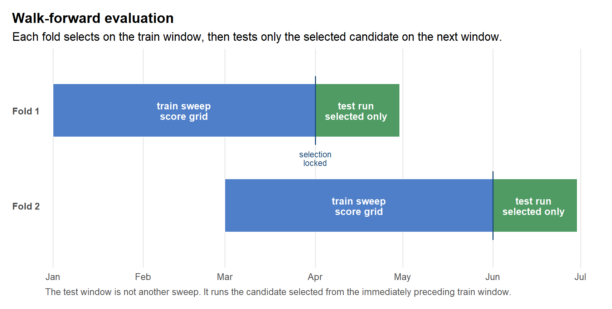

# Walk-Forward Evaluation


You ran a sweep and picked the best candidate. Was that a real edge, or
the luckiest parameter on this slice of history? A sweep selects and
scores on the same data, so its winner is in-sample evidence. It cannot
tell you whether the rule generalizes.

Walk-forward evaluation answers the generalization question. It splits
time into folds, and in each one it selects a candidate on a train
window, then tests only that candidate on the next, untouched window.
The test window is held-out evidence: the selection never saw it.

``` text
for each fold:
  train snapshot window -> sweep candidates -> scalar selection
  selected candidate -> test window run -> recorded evidence
```

Walk-forward uses the same `ledgr_sweep()` and `ledgr_run()` machinery
as the rest of ledgr; it does not add a separate execution engine. By
the end of this article you will run a multi-fold evaluation, read its
train-versus-test degradation table, and extract a candidate for review.

## Setup

``` r
library(ledgr)
library(dplyr)

data("ledgr_demo_bars", package = "ledgr")
```

<div class="ledgr-callout ledgr-callout-note">

**Running this yourself**

The code writes to a temporary DuckDB store, so the article leaves no
project files behind. The demo-data window and fold sizes are kept small
so the vignette runs quickly; they are not a statistical recommendation.

</div>

``` r
bars <- ledgr_demo_bars |>
  filter(
    instrument_id %in% c("DEMO_01", "DEMO_02"),
    between(ts_utc, ledgr_utc("2019-01-01"), ledgr_utc("2019-12-31"))
  )

snapshot <- ledgr_snapshot_from_df(
  bars,
  db_path = tempfile(fileext = ".duckdb"),
  snapshot_id = "walk_forward_demo"
)
```

The experiment is the same kind of object used by `ledgr_run()` and
`ledgr_sweep()`.

``` r
features <- ledgr_feature_map(
  fast = ledgr_ind_sma(ledgr_param("fast_n")),
  slow = ledgr_ind_sma(ledgr_param("slow_n"))
)

exp <- ledgr_experiment(
  snapshot = snapshot,
  strategy = ledgr_demo_sma_crossover_strategy(),
  features = features,
  opening = ledgr_opening(cash = 10000),
  cost_model = ledgr_cost_zero()
)
```

## Folds And The Train/Test Boundary

Folds are calendar-time value objects. They describe train and test
scoring windows; they do not execute anything by themselves.

``` r
folds <- ledgr_folds_rolling(
  start = "2019-01-01",
  end = "2019-07-31",
  train_window = "3 months",
  test_window = "1 month",
  step = "2 months"
)

folds
#> ledgr fold list
#> ================
#> Scheme: rolling
#> Folds:  2
#> Hash:   12a94353eb09
#>
#> # A tibble: 2 x 3
#>    fold train                    test
#>   <int> <chr>                    <chr>
#> 1     1 2019-01-01 -> 2019-03-31 2019-04-01 -> 2019-04-30
#> 2     2 2019-03-01 -> 2019-05-31 2019-06-01 -> 2019-06-30
```

Plotting the folds makes the core contract easier to see. The blue train
window sweeps and scores the grid. At the boundary, ledgr locks one
selected candidate. The green test window then runs only that candidate.



## Build The Grid And Run It

Build a small grid. Feature parameters vary the concrete SMA windows.
Strategy parameters vary the target quantity and threshold.

``` r
feature_grid <- ledgr_feature_grid(
  fast_n = c(5L, 10L),
  slow_n = 20L,
  .filter = fast_n < slow_n
)

strategy_grid <- ledgr_strategy_grid(
  qty = 5,
  threshold = 0
)

grid <- ledgr_grid_cross(features = feature_grid, strategy = strategy_grid)
```

The selection rule is explicit and scalar: ledgr selects one candidate
per fold from the train-window score rows.

``` r
wf <- ledgr_walk_forward(
  exp,
  grid = grid,
  folds = folds,
  selection_rule = ledgr_select_argmax("sharpe_ratio"),
  seed = 2026L
)

wf
#> ledgr walk-forward
#> ==================
#> Health warning: one or more test windows are shorter than 90 calendar days.
#>
#> Train/test degradation:
#> # A tibble: 2 x 7
#>   fold_seq selection_metric train_metric_value test_metric_value metric_diff_abs
#>      <int> <chr>                         <dbl>             <dbl>           <dbl>
#> 1        1 sharpe_ratio                   1.98             0.800           -1.18
#> 2        2 sharpe_ratio                   2.08             3.64             1.56
#> # i 2 more variables: warning_flags <chr>, selected_candidate <chr>
#>
#> Session: cec372f89579c986591a58aa9fb3f6d440433146691dad35a7dbe92659d09a5a
#> Status: DONE
#> Opening state: carry_test_state
#> Folds: 2
```

## Read The Degradation Table First

The degradation table is the first surface to inspect. Printing it shows
the core train-versus-test columns; the full table, including the window
ranges and percentage change, is one `as_tibble()` away.

``` r
wf$degradation
#> # ledgr walk-forward degradation
#> # A tibble: 2 x 7
#>   fold_seq selection_metric train_metric_value test_metric_value metric_diff_abs
#>      <int> <chr>                         <dbl>             <dbl>           <dbl>
#> 1        1 sharpe_ratio                   1.98             0.800           -1.18
#> 2        2 sharpe_ratio                   2.08             3.64             1.56
#> # i 2 more variables: warning_flags <chr>, selected_candidate <chr>
#>
#> # i Hidden columns: train_window, test_window, metric_diff_pct. Use as_tibble() for the full table.
```

`metric_diff_abs` is `test_metric_value - train_metric_value`. Whether a
positive value means improvement or degradation depends on the selection
rule direction.

Short test windows may carry warning flags. Those warnings are not
failures; they are metadata telling you how to interpret the evidence.

## Extract A Candidate With A Rationale

Use `ledgr_candidate()` to extract the selected candidate for a specific
fold. Using `"latest"` is allowed only with a rationale.

``` r
candidate <- ledgr_candidate(
  wf,
  fold_seq = "latest",
  selection_rationale = "Documentation example: inspect the latest completed fold."
)

candidate$candidate_id
#> [1] "feature_af0f94c90243/strategy_86be010cf688"
```

Promotion uses the same candidate object as sweep promotion. In a real
research project, promote only after you have written down why this fold
and candidate are being reviewed.

``` r
promoted <- ledgr_promote(
  exp,
  candidate,
  run_id = "wf_latest_review",
  note = "Manual review accepted the latest completed fold."
)
```

## Reading The Evidence Honestly

A degradation table is easy to over-read. Three things bound what it can
tell you.

Walk-forward evidence is only as survivorship-safe as the sealed
snapshot and universe semantics it evaluates.

<div class="ledgr-callout ledgr-callout-warning">

**Selection integrity is a separate question**

Reproducibility and selection integrity are orthogonal. Walk-forward
records what was selected and tested; it does not prove that the search
space, metric, or selection procedure was statistically sound. Scalar
scores are not PBO, CSCV, CPCV, DSR, benchmark diagnostics, or a
multiple-testing correction. For what provenance does and does not
prove, see `vignette("reproducibility", package = "ledgr")`.

</div>

<div class="ledgr-callout ledgr-callout-warning">

**Test folds are not independent**

The default `opening_state_policy = "carry_test_state"` is
path-dependent. Each completed selected test run may seed the next test
opening state, so per-fold test metrics are not independent
observations. The explicit `opening_state_policy = "flat_test_state"`
opt-in starts every test window from the original experiment opening
state and marks the result as `cold_start_distorted`.

</div>

Anchored folds grow their train window over time. That is useful for
some research workflows, but later folds can cost more to compute than
early folds, especially with large candidate grids and wide feature
sets.

## Try It

<div class="ledgr-callout ledgr-callout-tip">

**Try it**

Re-run `ledgr_walk_forward()` with
`opening_state_policy = "flat_test_state"`. How does the degradation
table change, and why does `cold_start_distorted` appear? Then widen the
`test_window` in `ledgr_folds_rolling()` to `"2 months"` and re-run. Do
the short-test-window warning flags go away?

</div>

## What This Does Not Do

<div class="ledgr-callout ledgr-callout-important">

**Outside this surface**

ledgr does not yet implement paper/live walk-forward, OMS behavior,
cross-snapshot walk-forward, benchmark-relative metrics, gross-vs-net
attribution, signal decay, implementation/cost decay, or
selection-integrity diagnostics. Those require later surfaces over the
stable session and candidate identity introduced here.

</div>

## Where Next

- For the sweep and selection mechanics this builds on, see
  `vignette("sweeps", package = "ledgr")`.
- For the full research arc from idea to reviewed candidate, see
  `vignette("research-workflow", package = "ledgr")`.
- For hashes, source capture, and the limits of provenance, see
  `vignette("reproducibility", package = "ledgr")`.
- For the Sharpe ratio and annualization conventions behind these
  scores, see
  `vignette("metric-contexts-and-conventions", package = "ledgr")`.
